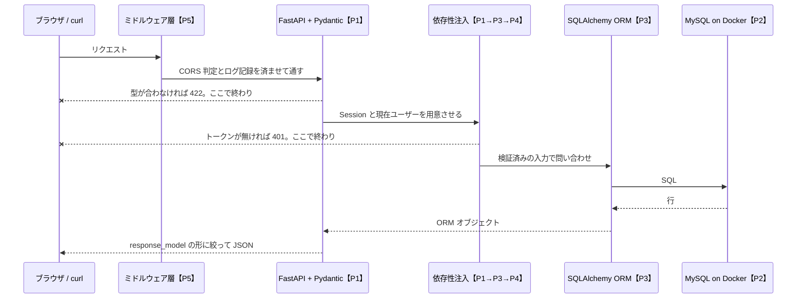
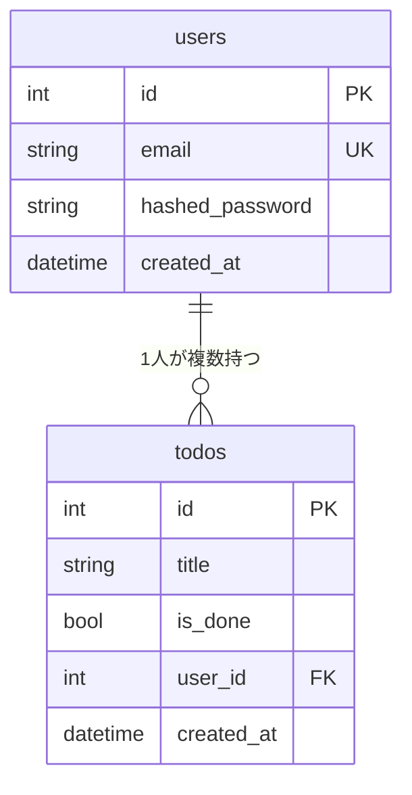
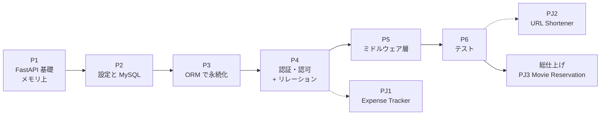

# M0 — 学習計画

`docs/_prompt.md` §5 の出力。**本編は書かない。** 範囲の確定と、全フェーズの目次だけを置く。

> ### 📣 説明方針（`_prompt.md` v9 時点）
>
> | 項目 | 当初（v5） | **現行（v7）** |
> | --- | --- | --- |
> | Python の文法 | 1〜2行の注釈。3行以上は禁止 | **量の上限なし。小学生にも通じる言葉で説明しきる**（§4.3） |
> | Python の説明形式 | 引用1行 | **4点セット**: 読み方 → 身近なたとえ → 正確な定義 → TS ならどう書くか |
> | 設計の「なぜ」 | 1段 | **🪜 なぜなぜ で3段掘る**（§4.2.1）。③は読者への問い |
> | 図 | 規定なし | **各ステップに最低1枚、Mermaid で必須**（§4.13）。飾りの図は禁止 |
> | OpenAPI / Swagger | `/docs` に触れるだけ | **到達点に格上げ**（§4.14）。P1 で読み方、以降は毎回スキーマの差分 |
> | ORM | SQLAlchemy 2.0（P3） | **同じ。加えてリレーションと N+1 を範囲内に戻した**（P4-5） |
> | Python の**文法以外** | 規定なし | **§4.3.1 で4項目に説明義務**（実行と仮想環境 / パッケージと import / トレースバック / インデントエラー） |
> | 検証の責任 | 規定なし | **§4.6(c) で役割分担**。`✅ 検証済み` は実行した者だけ、GUI は `🧑 読者が検証` |
> | SQL の可視化 | 規定なし | **§4.15**。`echo=True` で ORM が隠した SQL を見せる |
> | **ライブラリの API** | 仕組み解剖のみ（実務者向け） | **§4.2.2 で「🔤 入口の2行」を義務化**。読み方 + 専門用語なしの「要するに」を仕組み解剖の前に置く |
> | **Alembic** | §4.4 の周辺注（1〜3行・薄く） | **厚く扱う側へ移動**（§4.4 から除外） |
> | **設計パターン** | 規定なし | **§4.16**。問題 → 解 → **名前**の順。「使わない判断」を必ずセットで |
> | 範囲 | 主線に出たものだけ | **変更なし** |
>
> **深さと見せ方を増やし、範囲は広げない。** 出ていない文法を親切心で足すと FastAPI の話が埋もれるため、
> 範囲の上限は据え置いた。なぜなぜは **① 何が起きているか → ② なぜその仕組みを選んだか → ③ その選択の代償** の順で固定する。

---

## 1. 到達点は、どのフェーズで満たされるか

`_prompt.md` §2 の 10 条件を、達成フェーズと「達成したと言える根拠」に対応づける。

| # | 達成条件 | 満たすフェーズ | 達成の根拠（何を見て判定するか） |
| --- | --- | --- | --- |
| 1 | CRUD 4種が curl で動く | **P1**（メモリ上）→ **P3**（DB 上で再成立） | 4本の `curl` が 200 / 201 / 204 を返す |
| 2 | 不正入力で 422 が返る | **P1-4** | 型違反の JSON を POST → 422 と `loc` / `type` / `msg` を含むボディ |
| 3 | ORM で MySQL に永続化、Alembic でスキーマ変更、**リレーションを辿れて N+1 に気づける** | **P2**（接続）→ **P3**（ORM と永続化）→ **P4-5**（リレーション / N+1） | `docker compose ps` が healthy／`alembic upgrade head` 後の `SHOW COLUMNS`／再起動後もデータが残る／ログ上の SELECT 回数 |
| 4 | 未認証で 401、他人のリソースに 403 | **P4-3**（401）/ **P4-4**（403） | トークン無しで 401、他ユーザーの todo に 403 |
| 5 | CORS が通り、全リクエストがログに残る | **P5-1** / **P5-2** | プリフライトの `OPTIONS` に `Access-Control-Allow-Origin`／標準出力に1リクエスト1行 |
| 6 | pytest が全ケース green | **P6** | `uv run pytest` が全件 passed |
| 7 | ruff / mypy / pytest がコミット時に自動で回る | **P1-1** → **P6-4** | 壊れたコードを `git commit` → フックが止める |
| 8 | Zed からブレークポイントを張って止められる | **P1-9**（アプリ）→ **P6-4**（テスト） | §2.5 の判定基準 **5 まで**（変数ペインでリクエストボディが見える） |
| 9 | roadmap.sh のプロジェクト3件を自力で完成 | **PJ1**（P4 末）/ **PJ2**（P6 末）/ **PJ3**（総仕上げ） | 各 MP 回の「判定基準」をコマンド出力で自己判定 |
| 10 | **OpenAPI スキーマを読め、Swagger UI から認証付きで実行できる** | **P1-6**（読み方）→ 全ステップ（差分）→ **P4-3**（Authorize） | `jq` で `paths` / `components.schemas` / `$ref` を説明できる／`/docs` の Authorize でトークンを入れて 200 |

### 📊 完成時、リクエストはどの層を通るか

各レーンが「どのフェーズで足される層か」を括弧で示した。**P1 の時点では F の段で完結し、S と DB は存在しない。**



✅ 描画確認済み: mermaid 12.0.0 でパース通過。

**この図の読みどころは、下まで行かずに戻る2本の `--x`。** 422 と 401 は**ハンドラに到達する前に**決着する。
「なぜハンドラの中で入力チェックを書かないのか」の答えが、この2本に出ている（詳細は P1-4 / P4-3）。

---

## 2. 環境準備

### 2.1 前提チェック（すでに入っているもの）

```bash
uv --version
python3 --version
docker --version
docker compose version
```

```
uv 0.12.17 (Homebrew 2026-09-18 aarch64-apple-darwin)
Python 3.14.3
Docker version 29.6.1, build 8900f1d
Docker Compose version v5.2.0
```

✅ 検証済み: macOS (darwin / aarch64) 上で実行。4 つとも導入済み。

> システムの Python が 3.14 でも問題ない。**アプリが使う Python は uv が別に管理する**ので、
> システム側には一切触らない。次の `uv python pin 3.12` がその指定にあたる。

### 2.2 これから入れるもの（各コマンドの役割つき）

**実際に叩くのは P1-1。** ここでは「何が必要か」の一覧だけを先に示す。
なぜこの4つなのか、設定の各項目が何をしているかは P1-1 の仕組み解剖で扱う（設定名の羅列で終わらせない）。

#### 第1段: ここまでは今すぐ通る（設定ファイルが要らない）

```bash
# 1. プロジェクトを初期化する（pyproject.toml を作る。README.md と .git は既にあるので --bare）
uv init --bare --name roadmap-sh-fastapi --python 3.12 .

# 2. このプロジェクトが使う Python を 3.12 に固定する（.python-version を作る。システムの 3.14 は使わない）
uv python pin 3.12

# 3. 本番で使う依存を入れる（P1 時点では FastAPI と ASGI サーバだけ）
uv add fastapi "uvicorn[standard]"

# 4. 開発時だけ使うツールを入れる（--dev なので本番の依存には混ざらない）
uv add --dev ruff mypy pre-commit debugpy
```

✅ 検証済み: 実行して成功を確認。
Python 3.12.13 / ruff 0.16.8 / mypy 2.3.1 / pre-commit 4.6.2 / fastapi 0.141.1 / uv 0.12.17。
`pyproject.toml` `.python-version`（= `3.12`）`.venv/` `uv.lock` が生成される。

#### 第2段: ⛔ ここから先は P1-1 で `.pre-commit-config.yaml` を書いた**後**

```bash
# 5. Git フックを仕掛ける（何を走らせるかは .pre-commit-config.yaml に書いてある）
uv run pre-commit install

# 6. 全ファイルに対して一度フックを流す（初回の指摘をまとめて潰す。以降はコミット時に自動）
uv run pre-commit run --all-files
```

⚠️ 未実行（P1-1 で設定ファイルを書いてから実行する）。検証手順: 6 の実行後に
`uv run ruff check` と `uv run mypy .` がエラー 0 で終わることを確認する。

> ⚠️ **先に 5 を叩いてしまった場合**
>
> `pre-commit install` は**設定ファイルが無くても成功する**（フックの置き場所を作るだけなので）。
> だが置かれたフックは起動のたびに設定ファイルを探すので、**この状態では `git commit` が必ず失敗する**。
>
> ```
> No .pre-commit-config.yaml file was found
> ```
>
> 直し方は2つ。**P1-1 に進んで設定ファイルを書く**（本筋）か、
> それまでコミットしたいなら `uv run pre-commit uninstall` で一度フックを外す（P1-1 で入れ直す）。
>
> **この順番の理由**: `pre-commit` は「何を走らせるか」を設定ファイルからしか知らない。
> フックは*入れ物*で、中身は空のまま。だから**中身を先に書く**のが正しい順序になる。

**`jq` も入れておく**（OpenAPI スキーマを読むのに使う。P1-6 から毎ステップ登場する）。

```bash
brew install jq
```

⚠️ 未実行。検証手順: `echo '{"a":1}' | jq .a` が `1` を返す。

**Docker Desktop**: 導入済み（2.1 で確認）。P2-1 で `compose.yaml` を書くまで何もしない。
コンテナ化するのは **MySQL だけ**で、アプリはローカル実行のままにする（この構成がデバッガ接続を一番簡単にする理由は P1-9 で扱う）。

**debugpy**: 上の 4 で一緒に入れるが、設定（`.zed/debug.json`）を書くのは P1-9。

#### この時点で入れる設定の範囲

| ツール | P1-1 で書く範囲 | 後で足す |
| --- | --- | --- |
| ruff | lint + format の有効化、対象ディレクトリ | — |
| mypy | `disallow_untyped_defs = true` **だけ** | P3 で `disallow_any_generics` / `warn_return_any`、P6 で `strict = true` |
| pre-commit | ruff / mypy の2フック | P6-4 で pytest を追加 |

> いきなり `strict = true` にしない理由は `_prompt.md` §2.4 のとおり。動かない設定は外されて終わる。

---

## 3. 完成時のディレクトリ構成（P6 終了時点）

```
roadmap-sh-fastapi/
├── README.md                        到達点と進捗
├── .gitignore
├── .python-version                  P1-1（3.12）
├── pyproject.toml                   P1-1（依存 / ruff / mypy の設定）
├── uv.lock                          P1-1（自動生成。コミットする）
├── .pre-commit-config.yaml          P1-1（P6-4 で pytest を追加）
├── .env                             P2-2（コミットしない。.gitignore 済み）
├── .env.example                     P2-2（キーだけ。これはコミットする）
├── .zed/
│   └── debug.json                   P1-9（+ P6-4 でテスト用 5679 を追加）
├── compose.yaml                     P2-1（MySQL のみ）
├── alembic.ini                      P3-3
├── alembic/
│   ├── env.py                       P3-3（target_metadata をここで繋ぐ）
│   └── versions/                    P3-3 以降のマイグレーション
├── app/                             ← 本編の TODO API
│   ├── __init__.py                  P1-2
│   ├── main.py                      P1-2（P5 でミドルウェア / 例外ハンドラを登録）
│   ├── config.py                    P2-2（pydantic-settings）
│   ├── database.py                  P3-1（Engine / sessionmaker）
│   ├── dependencies.py              P1-8（DI）→ P3-1（get_db）→ P4-3（get_current_user）
│   ├── security.py                  P4-1（ハッシュ）→ P4-2（JWT）
│   ├── middleware.py                P5-2（リクエストログ）
│   ├── exception_handlers.py        P5-3（例外の一元化）
│   ├── models/                      SQLAlchemy ORM（DB の形）
│   │   ├── __init__.py              P3-2
│   │   ├── todo.py                  P3-2（P4-5 で relationship を追加）
│   │   └── user.py                  P4-1（P4-5 で relationship を追加）
│   ├── schemas/                     Pydantic（API の形）
│   │   ├── __init__.py              P1-4
│   │   ├── todo.py                  P1-4 / P1-5
│   │   └── user.py                  P4-1 / P4-2
│   └── routers/
│       ├── __init__.py              P1-8
│       ├── todos.py                 P1-8
│       ├── users.py                 P4-1
│       └── auth.py                  P4-2
├── tests/                           P6
│   ├── conftest.py                  P6-1 → P6-2（DB 分離）→ P6-3（トークン fixture）
│   ├── test_health.py               P6-1
│   ├── test_todos.py                P6-2
│   └── test_auth.py                 P6-3
├── docs/
│   ├── _prompt.md                   生成プロンプト
│   ├── 00-plan.md                   このファイル
│   ├── p1a-basics.md                M1 / M2 の出力（P1-1〜P1-5）
│   ├── p1b-openapi.md               （P1-6〜P1-9）
│   ├── p2-env.md 〜 p6-tests.md
│   ├── 90-python-index.md           Python 文法の逆引き索引（M1 のたびに追記）
│   ├── 91-library-index.md          ライブラリ記法の逆引き索引（§4.2.2）
│   ├── 99-uncovered.md              M3 の出力
│   └── images/                      スクリーンショット（読者が撮る。§4.13）
└── projects/                        ← roadmap.sh。本編アプリとは混ぜない
    ├── pj1-expense-tracker-api/     PJ1（独立した app / tests / compose.yaml / README.md）
    ├── pj2-url-shortener/           PJ2
    └── pj3-movie-reservation/       PJ3
```

**`models/` と `schemas/` を分ける**のが P3 の主題のひとつ。
「DB のテーブル定義」と「API の入出力定義」は、同じ Todo でも**変わる理由が違う**ので別物として置く（P3-2 / P3-4）。

### 📊 完成時のテーブル



✅ 描画確認済み: mermaid 12.0.0 でパース通過。

`todos.user_id` は **P4-4** で足す（認可のため）。**P4-5** で、その外部キーを ORM の `relationship()` として
辿れるようにし、そこで N+1 を実際に起こして見せる。

---

## 4. フェーズ別ステップ一覧

粒度のルール: **1ステップの FastAPI 側初出は最大3つ。** Python 解説・周辺注は数に含めない。

### 📊 フェーズの依存関係



✅ 描画確認済み: mermaid 12.0.0 でパース通過。

実線が「これが無いと次に進めない」、点線が「ここまでの力で作れるプロジェクト」。
**P1〜P3 に点線が無いのは、永続化と認証が揃うまで roadmap.sh のどの課題も要件を満たせないから。**

### P1 — 開発ツール → FastAPI 基礎 → 仕様書の読み方 → デバッガ（9ステップ / **P1a・P1b に分割**）

#### P1a（5ステップ）— 書けるようになる

| # | タイトル | 作るもの | 初出（FastAPI） | 重要度 |
| --- | --- | --- | --- | --- |
| P1-1 | 品質ゲートを先に立てる | `pyproject.toml` / `.pre-commit-config.yaml`。壊れたコードがコミットできない | —（uv / ruff / mypy / pre-commit） | 🔴 |
| P1-2 | 最小のエンドポイント | `GET /health` が 200 を返す。**わざと1回失敗させてエラーを読む** | `FastAPI()`, `@app.get()`, `uvicorn app.main:app` | 🔴 |
| P1-3 | パスとクエリの受け取り | `GET /items/{id}?q=` が型変換される。**経路の順序も実際に踏む** | パスパラメータ宣言, `Query()`, 422 の自動応答 | 🔴 |
| P1-4 | リクエストボディと 422 | `POST /todos` が Pydantic で検証される | `BaseModel`（ボディ判定）, 422 の自動応答, `Field()` | 🔴 |
| P1-5 | 返す形を宣言する | `TodoCreate` / `TodoRead` を分け、201 を返す | `response_model`, `status_code`, `model_config` | 🔴 |

#### P1b（4ステップ）— 生成物を読めるようになる

| # | タイトル | 作るもの | 初出（FastAPI） | 重要度 |
| --- | --- | --- | --- | --- |
| P1-6 | **生成された仕様書を読む** | `/openapi.json` を `jq` で読み解く。`/docs` で Try it out | `GET /openapi.json`, `components.schemas` と `$ref`, `tags=` / `summary=` | 🔴 |
| P1-7 | 残りの CRUD と 404 | `GET /todos/{id}` `PUT` `DELETE` が揃う。**P1-5 の `id = len(todos) + 1` が DELETE で重なるのを予測問題で踏む** | `HTTPException`, `status` 定数, `responses=`（スキーマへの宣言） | 🔴 |
| P1-8 | ルーター分割と依存性注入 | `app/routers/todos.py` に切り出し、共通処理を注入。**`__init__.py` と import がここで本番**。**`app.routes` で経路一覧を確認**（`prefix` の付き方を目で見る） | `APIRouter`, `include_router()`, `Depends()` | 🔴 |
| P1-9 | Zed からブレークポイントで止める | `.zed/debug.json`。`POST /todos` を止めてボディを覗く | —（debugpy / attach） | 🔴 |

#### P1 で扱う「Python の道具立て」（§4.3.1）

文法ではないが、**詰まった時点で手が完全に止まる**4つ。出てから説明するのでは間に合わないので、
初めて詰まりうるステップで先に扱う。

| 項目 | 扱うステップ | 何が起きるか |
| --- | --- | --- |
| 実行のしかたと仮想環境（`uv run` / `.venv`） | **P1-1** | `python main.py` で `ModuleNotFoundError`。入れたはずのものが無い、と混乱する |
| トレースバックの読み方（**下から読む**） | **P1-2** | 読まずに勘で直す癖がつき、以後すべてのステップの効率が落ちる |
| インデントエラー（`IndentationError` / `TabError`） | **P1-2** | 動かない理由が見た目に出ないので原因に辿り着けない |
| パッケージと import（`__init__.py`） | P1-2 で予告 → **P1-8 で本番** | ファイル分割の瞬間に import が壊れ、どこを直すか分からなくなる |

> **`Annotated` は P1-3 で前倒しした**（当初は P3-1 の初出予定）。公式が推奨する書き方が
> `Annotated[str | None, Query(...)]` であり、**先に古い形を教えて後で乗り換えるのは `async def` と同じ失敗**になるため。
> P3-1 の `Annotated[Session, Depends(...)]` は2度目の登場となり、1行の復習で済む（§4.3）。

> **P1-8 でルート一覧の確認を扱う。** P1-2 の なぜなぜ③ で「経路を関数の真上に貼ると**一覧性**を失う」と提示した。
> 手当ては2つあり、**P1-6** が `/openapi.json`（起動して見る）、**P1-8** が `app.routes`（起動せずに見る）。
> ルーターに分割すると経路がファイルをまたぐので、`include_router(prefix=...)` の付け間違いはここで一番起きやすい。
> `fastapi` CLI は使わない（`dev` と `run` しか無く、`routes` のようなコマンドは存在しない。§2.4）。

> **P1-2 では `async def` の予告も入れる**（§4.7）。公式チュートリアルは最初の例から `async def` だが、
> 本教材は `def` で統一する。予告が無いと、公式を開いた読者が「自分が間違えた」と思って勝手に直してしまう。

> **P1-6 と P1-9 の画面操作は `🧑 読者が検証`**（§4.6(c)）。Swagger UI の画面と Zed の GUI は生成側が実行できないため、
> `✅ 検証済み` は名乗らず、**手順と判定基準を書く**形になる。`curl` や `jq` で確かめられる部分は `✅` で出す。

**P1-6 をここに置いた理由**: OpenAPI スキーマは、**リクエストの形（P1-4）とレスポンスの形（P1-5）が両方そろって初めて読む価値が出る**。
P1-3 の時点で `/docs` を開いても `components.schemas` が空で、`$ref` という中心概念が出てこない。

**P1-9 を末尾に置いた理由**: `_prompt.md` §2.5 は「`GET /health` が動いた直後」とも書いているが、
同じ §2.5 の判定基準 5 が **「変数ペインでリクエストボディの中身が見える」** を要求している。
`GET /health` にボディは無いので、この基準は P1-4 以降でないと満たせない。判定基準を満たせる位置を優先した。

**分割を「する」に変えた**: 前回は 8 ステップで「分割しない」を推奨したが、P1-6 が入って **9 ステップ**になり、
`_prompt.md` §5 の目安（1フェーズ7ステップ）から離れすぎた。P1a / P1b で区切り、**M2（フェーズ末パック）を2回**行う。
P1a 末のブランクページ再現は `app/main.py` 1枚で済み、負荷が適正になる。

> ⚠️ P1-9 では `--reload` を**外す**。リローダーは子プロセスでアプリを動かすため、
> 親に attach した debugpy ではブレークポイントが止まらない（§4.12-15）。

### P2 — 環境と設定（3ステップ）

| # | タイトル | 作るもの | 初出（FastAPI） | 重要度 |
| --- | --- | --- | --- | --- |
| P2-1 | MySQL をコンテナで立てる | `compose.yaml`。`docker compose ps` が healthy | —（Docker / MySQL 8.x） | 🟡 |
| P2-2 | 設定をコードの外に出す | `app/config.py` / `.env` / `.env.example` | `BaseSettings`, 設定の `Depends` 注入, `@lru_cache` | 🔴 |
| P2-3 | アプリから DB に届くか確かめる | `GET /health/db` が `SELECT 1` を返す | `create_engine()`（接続まで。ORM は P3） | 🟡 |

🔓 P2 では §4.8 の表の全項目（認証情報の置き場所 / root 利用 / volume の有無 / managed DB という選択肢）に、
簡略化ラベルと「本番では」を必ず付ける。

### 📌 Pydantic / SQLAlchemy / Alembic の扱い（v9 で変更）

この3つは **Docker / MySQL とは別扱い**にした。**厚く扱う。**

| ライブラリ | ひとことで | 主に出るステップ |
| --- | --- | --- |
| **Pydantic** | **外**とやり取りする形の設計図 | P1-4 / P1-5 / P2-2 |
| **SQLAlchemy** | **表**の形の設計図 + SQL を組み立てる係 | P2-3 / P3-1〜P3-4 / P4-5 |
| **Alembic** | 表の形を**いつ・どう変えたか**の履歴 | P3-3 / P3-5 / P4-4 |

**Alembic を「薄く」から「厚く」に変えた理由**: §1 の到達点 (3) に「Alembic でスキーマを変更できる」が入っている。
**到達点に入っているものを1項目3行で扱うのは矛盾する。** Docker は「DB を用意する手段」で無くても FastAPI は書けるが、
Alembic は**スキーマ変更という設計判断そのもの**を扱う道具なので、役割の重さが違う。

**Docker / MySQL は薄いまま**にした。ここを厚くすると FastAPI の話が埋もれるので、
「DB を用意する手段」「データが入る箱」以上には踏み込まない。

> **3つとも、まず 🔤 入口の2行から入る**（§4.2.2）。`mapped_column()` を「マップド・カラム」と読めない状態で
> 「実行時に SQLAlchemy が〜」を読んでも入らないため、**読み方と「要するに」を仕組み解剖の前に置く**。
> 逆引きは `docs/91-library-index.md`。

### P3 — ORM で永続化（5ステップ）

| # | タイトル | 作るもの | 初出（FastAPI） | 重要度 |
| --- | --- | --- | --- | --- |
| P3-1 | Session をリクエストごとに配る | `app/database.py` / `get_db` 依存。**`echo=True` で SQL を見えるようにする**（§4.15） | `yield` を使う依存, `Depends()` との組み合わせ（`Annotated` は **P1-3 で既出**）, `def` と `async def` の判断（§4.7 を1回だけ厚く） | 🔴 |
| P3-2 | テーブルを ORM モデルで定義する | `app/models/todo.py` | —（`DeclarativeBase` / `Mapped` / `mapped_column`）+ mypy を1段締める | 🔴 |
| P3-3 | Alembic を繋いで最初の1本を当てる | `alembic/` / `versions/0001_*.py` | —（`target_metadata` / `--autogenerate` / `upgrade` / `downgrade` を厚く） | 🔴 |
| P3-4 | CRUD をメモリから DB に差し替える | `app/routers/todos.py` の中身が全部入れ替わる | `from_attributes`（ORM → スキーマ変換）, `select()` の結果を返す, コミット境界と例外 | 🔴 |
| P3-5 | スキーマを変更して当て直す | カラム追加のマイグレーション1本 | —（`downgrade -1` で戻せることの確認 / `VARCHAR` の長さ指定） | 🟡 |

> **P3-1 では「責務の分担図」を必ず描く**（§4.13）。Pydantic と SQLAlchemy は
> どちらも「データの形を書くもの」に見えるが、**片方は外向き（API の形）、もう片方は内向き（表の形）**。
> ここが混ざったまま進むと、P3-4 の「モデルとスキーマの分離」が何を分離しているのか分からなくなる。

> **ORM をここで扱いきる。** P3-4 の 🪜 なぜなぜ で「**そもそもなぜ ORM を挟むのか。生 SQL ではだめか**」を3段掘る。
> ORM は無料ではなく、**発行される SQL が見えなくなる**という代償を払って型と移植性を買っている。
> その代償が具体的に牙を剥くのが N+1 で、これは P4-5 で実際に起こして見せる。

#### 🏛 名前を付けて扱う設計パターン（§4.16）

**名前から入らない。** 「こう書くと、こう困る」を先に見せ、困りごとが消える形を示してから名前を付ける。

| パターン | ステップ | 解いている困りごと |
| --- | --- | --- |
| 入口で弾く（バリデーション境界） | P1-4 | 入力チェックをハンドラ内でやると、全ハンドラに同じ `if` が並ぶ |
| 外から渡す（依存性注入 / DI） | P1-8 | DB 接続を作る処理を各ハンドラにコピーすると、直すとき全部直すことになる |
| やり取りを1つの束にする（Unit of Work = `Session`） | P3-1 | 2つの更新のうち**片方だけ成功した状態**が生まれる |
| 入れ物を分ける（モデルとスキーマの分離） | P3-2・P3-4 | 表の行をそのまま返すと `hashed_password` まで外に出る |
| 形に版をつける（マイグレーション） | P3-3 | 手で `ALTER TABLE` を打つと他の人の DB と形がズレ、戻せない |
| リポジトリ層を作るか作らないか | P3-4 | ★ **結論を先に決めない。** なぜなぜで3段掘り、判断の分かれ目まで出す |

各パターンに**「使わない判断」を必ずセットで書く**。困っていないのに使うと、層が増えるだけで何も解決しないため。

### P4 — 認証・認可 + リレーション（5ステップ + PJ1）

| # | タイトル | 作るもの | 初出（FastAPI） | 重要度 |
| --- | --- | --- | --- | --- |
| P4-1 | ユーザー登録とパスワードの保存 | `POST /users` / `app/security.py`（ハッシュ） | ハッシュ化ライブラリ（§2.4 に従い公式で現行推奨を確認して確定）, レスポンスからの秘密の除外 | 🔴 |
| P4-2 | ログインしてトークンを発行する | `POST /token` | `OAuth2PasswordRequestForm`, フォーム形式のボディ, JWT の署名（RFC 7519） | 🔴 |
| P4-3 | トークンを検証して 401 を返す | `get_current_user` 依存 + `/docs` の **Authorize** | `OAuth2PasswordBearer`, 401 と `WWW-Authenticate`, `securitySchemes`（スキーマへの反映） | 🔴 |
| P4-4 | 持ち主だけが触れるようにする（403） | `todos.user_id` 追加のマイグレーション + 所有者チェック | 403 と 404 の使い分け, ルーター単位の `dependencies=[...]` | 🔴 |
| P4-5 | **リレーションを辿る / N+1 を見る** | `relationship()` を両モデルに追加。SQL ログで件数を数える | `Mapped[list[Todo]]`, 遅延読み込みと N+1, `selectinload()` | 🔴 |
| **PJ1** | **Expense Tracker API** | `projects/pj1-expense-tracker-api/` | — | — |

**P4-5 を P4 に置いた理由**: リレーションは「2つ目のテーブル」が無いと作れない。本編で2つ目のテーブルが現れるのは
`users`（P4-1）が最初で、外部キーが引かれるのは P4-4。**外部キーを引いた次の回に、それを ORM でどう辿るかをやる**のが最短で、
テーブルを学習用にもう1つ増やさずに済む。

🔓 P4 では §4.8 の全項目（秘密鍵の管理 / 有効期限 / リフレッシュトークンの有無 / ハッシュのアルゴリズムとコスト / HTTPS 前提 / ログに出さないもの）に簡略化ラベルを付ける。
**この領域は「動くから正しい」が成立しない**ので、根拠URLを他フェーズより厳しく求める。

### P5 — ミドルウェア層（3ステップ）

| # | タイトル | 作るもの | 初出（FastAPI） | 重要度 |
| --- | --- | --- | --- | --- |
| P5-1 | ブラウザから叩けるようにする | `CORSMiddleware` の登録 | `add_middleware()`, ミドルウェアの実行順, プリフライト応答 | 🟡 |
| P5-2 | 全リクエストを1行で残す | `app/middleware.py` | `@app.middleware("http")`, `call_next`, 標準 `logging` との接続 | 🟡 |
| P5-3 | エラーの返し方を1箇所に集める | `app/exception_handlers.py` | `@app.exception_handler()`, `RequestValidationError`, 例外 → レスポンスへの変換点 | 🟡 |

🔓 P5 では `allow_origins` にワイルドカードを使っていないか、ログにトークンや個人情報が出ていないかを明示する。

### P6 — テスト（4ステップ + PJ2）

| # | タイトル | 作るもの | 初出（FastAPI） | 重要度 |
| --- | --- | --- | --- | --- |
| P6-1 | サーバを起動せずに叩く | `tests/test_health.py` | `TestClient`, テストが ASGI アプリを直接呼ぶ仕組み | 🔴 |
| P6-2 | 依存を差し替えてテスト用 DB を使う | `tests/conftest.py` / `tests/test_todos.py` | `app.dependency_overrides`, fixture での DB 分離, テスト間のロールバック | 🔴 |
| P6-3 | 認証が要るエンドポイントを試す | `tests/test_auth.py`（401 / 403 を含む） | トークン取得 fixture, `parametrize` による境界値, 認証依存の差し替え | 🔴 |
| P6-4 | 仕上げ: strict 化・フック追加・テストのデバッグ | `pyproject.toml` / `.pre-commit-config.yaml` / `.zed/debug.json` 更新 | —（mypy `strict` / pytest フック / debugpy ポート 5679） | 🟡 |
| **PJ2** | **URL Shortening Service** | `projects/pj2-url-shortener/` | — | — |

### 総仕上げ

新しい単元は無し。**PJ3: Movie Reservation System**（`projects/pj3-movie-reservation/`）のみ。
その後 **M3**（つまずき / まとめ / 範囲外 / 次に学ぶこと）で締める。

### ステップ総数

| Ph | P1a | P1b | P2 | P3 | P4 | P5 | P6 | 計 |
| --- | --- | --- | --- | --- | --- | --- | --- | --- |
| ステップ数 | 5 | 4 | 3 | 5 | 5 | 3 | 4 | **29** |

これに MP 3回、M2 **7回**（P1a / P1b / P2〜P6）、M3 1回が加わる。

---

## 5. プロジェクトの選定（roadmap.sh 共通プール 25件 → 3件）

### 採用した3件

| PJ | プロジェクト | 追加される軸 | 実施時期 |
| --- | --- | --- | --- |
| PJ1 | [Expense Tracker API](https://roadmap.sh/projects/expense-tracker-api) | 本編と同じ土台を**ゼロから自力で**。加えてフィルタ・日付範囲・集計クエリ | P4 末 |
| PJ2 | [URL Shortening Service](https://roadmap.sh/projects/url-shortening-service) | リダイレクト(3xx)、一意コード生成と衝突処理、アクセス統計 | P6 末 |
| PJ3 | [Movie Reservation System](https://roadmap.sh/projects/movie-reservation-system) | 座席の同時予約による競合、トランザクション分離、admin/user のロール認可 | 総仕上げ |

### 外したものと、その理由

| 外したもの | 理由 |
| --- | --- |
| Todo List API | 本編の TODO API と構造が同一。同じものを2回作ることになる |
| Blogging Platform API | 同上。CRUD + 認証の枠から出ない |
| Weather API | DB を使わず、本教材の中心（永続化・認証）に触れない |
| E-Commerce API | 決済ゲートウェイが主題で範囲が膨らむ |
| Scalable E-Commerce Platform | 分散・スケーリングが主題。単一インスタンスの本教材とズレる |
| Image Processing Service | S3 依存。AWS の学習と混ざる |
| Real-time Leaderboard | Redis / WebSocket の比重が大きい |
| Multi-Container Application | Docker 学習リポジトリと重複（本教材は DB のみコンテナ） |
| CLI 系（Task Tracker ほか） | API ではない |

**プロジェクトは本編アプリと混ぜない。** `projects/<pj>/` 配下にそれぞれ独立した
`app/` `tests/` `compose.yaml` `README.md` を持たせる。
MySQL は本編とポートを分けるか DB 名を分けて同一インスタンスを使う（**どちらにしたかを各 README に書く**）。

---

## 6. 範囲外の予告

`_prompt.md` §2 の【範囲の外枠】5つの目次と突き合わせた差分。**M3 で詳述する**ので、ここでは項目名だけ。

| 出どころ | 扱わない主要項目 | 一次情報 |
| --- | --- | --- |
| FastAPI | 非同期DB（`async` ドライバ / `AsyncSession`）、WebSocket、`BackgroundTasks`、`Lifespan`、`SecurityScopes` による細かい権限、サブアプリのマウント、GraphQL、**`fastapi` CLI（`fastapi dev` / `fastapi run`）** | https://fastapi.tiangolo.com/learn/ |
| Pydantic | カスタムバリデータ（`field_validator` / `model_validator`）、`Discriminated Union`、シリアライザのカスタマイズ、`TypeAdapter` | https://docs.pydantic.dev/latest/ |
| Starlette | Starlette 単体での利用、`Request` / `Response` の低レベル操作、`StreamingResponse`、テンプレート、静的ファイル配信 | https://www.starlette.io/ |
| SQLAlchemy | Core（Expression Language 単体）、多対多と関連テーブル、`joinedload` / `subqueryload` の使い分け、複合インデックス、`AsyncSession` | https://docs.sqlalchemy.org/en/20/ |
| Alembic | ブランチとマージ、複数DB対応、データ移行を含むマイグレーション、オフラインモード（SQL 出力） | https://alembic.sqlalchemy.org/en/latest/ |
| OpenAPI | スキーマの手書き、サーバ／クライアントのコード生成、`webhooks`、`callbacks`、複数バージョンの併存 | https://swagger.io/specification/ |

> **v7 で範囲内に戻したもの**: 1対多の `relationship()`、遅延読み込み、N+1 の検出と `selectinload()` による回避（P4-5）。
> 「ORM を使う」と言いながらリレーションを避けると、ORM の利点も代償もどちらも体験できないため。
> ただし**多対多は範囲外のまま**にした。中間テーブルの設計が主題になり、FastAPI の話から離れる。

**明示的に範囲外とした3つ**（M3 で必ず再掲する）:

| 領域 | なぜ外すか | 一次情報 |
| --- | --- | --- |
| 非同期DB | 同期ドライバ（PyMySQL）で統一する方針のため（§4.7）。混在は事故の元 | https://docs.sqlalchemy.org/en/20/orm/extensions/asyncio.html |
| アプリ側のコンテナ化 | Docker 学習リポジトリ側で扱う。ここでは DB のみコンテナ | https://docs.docker.com/reference/dockerfile/ |
| CI（GitHub Actions） | ローカルで pre-commit が回れば学習上は足りる。CI は別テーマ | https://docs.github.com/en/actions |

> 一部は M2 の Lv3 課題として触れる（例: トークン失効は P4 の Lv3、テスト用DBの分離は P6 の Lv3）。
> 「範囲外」は**本編で体系的に扱わない**という意味で、課題として一度も出さないという意味ではない。

---

## 7. 次の一手

```
M1: P1 ステップ1
```

以降は `M1: P1 ステップ2` … と1ステップずつ。フェーズ末は `M2: P1a` / `M2: P1b` / `M2: P2` …、
プロジェクト回は `MP: PJ1`。**1回の応答で1モードだけ**（§1）。

進め方のメモ:

- ステップごとにコミットする（P1-1 以降はフックが自動で ruff / mypy を回す）
- **各ステップの最後に README の進捗表と「次の一手」が更新される**（§6 の N-9）。会話が切れたら README を見る
- **Python の文法で詰まったら `docs/90-python-index.md`、ライブラリの記法は `docs/91-library-index.md` で逆引きする**
- **Pydantic と SQLAlchemy が混ざったら P3-1 の責務の分担図に戻る**（外向き / 内向きの違い）
- 🪜 なぜなぜ の③は、`<details>` を開く前に必ず自分の答えを出す。**外した理由のほうが記憶に残る**
- 📊 図は読み飛ばさない。**矢印が途中で折り返している箇所**が、そのステップの要点であることが多い
- 🧾 OpenAPI 差分は P1-6 以降、毎回出る。**`jq` のコマンドを自分で叩いてから**答えを見る
- ブランクページ再現（M2）は**翌日**にやる。直後だと短期記憶で書けてしまい負荷が足りない
