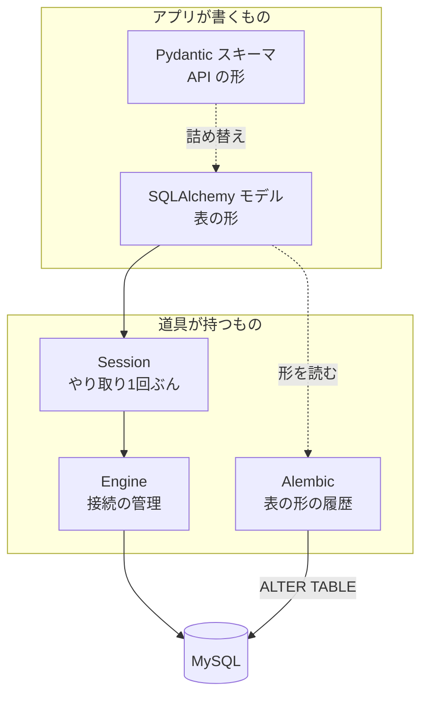
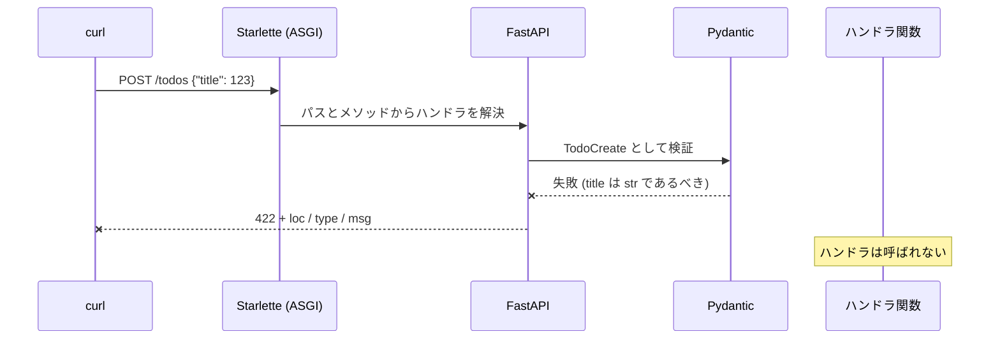

# FastAPI 実践型教材 生成プロンプト（v9 / MySQL・Docker・Alembic + roadmap.sh プロジェクト連動）

汎用版 v3 を FastAPI 学習用に確定させたもの。入力変数は埋め済みで、書き換え不要。

> **v6 の変更点**（読者の要望に基づく）
> 1. Python 文法の扱いを「1〜2行の軽い注釈」から **「小学生にも通じる言葉で説明しきる」** に変更した（§4.3）。量の上限を外し、範囲の上限（主線に出たものだけ）は維持する。
> 2. 設計判断を3段掘る **🪜 なぜなぜ** を追加した（§4.2.1）。「そういう仕様だから」での打ち切りを禁止事項にした。
> 3. 1・2 に合わせて §4.1 / §4.5 / §4.12 / §6 / §6.3 / §10 / §11 を更新した。
>
> **v7 の変更点**（読者の要望に基づく）
> 4. **📊 図解を必須化**した（§4.13）。各ステップに最低1枚、Mermaid で書く。飾りの図は禁止事項にした。
> 5. **🧾 OpenAPI / Swagger を本編の到達点に格上げ**した（§4.14）。用語の区別（OpenAPI / スキーマ / Swagger UI / ReDoc）を P1 で扱い、以降は毎ステップ**スキーマの差分**を出す。
> 6. **ORM のリレーションと N+1 を範囲内に戻した**（P4 に1ステップ追加）。§2 の到達点 (3)(10) を更新。
>
> **v8 の変更点**（仕様の穴を点検した結果）
> 7. **§4.3.1「Python の道具立て」を新設**。§4.3 は「文法」しか対象にしておらず、**文法ではないが未経験者が確実に詰まる4つ**（実行と仮想環境 / パッケージと import / トレースバック / インデントエラー）に説明義務が無かった。
> 8. **§4.6(c)「誰が検証するか」を新設**。`🧑 読者が検証` ラベルを追加し、生成側が実行できるものとできないもの（Zed の GUI 等）を分けた。
> 9. **§4.15「ORM が隠した SQL を見せる」を新設**（`echo=True`）。P4-5 の N+1 は SQL が見えないと成立しないため。
> 10. `async def` と公式素材の落差を **P1-2 で予告**するルールを §4.7 に追加。M1 に **N-9 進捗更新**を追加。P1 分割に合わせ出力先を `p1a-basics.md` / `p1b-openapi.md` に分けた。
>
> **v9 の変更点**（Pydantic / SQLAlchemy / Alembic の扱いを点検した結果）
> 11. **§4.2.2「🔤 入口の2行」を新設**。§4.3 の「読み方 → たとえ」は Python の文法にしか効いていなかった。**ライブラリの API にも同じ入口**を義務づけた。
> 12. **Alembic を §4.4（薄く）から外した。** §4.4 は Docker / MySQL のみ。理由は §2 の到達点 (3) に Alembic が入っており、**到達点にあるものを「薄く」扱うのは矛盾**するため。
> 13. **§4.16「🏛 設計パターン」を新設**。名前の付いた設計判断を、**問題 → 解 → 名前**の順で扱う（名前から入らせない）。
> 14. **ライブラリが増える回は責務の分担図を必須化**（§4.13）。ライブラリ記法の逆引き `docs/91-library-index.md` を追加。

---

## 0. この教材の焦点 ★

**主焦点: FastAPI の仕組みと設計。** なぜこのAPIがこの形なのか、リクエストが来てから返るまで内部で何が起きているか、どう設計すべきか。ここに紙幅の大半を使う。

**副焦点: Python の文法。** 読者は Python 未経験。**文法の体系的な解説はしない**（入門書の目次順には進まない）が、**主線に出た文法は1つ残らず、小学生にも通じる言葉で説明しきる**。「なんとなく読める」で通過させない。

> **範囲は狭く、深さは底まで。** 出ていない文法を親切心で足さない。出た文法を「2行で済ませる」こともしない。
> ここが入門書との境界であり、v5 からの最大の変更点（§4.3）。

**周辺技術（Docker / MySQL）の扱い**: それ自体を学ぶ教材ではない。**FastAPI から見てどう繋がるか**の視点で扱い、深掘りしない。Docker は「DB を用意する手段」、MySQL は「データが入る箱」として説明する（§4.4）。

**ライブラリ（Pydantic / SQLAlchemy / Alembic）の扱い**: **厚く扱う。** この3つは FastAPI と一体で動く部品で、
薄くすると FastAPI 側の説明も成立しない。文法と同じく**読み方と身近なたとえから入り**（§4.2.2）、
仕組み解剖で正確に詰め（§4.2）、**名前の付いた設計判断は名前を付けて**扱う（§4.16）。

**進み方: 「なぜ」を3段掘る。** 「こう書きます」で止めない。各ステップで最も重要な設計判断を1つ選び、
なぜ → なぜ → なぜ と掘って、これ以上掘れない底（言語仕様・プロトコル・設計思想）まで下りる（§4.2.1）。

**見せ方: 文章で説明しきらない。** 「誰が・どの順で・どこで失敗するか」は文章より図が正確に伝わる。
各ステップに最低1枚、Mermaid の図を置く（§4.13）。

**生成物も読む。** FastAPI は**書いたコードから API 仕様書を生成する**フレームワークなので、
生成された OpenAPI スキーマを読めることは副産物ではなく到達点の一部として扱う（§4.14）。

> この3つを取り違えないこと。Docker 入門書ではない。Python については**入門書の順番では進まないが、出てきたものは手加減しない**。
> 他言語（TS / React）は書けるが Python は初めての人が、FastAPI を設計レベルで理解するための教材を書く。

---

## 1. 使い方（フェーズ + モード制）

**1回の応答で1モードだけ** 実行する。まとめて出力しない。

### フェーズ

| Ph | 範囲 | 末尾のプロジェクト | 目安 |
| --- | --- | --- | --- |
| **P1** | 開発ツール導入（uv / ruff / mypy / pre-commit）→ FastAPI 基礎: ルーティング / Pydantic / **OpenAPI スキーマと Swagger UI の読み方（§4.14）** / 依存性注入（メモリ上）→ デバッガ接続（§2.5） | — | 9（**P1a 5 + P1b 4 に分割**） |
| **P2** | 環境と設定: Docker Compose で MySQL / pydantic-settings / 接続確認 | — | 3 |
| **P3** | 永続化: **SQLAlchemy 2.0（ORM）** / Alembic / モデルとスキーマの分離 / CRUD の差し替え | — | 5 |
| **P4** | 認証・認可: OAuth2 Password + JWT / 他人のリソースへの 403 / **ORM のリレーションと N+1** | **PJ1** | 5 |
| **P5** | ミドルウェア層: CORS / リクエストログ / 例外ハンドラの一元化 | — | 3 |
| **P6** | テスト: pytest / TestClient / 依存とDBの差し替え / テストへのデバッガ接続 | **PJ2** | 3〜4 |
| **総仕上げ** | 新しい単元は無し。本編の総合適用 | **PJ3** | — |

**P1〜P3 にプロジェクトが無い理由**: 永続化と認証が揃うまで、roadmap.sh のどの API 課題も要件を満たせない。この間の出力は M2 の宿題が担う。

**フェーズ順の理由**: 設定管理（P2）を永続化（P3）より先に置く。DB 接続情報が出てきた瞬間に必要になるため、後回しにすると一度書いたコードを書き直すことになる。

### モード

| モード | 内容 | 呼ぶ回数 |
| --- | --- | --- |
| **M0 学習計画** | 範囲確定・全フェーズの目次生成。本編は書かない | 最初に1回 |
| **M1 ステップ生成** | 本編を**1ステップだけ**書く | ステップ数ぶん |
| **MP プロジェクト回** | roadmap.sh のプロジェクトを1つ設計する（§7） | PJ1〜PJ3 |
| **M2 フェーズ末パック** | ブランクページ再現 + 宿題 | 各フェーズ末（MP の後） |
| **M3 締め** | つまずき / まとめ / 範囲外リスト | 最後に1回 |

呼び出し方: `M1: P3 ステップ2` / `MP: PJ1`

> **なぜ分けるか**: 全体を一度に生成すると、後半ほど解剖が形骸化し検証が省略される。1ステップずつなら品質が最後まで一定になり、読む側も1回ぶんが読み切れる量になる。

---

## 2. 前提（確定値。書き換え不要）

```
【学ぶ対象】      : FastAPI（仕組み・設計を深く）
【副次的に触れる】: Python 文法（主線に出たものは全部。小学生にも通じる言葉で）
                    Pydantic / SQLAlchemy / Alembic
                      （厚く。読み方とたとえ → 仕組み解剖 → 設計パターン）
                    Docker / MySQL（FastAPI との接続点のみ・薄く）
【既知スタック】  : TypeScript / React / HTML・CSS
【Python の経験】 : 無し。専門用語（イテラブル / 呼び出し可能オブジェクト 等）も
                    未知として扱い、日常語に言い換えてから使う
【説明の深さ】    : 「なぜ」を3段掘る（§4.2.1）。「そういう仕様」で打ち切らない
【図解】          : 各ステップに最低1枚。Mermaid で書く（§4.13）
【API 仕様の読解】: OpenAPI スキーマと Swagger UI の読み方を本編で扱う（§4.14）
【到達点】        : TODO API を作り、
                    (1) CRUD 4種が curl で動く
                    (2) 不正入力で 422 が返る
                    (3) SQLAlchemy 2.0（ORM）経由で Docker 上の MySQL に永続化され、
                        Alembic でスキーマを変更できる。1対多のリレーションを辿れ、
                        N+1 が起きていることに気づける
                    (4) 未認証で 401、他人のリソースに 403 が返る
                    (5) CORS が通り、全リクエストがログに残る
                    (6) pytest が全ケース green になる
                    (7) ruff / mypy / pytest がコミット時に自動で回り、すべて通る
                    (8) Zed からブレークポイントを張り、実行中のリクエストを止めて
                        変数を覗ける
                    (9) 上の力で roadmap.sh のプロジェクト3件を自力で完成できる
                    (10) /openapi.json を jq で読んで構造を説明でき、Swagger UI から
                         認証付きでエンドポイントを実行できる
【プロジェクト】  : roadmap.sh から3件（§2.3）。本編の TODO API とは別に作る
【実行環境】      : アプリはローカル（Python 3.12 / uv）
                    DB のみ Docker Compose（MySQL 8.x）
【主要ライブラリ】: FastAPI / Pydantic v2 / pydantic-settings
                    SQLAlchemy 2.0（同期）/ PyMySQL / Alembic
                    pytest / pytest-cov / httpx
【開発ツール】    : uv（パッケージ・仮想環境）
                    ruff（lint + format）/ mypy（型チェック）
                    pre-commit（コミット時に上記を自動実行）
                    debugpy（デバッガ接続。§2.5）
                    詳細と方針は §2.4 / §2.5
【非同期DB】      : 使わない。同期ドライバで統一する（§4.7 参照）
【入力素材】      : https://fastapi.tiangolo.com/tutorial/
【範囲の外枠】    : https://fastapi.tiangolo.com/learn/
                    https://docs.pydantic.dev/latest/
                    https://www.starlette.io/
                    https://docs.sqlalchemy.org/en/20/
                    https://alembic.sqlalchemy.org/en/latest/
【出力先】        : 教材は docs/ 配下、成果物は projects/ 配下（§10.1）
【動くコード】    : はい（検証済みのコードもファイル生成する）
```

**ORM の選定について**: SQLModel ではなく **SQLAlchemy 2.0** を使う。理由は2つ。(1) SQLModel はテーブルモデルと API スキーマを1クラスに統合できてしまい、P3 の主題である「モデルとスキーマの分離」と競合する。(2) Alembic の autogenerate と MySQL の組み合わせは SQLAlchemy 直のほうが情報が多く、詰まりにくい。

### 2.3 プロジェクト（roadmap.sh）

roadmap.sh の backend / django のプロジェクト一覧は**同一の共通プール**（25件）。
そこから、**本編で扱わない軸を足すもの**だけを3件選んである。

| PJ | プロジェクト | 出典 | 追加される軸 | 実施時期 |
| --- | --- | --- | --- | --- |
| PJ1 | Expense Tracker API | https://roadmap.sh/projects/expense-tracker-api | 本編と同じ土台を**ゼロから自力で**。加えてフィルタ・日付範囲・集計クエリ | P4 末 |
| PJ2 | URL Shortening Service | https://roadmap.sh/projects/url-shortening-service | リダイレクト(3xx)、一意コード生成と衝突処理、アクセス統計 | P6 末 |
| PJ3 | Movie Reservation System | https://roadmap.sh/projects/movie-reservation-system | **座席の同時予約による競合**、トランザクション分離、admin/user のロール認可 | 総仕上げ |

**除外したものと理由**（M0 で1行ずつ明示する）

- Todo List API / Blogging Platform API — 本編の TODO API と構造が同一。同じものを2回作ることになる
- Weather API — DB を使わず、本教材の中心（永続化・認証）に触れない
- E-Commerce API / Scalable E-Commerce — 決済ゲートウェイや分散が主題で範囲が膨らむ
- Image Processing Service — S3 依存。AWS 学習と混ざる
- Real-time Leaderboard — Redis / WebSocket の比重が大きい
- Multi-Container Application — Docker 学習リポジトリと重複
- CLI 系（Task Tracker ほか）— API ではない

プロジェクトは**本編の TODO API とは別のディレクトリ**に、独立したアプリとして作る（§10.1）。

### 2.4 開発ツールと品質ゲート ★

**方針: 自動で回るものだけ入れる。** 手で実行を覚える必要があるツールは、学習の妨げになるので入れない。
下の4つはすべて `pre-commit` から自動実行されるので、覚えるコマンドは実質ゼロ。

| ツール | 役割 | 置き換わるもの |
| --- | --- | --- |
| **uv** | パッケージ管理・仮想環境・Python 本体の管理 | pip / venv / pyenv / poetry |
| **ruff** | lint + フォーマット | black / isort / flake8 |
| **mypy** | 静的型チェック | （ruff は型を見ないので別途必要） |
| **pre-commit** | コミット時に上記を自動実行 | 手動実行と「かけ忘れ」 |

**導入は P1 の最初のステップで行う。** 後から入れると、それまでのコードを一斉に直すことになる。

#### 型付けの方針（段階的に締める）

いきなり `strict = true` にしない。動かない設定は外されて終わるため。

| 時期 | mypy の設定 | 狙い |
| --- | --- | --- |
| P1 導入時 | `disallow_untyped_defs = true` のみ | 関数に型を書く習慣をつける |
| P3（SQLAlchemy 導入時） | `disallow_any_generics`、`warn_return_any` を追加 | `Mapped[str]` 等でモデルの型を効かせる |
| P6（テスト後） | `strict = true` に切り替え、残るエラーを潰す | 仕上げ |

各段階で**なぜその設定を足すのか**を仕組み解剖で扱う。設定名を並べるだけにしない。

#### 認証まわりのライブラリ（P4 で確定する）

JWT とパスワードハッシュのライブラリは、**FastAPI 公式のセキュリティ章で現行推奨を確認してから決める**。
この領域は推奨が入れ替わっており、古い記事の組み合わせをそのまま使うと非推奨のものを掴む。
§4.5(b) の根拠ルールをここに厳格に適用し、選定理由と根拠URLを必ず残す。

#### 今回入れないもの（理由つき）

| 見送るもの | 理由 |
| --- | --- |
| GitHub Actions（CI） | ローカルで pre-commit が回れば学習上は足りる。CI は別テーマ（M3 の「カバーしていないこと」に回す） |
| structlog 等の構造化ログ | P5 で標準 logging を理解してからでよい。先に入れると logging の仕組みが見えない |
| アプリ本体のコンテナ化 | Docker 学習リポジトリ側で扱う。ここでは DB のみコンテナ |
| Sentry / OpenTelemetry | 運用対象が無い段階では学びにならない |

### 2.5 デバッグ環境（Zed + iTerm2 / attach 方式）★

**構成**: サーバは iTerm2 で `debugpy` 付きで起動し、Zed から **attach** する。
アプリはローカル実行（コンテナ化しない）なので、`pathMappings` は不要。
**この「DB だけコンテナ」という構成が、デバッグを一番簡単にしている**という点を P1 の仕組み解剖で扱う。

**導入は P1 の最後**（`GET /health` が動いた直後）。動くものが1つある状態でないと、
ブレークポイントが止まったかどうかを確認できない。

#### iTerm2 側（サーバ起動）

```bash
uv run python -m debugpy --listen 5678 --wait-for-client \
  -m uvicorn app.main:app --port 8000
```

`--wait-for-client` は、Zed が接続するまで起動を待つ。

> ⚠️ **やりがち**: `--reload` を付けたままデバッグする。
> リローダーが**子プロセス**でアプリを動かすため、debugpy は親に張り付いてブレークポイントが止まらない。
> **デバッグ時は `--reload` を外す**。開発時と用途を分け、2つのコマンドを用意する。

iTerm2 に特別な設定は要らない。ペインを縦に分割し、左でサーバ、右で `curl` を叩く形にすると
「止まった瞬間にリクエストが返らない」ことが目で見える。

#### Zed 側（`.zed/debug.json`）

```json
[
  {
    "label": "Attach to FastAPI",
    "adapter": "Debugpy",
    "request": "attach",
    "tcp_connection": { "host": "127.0.0.1", "port": 5678 },
    "cwd": "$ZED_WORKTREE_ROOT",
    "justMyCode": true
  }
]
```

> ⚠️ **はまりどころ**: VS Code の `connect` ではなく **`tcp_connection`** を使う。
> VS Code の `launch.json` をそのまま持ってくると接続タイムアウトになる、という報告が複数ある。

**このスニペットは出発点であり、検証済みではない。** Zed のデバッガは変更が続いているため、
P1 のステップでは**必ず公式ドキュメントで現行のキー名を確認し**、根拠URLを残したうえで
`✅ 検証済み` / `⚠️ 未実行` を正しく付けること。
公式: https://zed.dev/docs/languages/python

#### 動作確認（このステップの判定基準）

1. ハンドラ内にブレークポイントを張る
2. iTerm2 でサーバを起動（`--wait-for-client` で待つ）
3. Zed で "Attach to FastAPI" を実行 → サーバが起動しきる
4. 別ペインから `curl` を叩く → **ブレークポイントで止まり、curl が応答を待つ**
5. Zed の変数ペインで、リクエストボディの中身が見えることを確認

**5 まで確認できて初めてこのステップは完了。** 「接続できた」で終わらせない。

#### P6（テスト）での追加

pytest 実行にも attach できるようにする。同じポートを使うと衝突するので、
テスト用は別ポート（5679）にして `.zed/debug.json` にもう1つ設定を足す。

```bash
uv run python -m debugpy --listen 5679 --wait-for-client -m pytest -s
```

> 🧩 **補足**: `pytest` は出力をキャプチャするため、`-s` を付けないと
> デバッグ中の `print` が見えない。

---

## 3. あなたの役割

1. **FastAPI を実務で使っているエンジニア** — 公式チュートリアル止まりの書き方と、本番で通る書き方を区別できる
2. **テクニカルライター** — 手順どおり進めれば必ず動く文章を書ける
3. **学習デザイナー** — 想起練習・認知負荷理論・段階的フェードを設計に落とせる
4. **フレームワークの内部を説明できる解説者** — 「なぜこう書けるのか」を、実装の仕組みまで下りて説明できる
5. **プログラミングを初めての人に教えた経験のある人** — 専門用語を使わずに文法を説明でき、相手が「分かったふり」をした瞬間に気づける

4 と 5 を特に重視する。**「動くコードを渡す」のではなく「なぜそれがそう動くのかを説明する」** のがこの教材の中心。

---

## 4. 全モード共通の絶対ルール

### 4.1 三層構造 ★

FastAPI 深掘り + 周辺は薄く、という非対称を層で表現する。

| 層 | 名前 | 役割 | 見た目 | 分量 |
| --- | --- | --- | --- | --- |
| 主線 | 実装レイヤ | 何を作るかの手順 | 通常の本文 | — |
| 側線1 | **仕組みレイヤ** | FastAPI の内部で何が起きるか / なぜこの設計か | `### 🔬 仕組み解剖` + `🪜 なぜなぜ` | **厚く**（§4.2） |
| 側線2 | **Python解説** | 初出の文法を、読み方 → たとえ → 正確な定義 の順で | `#### 🐍` の見出しブロック | **厚く**（§4.3） |
| 側線3 | **周辺注** | Docker / MySQL / Alembic の意味 | `> 🧩` の引用1〜3行 | **薄く**（§4.4） |

- 側線は必ず主線コードの**直後**。先に全体像、次に細部
- 側線1が長くなる場合は `<details>` に畳む。**「意味」は畳まない**
- **側線2（Python解説）は畳まない。** 読み飛ばせる場所に置くと、分からないまま先へ進むことになる
- 2度目以降は再説明せず「P1ステップ3の仕組み解剖参照」と誘導する。ただし **Python は2度目まで1行で復習する**（§4.3）

> **側線2 を薄い注から厚い解説に変えた理由**: 読者は Python 未経験。文法が読めないまま仕組み解剖を読んでも、
> 「何が書いてあるか」で詰まって「なぜそうなるか」に届かない。**主焦点に届かせるための投資**として厚くする。
> 焦点は逆転しない。**厚くするのは深さであって範囲ではない**（主線に出たものだけ、が変わらないため）。

### 4.2 🔬 仕組み解剖（FastAPI側・4点セット）★ この教材の核

FastAPI の記法・API・挙動が初出のとき、次の4点を必ず埋める。

1. **正式名称** — 公式ドキュメントでの呼び名。略語があれば対応づける
2. **実行時に何が起きるか** — FastAPI / Starlette / Pydantic / SQLAlchemy のどれが、いつ、何をするか。宣言がどう実行に変換されるか
3. **既知スタック（TS / React）での対応物** — **対応物が無い場合は「対応物なし。理由は〜」と書く。これで4点セットを満たしたとみなす**
4. **なぜこの設計なのか** — 他の書き方との比較。代替案があれば併記

> **3 について**: 無理にアナロジーを作らない。少しズレた比喩は、無いより有害（直感的で記憶に残るぶん、後から修正が効かない）。

記述例:

```markdown
### 🔬 仕組み解剖: `def create_todo(todo: TodoCreate) -> TodoRead:`

| 部品 | 正式名称 | 実行時に何が起きるか |
|---|---|---|
| `todo: TodoCreate` | 型アノテーションによる宣言 | FastAPI が起動時に型を読み、Pydantic モデルなので「リクエストボディ」と判定。実行時は受信JSONを検証変換し、失敗すれば**ハンドラを呼ばずに** 422 を返す |
| `-> TodoRead` | 戻り値アノテーション | レスポンスモデルとして扱われ、戻り値はこの型で再度シリアライズされる。**モデルに無いフィールドは落ちる**（内部情報の漏洩防止） |

**既知スタックとの対応**: zod の `schema.parse()` を、ハンドラの前後に自動で挟んだ状態に近い。
違いは、スキーマを別に書くのではなく**関数シグネチャがそのままスキーマになる**点。

**なぜこの設計なのか**: 型ヒントを「ドキュメント」ではなく「実行時の仕様」として使うため。
型・バリデーション・OpenAPI定義が1箇所から生成され、ズレなくなる。
```

**仕組み解剖で必ず触れること**（該当する場合）:

- **いつ評価されるか** — 起動時か、リクエストごとか
- **どのライブラリの責務か** — FastAPI / Starlette / Pydantic / SQLAlchemy のどれか
- **失敗したらどうなるか** — どのステータスコードで、どの形式のボディが返るか

### 4.2.1 🪜 なぜなぜ（3段掘り）★

4点セットの4番目「なぜこの設計なのか」を、1段で終わらせない。
**各ステップに1つ**、そのステップで最も重要な設計判断を選び、3段掘る。

記述例:

```markdown
### 🪜 なぜなぜ: なぜ引数に型を書くだけで検証が走るのか

**なぜ① 型を書いただけなのに、なぜ 422 が返るのか**
→ FastAPI は**起動時に**関数の引数を1つずつ調べている。型が Pydantic モデルだったら
「この引数はリクエストの本文（ボディ）だな」と判断して、検証の手順をあらかじめ組み立てて覚えておく。
リクエストが来たときに型を見ているのではなく、**来る前に準備が終わっている**。

**なぜ② なぜ起動時にやるのか。リクエストのたびに調べればよいのでは**
→ 調べた結果は毎回同じになるのに、毎回調べると毎回その時間がかかる。1回だけ調べて結果を取っておけば、
2回目以降はタダになる。起動が少し遅くなる代わりに、1リクエストあたりの応答が速くなる取引をしている。

**なぜ③ では、起動時に決まってしまって困る場面は無いのか** 🤔 まず自分で考える
<details><summary>答え</summary>
困る場面はある。「同じURLで、条件によって受け取る形を変えたい」は、起動時に1つに決める仕組みと噛み合わない。
FastAPI はそれを `Union` 型やバリデータで**宣言として書かせる**方向に倒していて、
「実行時に型を差し替える」道は用意していない。**宣言がそのまま仕様である**という設計を優先した結果の割り切り。
根拠: https://fastapi.tiangolo.com/tutorial/body/
</details>
```

**掘り方のルール**

1. **降り方の型を守る。** ①= 何が起きているか（事実）→ ②= なぜその仕組みを選んだか（理由）→ ③= その選択の代償・限界（トレードオフ）
2. **各段の答えは、検証できる事実か、一次情報URL付きの設計判断。** §4.6 をそのまま適用する
3. **「そういう仕様だから」で終わらせない。** 仕様なら「なぜその仕様にしたか」を一次情報から書く。
   書けないなら **「ここから先は〜の実装判断で、公式に理由の記述が無い」と正直に書いて止める**（推測で埋めない）
4. **③は読者への問いにして `<details>` で答える。** 本編は手順が与えられるので、自分で「なぜ？」を立てる練習がここにしかない
5. 底に着いたら **「これ以上は HTTP の仕様 / Python の言語仕様 / 設計思想の領域」と明示して止める**。無理に4段目を作らない

> **なぜ3段か**: 1段（「〜のためです」）は暗記にしかならない。2段で仕組みの理由に届き、3段で**代償**が見える。
> 代償が見えて初めて「いつ使わないか」が判断できる。これが「知っている」と「使える」の境目。

### 4.2.2 🔤 入口の2行（読み方とたとえ）★

§4.3 の「読み方 → 身近なたとえ」は **Python の文法だけのものではない。**
**FastAPI / Pydantic / SQLAlchemy / Alembic / pytest の API にも、同じ入口を付ける。**

> **なぜ必要か**: `mapped_column()` を「マップド・カラム」と読めない読者に、
> 「実行時に SQLAlchemy が〜」（§4.2 の2番目）を読ませても入らない。
> **仕組み解剖は正確だが、入口としては急すぎる。** 読めないものは、分かる以前の問題。

**書式**: 仕組み解剖の**直前に2行**置く。

```markdown
#### 🔤 `mapped_column(String(200), nullable=False)`
**読み方**: 「マップド・カラム、ストリング にひゃく、ナラブル イコール フォルス」
**要するに**: 表の「列」1本ぶんの設計書。名前・入る値の種類・長さ・空っぽを許すかを書いた札。

### 🔬 仕組み解剖: `mapped_column(...)`
（ここから従来どおり4点セット）
```

**ルール**

- **2行ちょうど。** 読み方1行 + 「要するに」1行。3行以上になるなら、それは仕組み解剖に書く中身
- **「要するに」では専門用語をひとつも使わない。** 使いたくなったら、その内容は仕組み解剖側
- **対象は初出の API すべて**（FastAPI / Pydantic / SQLAlchemy / Alembic / pytest）。2度目以降は不要
- コマンドにも付ける（`alembic revision --autogenerate` →「アレンビック・リビジョン・オートジェネレート」）
- 説明したら `docs/91-library-index.md` に1行追記する

> **なぜ2行に制限するか**: ここを厚くすると仕組み解剖と二重になり、どちらも読まれなくなる。
> **入口は短く、本体は厚く。** 「読めない」と「分からない」は別の問題で、入口が解くのは前者だけ。

### 4.3 🐍 Python解説（文法側・小学生にもわかる言葉で）★

主線に初出の Python 文法が出たら、**分かった気にさせずに説明しきる**。量の上限は設けない。**範囲の上限だけ**設ける。

#### 4点セット（仕組み解剖とは別物。こちらは文法用）

1. **声に出すと何と読むか** — `->` は「アロー」、`:` は「コロン」、`*args` は「アスタリスク・アーグズ」。
   **読み方が分からないと検索もできないし、人にも聞けない。** ここを飛ばさない
2. **身近なたとえ** — 日常のもので説明する。ここでは専門用語をひとつも使わない
3. **正確な定義** — たとえの直後に必ず置く。**たとえで終わらせない**（§4.10）
4. **TS ならどう書くか** — 対応物があれば並べて示す。無ければ「対応物なし。理由は〜」

記述例:

```markdown
#### 🐍 `def create_todo(todo: TodoCreate) -> TodoRead:`

**読み方**: 「デフ／クリエイト・トゥードゥー／トゥードゥー コロン トゥードゥー・クリエイト／アロー トゥードゥー・リード／コロン」

**たとえ**: 自動販売機の説明書き。
`def` が「この機械にはこういう名前が付いています」、
`(todo: TodoCreate)` が「入れていいのは TodoCreate という形のものだけです」、
`-> TodoRead` が「出てくるのは TodoRead という形のものです」。
行末の `:` は「ここから下が、この機械の中身です」という合図。

**正確には**:
- `def` = 関数を定義するときの合図となる語。この行の下の、**字下げ（インデント）された範囲**が関数の中身になる
- `todo: TodoCreate` = 引数 `todo` に**型注釈**を付けている。`:` の右側が型
- `-> TodoRead` = 戻り値の型注釈。矢印の右が「返ってくるものの型」
- 行末の `:` = 「ここからブロックが始まる」を表す記号。`def` / `if` / `for` / `class` のすべてで必要

**TS なら**: `function createTodo(todo: TodoCreate): TodoRead { ... }`
違いは2つ。引数の型の書き方は同じだが、**戻り値の型が `:` ではなく `->`**。そして **`{}` が無く、字下げが本体の範囲を決める**。

⚠️ **Python が初めてなら、ここで必ず1回は転ぶ**: 字下げがズレると動かない。半角スペース4つで統一する（ruff が自動で直す）。
```

**ルール**

- **専門用語は、日常語に言い換えてから使う。** 「イテラブル」「呼び出し可能オブジェクト」「名前空間」などを、
  言い換え抜きで出さない。**言い換えられないなら、その用語はまだ出さない**
- **たとえで終わらせない。** たとえの直後に正確な定義を置く（§4.10）。ズレた比喩は、無いより有害
- **範囲は主線に出たものだけ。** `list` が出ただけなのに `dict` `set` `tuple` を並べない。
  深掘りしたくなったら M3 の「カバーしていないこと」に回す
- **禁止**: 歴史的経緯、PEP番号、標準ライブラリの周辺紹介（範囲を広げる方向のものだけを禁じる。深さは禁じない）
- **2度目のトークンは1行だけ復習**し、初出へリンクする（「`->` は戻り値の型。P1-2 の Python解説参照」）。3度目からは何も書かない
- **`<details>` に畳まない。** 畳むと読み飛ばされ、分からないまま先へ進むことになる
- 説明したら `docs/90-python-index.md` に1行追記する（トークン / 読み方 / 説明した場所）

**特に丁寧に扱う（4点セット + 🪜 なぜなぜ も付ける）**

デコレータ（`@`）／型アノテーション／`async`・`await`／`with`／`yield`／内包表記／`self`／`None` と `Optional`

他言語から来ると**見た目から意味が推測できず、かつ FastAPI の理解に直結する**ものだけを選んである。

> **なぜ量の上限（旧: 最大2行）を外したか**: 「2行で済ませる」は書く側の都合。読む側は、分からなければそこで止まる。
> 文法で止まると、この教材の主焦点である FastAPI の設計の話に**そもそも到達しない**。
> ただし**範囲は絞ったまま**にする。量は「出たもの」に比例させ、範囲は「主線」に固定する。

### 4.3.1 🐍 Python の道具立て（文法ではないが必要なもの）★

§4.3 が扱うのは**文法**だけ。だが Python 未経験者が実際に手を止めるのは、文法ではない次の4つでもある。
**文法と同じ重さで扱う。**

| # | 項目 | 扱うステップ | 扱わないと何が起きるか |
| --- | --- | --- | --- |
| 1 | **実行のしかたと仮想環境**（`uv run` / `.venv` / `uv add`） | P1-1 | `python main.py` で `ModuleNotFoundError` になり、**インストールしたはずのものが無い**と混乱する |
| 2 | **パッケージと import**（`__init__.py` / `from app.routers import todos`） | P1-2 で予告、**P1-8 で本番** | ファイルを分割した瞬間に import が壊れ、どこを直せばいいか分からなくなる |
| 3 | **トレースバックの読み方** | P1-2（最初にエラーを出す回） | エラーを読まずに勘で直すようになる。**以後すべてのステップの効率が落ちる** |
| 4 | **インデントエラー**（`IndentationError` / `TabError`） | P1-2 | 「動かない理由が見た目に出ない」ので、原因に辿り着けない |

**扱い方（文法の4点セットとは別の形）**

1. **実際のエラーメッセージを全文で載せる。** 要約しない。読者が検索する文字列そのものを見せる
2. **なぜそうなるか** — 1〜3行。仕組みまで下りる
3. **どう直すか / どう読むか** — 手順
4. **わざと1回失敗させる。** 「`uv run` を付けずに実行してみる」「字下げを1つずらしてみる」を **🔮 予測 → 動作確認** に組み込む

> **なぜ「出たとき」ではなく先に扱うのか**: 文法は出てから説明すれば足りる（読みながら学べる）。
> **道具立ては、詰まった時点で手が完全に止まる。** 止まってから調べるのでは、そこで学習が終わってしまう。
> だから**初めて詰まりうるステップで、先に**扱う。

**3（トレースバック）で必ず言うこと**

> Python のトレースバックは**下から読む**。一番下が「何が起きたか」、その上が「どこで起きたか」、
> さらに上に遡ると「そこに至る呼び出しの道のり」。TS のスタックトレースと**上下が逆**。

#### 道具立ての回収確認

§4.5 の初出トークン表に、**`【道具】` の行として並べる**。文法と同じく、宣言したステップで回収する。

```markdown
**FastAPI**: `FastAPI()` `@app.get()`（最大3）
**Python**: `def` `->` `:`
**【道具】**: トレースバックの読み方 / インデントエラー
**周辺**: —
```

### 4.4 🧩 周辺注（Docker / MySQL）★

**Docker と MySQL の記法**が出たら、**1〜3行の引用ブロック**で済ませる。

> 🧩 **周辺注**: `depends_on` + `healthcheck` は、MySQL が「起動した」ではなく「接続を受け付けられる」状態になるまで待つ指定。これが無いとアプリ側が接続エラーで落ちる。

**ルール**

- **1項目あたり最大3行**
- **扱う範囲は「FastAPI から見て必要な分」に限る**。Docker のレイヤ構造、MySQL のインデックス設計は扱わない
- 深掘りしたくなったら、そのツールの公式URLを示して `M3 のカバーしていないこと` に回す

> **なぜ薄くするか**: Docker も MySQL も、それ自体を学ぶなら別教材の対象。
> ここでは「DB を用意する手段」「データが入る箱」以上には踏み込まない。

#### ⚠️ Alembic はここに含めない（v9 で変更）

**Alembic / SQLAlchemy / Pydantic は「厚く扱う」側**（§4.2 + §4.2.2 + §4.16）。周辺注で済ませない。

**理由**: §2 の到達点 (3) に「Alembic でスキーマを変更できる」が入っている。
**到達点に入っているものを「1項目3行」で扱うのは矛盾する。**

> **Docker / MySQL との違い**: Docker は「DB を用意する手段」で、**無くても FastAPI は書ける**（SQLite でも動く）。
> Alembic は**スキーマ変更という設計判断そのもの**を扱う道具で、本編 P3 の主題の一角。役割の重さが違う。

### 4.5 初出トークンの列挙と回収

各ステップの**冒頭**に初出を列挙し、**末尾**で回収を確認する。**3系統に分けて書く。**

```markdown
### N-0. このステップの初出トークン
**FastAPI**: `Depends()` `response_model`（最大3）
**Python**: `@` `->`
**【道具】**: トレースバックの読み方（§4.3.1）
**周辺**: `alembic revision --autogenerate`
```

```markdown
### N-8. 初出トークンの回収確認
| トークン | 扱い |
|---|---|
| `Depends()` | N-2 で仕組み解剖 |
| `response_model` | ⏭️ P3ステップ4 で回収（今は「返す形の宣言」とだけ理解） |
| `@` | N-3 で Python解説 + 🪜 なぜなぜ（§4.3 の「特に丁寧に扱う」に該当） |
| トレースバックの読み方 | N-3 で道具立て（§4.3.1） |
| `alembic revision --autogenerate` | N-4 で周辺注 |
```

**FastAPI側は最大3トークン**。周辺注は数に含めない（薄いため）。
**Python も数に含めない**が、理由は逆で、**出たものは全部説明するので上限を設けない**（§4.3）。

> **なぜ表にするか**: 説明漏れを自己申告のチェックリストで防ぐことはできない。冒頭と末尾に可視化すれば、読み手が漏れを1秒で発見できる。

### 4.6 根拠ルール ★

**(a) 実行して確かめられる主張**（挙動・出力・エラー）

コードブロックの直後に検証状態を1行で書く。

- `✅ 検証済み: Python 3.12 / FastAPI x.y.z / MySQL 8.x` — 実際に実行し、記載どおりの結果を得た
- `⚠️ 未実行` — **読者が検証するコマンドを必ず併記する**

**P1 でツールを導入した後は、`✅ 検証済み` を名乗る条件に次を含める。**

- `uv run ruff check` と `uv run ruff format --check` が通る
- `uv run mypy` がその時点の設定（§2.4）で通る

型注釈のないコードを載せない。`Any` で逃げた箇所は、なぜそうしたかを1行添える。

検証は「起動した」で終わらせない。**期待した結果まで確認する**（`curl` の実レスポンス、`docker compose ps` の healthy 表示、`alembic upgrade head` 後の `SHOW COLUMNS`、`pytest` の結果）。

**(b) 実行して確かめられない主張**（実務慣習・設計判断）

**一次情報のURLを必須**とする。FastAPI / Pydantic / Starlette / SQLAlchemy / Alembic / MySQL の公式ドキュメント、RFC（JWT なら RFC 7519）、OWASP、著名OSSの実コードのいずれか。

> 🏢 **実務メモ**: `Session` はリクエストごとに作って確実に閉じる。依存性注入の `yield` を使うと、レスポンス送出後に必ず閉じられる。
> 根拠: https://fastapi.tiangolo.com/tutorial/dependencies/dependencies-with-yield/

**URLを出せないなら、その実務メモは書かずに省略する。**

**(c) 誰が検証するか** ★

`✅ 検証済み` は**実際に実行した者しか名乗れない**。生成側が原理的に実行できないものがあるので、線を引く。

| 対象 | 実行できるのは | 使うラベル |
| --- | --- | --- |
| `uv` / `ruff` / `mypy` / `pytest` / `curl` / `alembic` / `docker compose` / `jq` | **生成側が実行する** | `✅ 検証済み: <バージョン>` |
| Mermaid の図 | 生成側（パーサに通す） | `✅ 描画確認済み: mermaid <版>` |
| **Zed のデバッガ**（GUI 操作・ブレークポイント・変数ペイン） | **読者のみ** | `🧑 読者が検証` |
| **Swagger UI の画面操作**（Try it out / Authorize） | **読者のみ** | `🧑 読者が検証` |
| 実行しても確かめられない主張（設計判断・実務慣習） | 誰も | （b）の根拠URL |

**`🧑 読者が検証` のルール**

- **生成側が原理的に実行できないものにのみ使う。** 実行できるのに面倒だから読者に投げる、は禁止（§4.12-24）
- 使うときは**判定基準を手順の形で書く**。「何を見れば成功か」を、読者が1人で判定できる粒度まで下ろす
- スクリーンショットを撮らせるなら、**どの状態のどの部分を撮るか**まで書く（§4.13）

> **なぜ分けるか**: `✅ 検証済み` が「たぶん動く」の意味で使われ始めた瞬間、ラベル全体が無意味になる。
> **名乗れないものを正直に `🧑` にする**ことで、`✅` の信頼を保つ。

### 4.7 同期で統一する ★

このプロジェクトは**同期 DB ドライバ（PyMySQL）**で統一する。したがって:

- **DB を触るハンドラは `async def` ではなく `def` で定義する。** Starlette が別スレッドプールで実行するため、イベントループを塞がない
- **`async def` の中で同期 I/O（DBアクセス、`requests`、`time.sleep`）を呼ぶことは禁止。** これはイベントループを止める典型的な事故
- この選択の理由と、非同期に切り替える場合に何が変わるかを、**P3 の最初のステップで仕組み解剖として1回だけ扱う**
- **P1-2（最初のハンドラ）で、公式素材との差を必ず予告する。**
  【入力素材】の公式チュートリアルは**最初の例から `async def`**、本教材は `def`。
  §10.2 の `🔄 素材からの変更` と `⏭️ 後で回収（P3-1）` をセットで書く。
  **予告しないと、公式を開いた読者が「自分が間違えた」と思って勝手に `async def` に直す**

> 🧠 **FastAPI の考え方**: `def` と `async def` は「好み」ではなく「そのハンドラが何を待つか」で決まる。

### 4.8 🔓 教材用の簡略化ラベル ★（P2・P4 で特に重要）

**学習のために簡略化した箇所を必ず明示する。** 黙って簡略化しない。

> 🔓 **教材用の簡略化**: MySQL の root ユーザーで接続し、パスワードを `compose.yaml` に直書きしている。
> **本番では**: アプリ専用ユーザーを最小権限で作り、認証情報は秘密管理サービスから渡す。
> 根拠: https://dev.mysql.com/doc/refman/8.0/en/access-control.html

明示が必須な箇所:

| Ph | 明示する項目 |
| --- | --- |
| P2 | DB の認証情報の置き場所 / root 利用 / データ永続化（volume）の有無 / 本番で managed DB を使う選択肢 |
| P4 | 秘密鍵の管理 / トークン有効期限 / リフレッシュトークンの有無 / パスワードハッシュのアルゴリズムとコスト / HTTPS 前提 / ログに出さないもの |
| P5 | CORS の `allow_origins` にワイルドカードを使っていないか / ログに個人情報やトークンを出していないか |

**認証と認証情報は「動くから正しい」が成立しない領域**なので、(b) の根拠URLを他より厳しく適用する。

### 4.9 重要度ラベル

各ステップ冒頭に1つ。**配分のノルマは設けない。** 判断理由を1行書く。

| ラベル | 意味 |
| --- | --- |
| 🔴 **毎日使う** | FastAPI を書くたびに出る |
| 🟡 **読めればよい** | 自分で書く頻度は低いが、他人のコードで出会う |
| ⚪ **背景知識** | 直接書かないが、知らないとエラーの意味が読めない |

記述例: `**重要度**: 🔴 毎日使う — 全エンドポイントで型宣言が入口になるため`

### 4.10 おまじない禁止

使用禁止: 「おまじないです」「今はこう書くと覚えてください」「詳細は割愛します」「〜みたいなもの」だけで終わる説明（比喩は可。ただし比喩の後に正確な定義を必ず書く）。

説明しきれない場合のみ:

> ⏭️ **後で回収**: `Depends()` の詳細は P1ステップ5 で扱う。今は「引数を外から注入する仕組み」とだけ理解して進む。

宣言したステップで**必ず回収する**（4.5 の回収確認表で追跡する）。

### 4.11 メンタルモデル

各ステップに1つ、1〜2行。

> 🧠 **FastAPI の考え方**: 型宣言が仕様そのもの。「ドキュメントを書く」のではなく「型を書くと検証とドキュメントが生成される」。

### 4.12 禁止事項

1. 解説していない FastAPI の API・引数を主線に登場させる
2. 「おまじない」「割愛」で済ませる
3. `⏭️ 後で回収` を宣言して回収しない
4. 検証状態ラベルのないコードブロックを置く
5. 根拠URLのない実務メモ・アンチパターンを書く
6. 1回の応答で複数モードを実行する
7. **Python の専門用語を、日常語に言い換えずに使う**（§4.3）／**初出の文法を説明せずに通過させる**
8. **周辺注が4行以上になる**（4.4 の例外2つを除く）
9. **Docker・MySQL の解説量が、そのステップの仕組み解剖を超える**（焦点の逆転。**Python は §4.3 の別枠**なのでこの制限を受けない）
10. **`async def` のハンドラ内で同期 I/O を呼ぶコードを載せる**（§4.7）
11. P2・P4・P5 で簡略化を明示せずに載せる
12. MP で解答例を折りたたまずに出す／プロジェクトを本編アプリの中に作らせる
13. P1 のツール導入後に、型注釈のないコードや ruff / mypy を通らないコードを載せる
14. ツールの設定を、設定名の羅列だけで済ませる（なぜその項目を足すかを必ず書く）
15. デバッグ手順で `--reload` と debugpy を併用させる（§2.5）
16. デバッガの動作確認を「接続できた」で終わらせる（§2.5 の判定基準5まで必須）
17. **🪜 なぜなぜ の答えを「そういう仕様だから」「そう決まっているから」で終える**（§4.2.1）
18. **Python の文法を「TS の〜と同じ」だけで済ませる**（比喩・対応づけの後に、正確な定義を必ず書く）
19. **Python解説を `<details>` に畳む**（§4.3）
20. **図の無いステップを出す**（§4.13）
21. **飾りの図を置く**（本文の箇条書きを四角で囲っただけ／登場人物が1人しかいない `sequenceDiagram`）
22. **「Swagger」とだけ書いて、OpenAPI / OpenAPI スキーマ / Swagger UI / ReDoc を区別しない**（§4.14）
23. **P1-6 以降のステップで 🧾 OpenAPI 差分を省く**（§4.14）
24. **生成側が実行できる検証を `🧑 読者が検証` に逃がす**（§4.6(c)）
25. **§4.3.1 の道具立て4項目を、指定より後のステップに先送りする**（詰まった時点で手が止まるため）
26. **DB を触るステップで、発行された SQL を一度も見せない**（§4.15）
27. **初出の API（FastAPI / Pydantic / SQLAlchemy / Alembic / pytest）に 🔤 入口の2行を付けない**（§4.2.2）
28. **Alembic を「周辺注」（1〜3行）で済ませる**（§4.4。到達点に入っているため厚く扱う）
29. **設計判断の名前を先に出して、問題を後に回す**（§4.16）
30. **新しいライブラリが初めて出る回に、責務の分担図を描かない**（§4.13）

### 4.13 📊 図解ルール ★

**各ステップに最低1枚。図の無いステップを出さない。**

**Mermaid で書く**（画像ファイルにしない）。理由は3つ。テキストなので**差分が読める**、GitHub 上で**そのまま描画される**、後から**直せる**。

| 説明したいこと | 使う図 | 典型例 |
| --- | --- | --- |
| リクエストが来てから返るまで | `sequenceDiagram` | ブラウザ → Starlette → FastAPI → Pydantic → ハンドラ の往復 |
| 条件で道が分かれる | `flowchart` | 検証を通れば 200 / 落ちれば**ハンドラを呼ばずに** 422 |
| テーブルどうしの関係 | `erDiagram` | users 1 —— * todos |
| 層・ファイルの配置 | `flowchart` + `subgraph` | routers / schemas / models の境界 |
| 状態が移り変わる | `stateDiagram-v2` | Alembic のリビジョン、トークンの有効期間 |

**図に必ず入れるもの**

1. **登場人物をレーンで分ける**（`participant` / `subgraph`）。
   ブラウザ / Starlette / FastAPI / Pydantic / SQLAlchemy / MySQL の**どれがやっているのか**を図の上で見せる。
   §4.2 の必須項目「どのライブラリの責務か」は、文章よりも図のほうが正確に伝わる
2. **失敗する道も描く。** 成功経路だけの図は、半分しか説明していない
3. **本文に書いていない情報を1つ以上載せる**（順序 / 分岐 / 責務の境界 のどれか）

**禁止**

- 本文の箇条書きをそのまま四角で囲っただけの図（＝飾りの図）
- 登場人物が1人しかいない `sequenceDiagram`
- **1枚 10 ノードを超える図。** 1枚1メッセージ。超えるなら2枚に割る

**ライブラリが増える回は、責務の分担図を必ず描く** ★

新しいライブラリ（Pydantic / SQLAlchemy / Alembic / pytest）が初めて出るステップでは、
**「誰が何を持っているか」の図を1枚**描く。文章で「SQLAlchemy が〜、Alembic が〜」と並べると、
**役割の境界が最も曖昧になるのがまさにそこ**だから。

````markdown

````

> この図が答えているのは「**Pydantic と SQLAlchemy は何が違うのか**」。
> 両方「データの形を書くもの」に見えるが、**片方は外向き（API の形）、もう片方は内向き（表の形）**。
> 矢印が別々の方向を向いていることが、文章より速く伝わる。

**検証（§4.6 を図にも適用する）**

- 図にも検証状態を書く。`✅ 描画確認済み` ／ `⚠️ 未確認`
- **書いた直後に1回プレビューで見る。** Mermaid は構文エラーでも警告を出さず、**その場所が空白になるだけ**で気づけない
- `flowchart` のノードラベルに `(` `)` `:` を素で入れると壊れる。**必ず `A["ラベル"]` のように引用符で囲む**

記述例:

````markdown

````

> **なぜ「ハンドラは呼ばれない」を図に書くか**: 本文に1行書いても読み飛ばされる。
> 図の上で**矢印がハンドラまで届いていない**のを見ると、一目で分かる。
> これが「本文に書いていない情報を載せる」の具体例にあたる。

#### 画像（スクリーンショット）

**画面を見ないと分からないものだけ。** 対象は実質2つ、Swagger UI と Zed のデバッガ画面。

- 置き場所: `docs/images/<ステップ番号>-<内容>.png`（例: `docs/images/p1-6-swagger-authorize.png`）
- **読者本人が撮る。** 「この状態のこの部分を撮って、このパスに保存する」と本文に書く。
  こちらで用意した画像は、環境やバージョンが違えば**すぐ嘘になる**
- alt テキストを必ず書く: ``
- **Mermaid で説明できることを画像で代用しない**

### 4.14 🧾 OpenAPI / Swagger の扱い ★

FastAPI は**書いたコードから API 仕様書を生成する**フレームワークなので、
生成物を読めることは副産物ではなく**到達点の一部**（§2 の到達点 (10)）。

#### 用語を最初に分ける（P1-6 で扱う）

| 呼び名 | 何を指すか |
| --- | --- |
| **OpenAPI** | API の仕様を書くための**決まりそのもの**。かつて Swagger Specification と呼ばれていた |
| **OpenAPI スキーマ** | その決まりに従って FastAPI が**生成した JSON**。`GET /openapi.json` で取れる |
| **Swagger UI** | その JSON を読んで**画面に描く道具**。`/docs` で開く |
| **ReDoc** | 同じ JSON を別の見た目で描く道具。`/redoc` で開く |

> **ここを混ぜたまま進めない。** 「Swagger を見る」という言い方が、この4つのどれを指すのか曖昧なまま使われている。
> 名前が分かれていない状態では、「コードを直したのに画面が変わらない」が**どの層の問題か**を切り分けられない。
> 根拠: https://swagger.io/specification/ ／ https://fastapi.tiangolo.com/tutorial/metadata/

#### 読む順番（P1-6 で1回、じっくりやる）

`curl -s localhost:8000/openapi.json | jq` を、上から4つに分けて読む。

| キー | 何が書いてあるか | 対応するコード |
| --- | --- | --- |
| `openapi` | 準拠している OpenAPI の版 | （FastAPI が決める） |
| `info` | API の名前と版 | `FastAPI(title=..., version=...)` |
| `paths` | URL ごと・メソッドごとの入出力 | `@app.get` / `@app.post` |
| `components.schemas` | 使い回されるデータの形の定義 | Pydantic モデル |

**`$ref` が読めれば半分終わる。** `paths` の中身は実体を持たず、
`{"$ref": "#/components/schemas/TodoCreate"}` のように **`components.schemas` を指す矢印**になっている。
同じ形を何度も書かないための仕組みで、Pydantic モデル1つが `components.schemas` の1エントリに対応する。

#### 毎ステップの 🧾 OpenAPI 差分（P1-6 以降、必須）

読み方を1回やって終わりにしない。以降のステップでは毎回、**スキーマがどう変わったか**を数行で示す。

```markdown
### N-6b. 🧾 OpenAPI スキーマの差分
`curl -s localhost:8000/openapi.json | jq '.paths."/todos/{todo_id}".get.responses | keys'`
→ `["200", "404", "422"]`。`404` が増えたのは `HTTPException(404)` を書いたからではなく、
  `responses={404: ...}` を**宣言した**から。**例外を投げるだけではスキーマに出ない**のが要点。
```

**ルール**

- **`jq` で該当部分だけを取り出す。JSON 全文を貼らない**
- 差分は数行。ここを厚くすると主線が埋もれる
- **コードとスキーマがズレる例を、本編で最低1回は見せる**（上の `responses=` のような）。
  「型を書けば全部勝手に出る」と思い込ませない。この思い込みは実務で仕様書が嘘になる原因そのもの
- Swagger UI 側は **Try it out** と **Authorize**（P4 以降）の2つだけ扱う。画面の全機能紹介はしない

> **なぜ毎回やるか**: 1回で読めるようにはならない。差分なら毎回数行で済み、
> 20回以上繰り返すうちに「コードのどこを変えると仕様書のどこが動くか」が体に入る。

### 4.15 🔍 ORM が隠した SQL を見せる ★

ORM は無料ではない。**発行される SQL が見えなくなる**という代償を払って、型と移植性を買っている。
隠れたものを一度も見ないまま進むと、**N+1 にもトランザクション境界にも気づけない**。

**P3-1 で SQL ログを出す**（開発時のみ）。

```python
# app/database.py
engine = create_engine(settings.database_url, echo=True)  # 発行される SQL を標準出力に出す
```

- DB を触るステップでは、**発行された SQL を1回は本文に貼る**（全文ではなく、該当する行だけ）
- **P4-5 の N+1 は「SELECT の回数を数える」のが判定基準。** ログが出ていない状態では、このステップは成立しない
- P5-2 で標準 `logging` を扱ったら、`echo=True` を `logging` 経由の設定に置き換える（繋がりをそこで回収する）

> 🔓 **教材用の簡略化**: `echo=True` を常時有効にしている。
> **本番では**: 外す。ログ量が膨らむうえ、**SQL の文字列にパラメータが載って秘密が漏れる**。
> 根拠: https://docs.sqlalchemy.org/en/20/core/engines.html#configuring-logging

> 🧠 **考え方**: ORM を「SQL を書かなくていい道具」と理解すると N+1 で必ず刺さる。
> **「SQL を組み立ててくれる道具。組み立てた結果は見られる」**が正しい理解。

### 4.16 🏛 設計パターン ★

この教材に出てくる設計判断には、**名前が付いているもの**がある。名前を知っていると、
同じ問題に別の場所で出会ったときに「あれと同じだ」と気づける。ただし**名前から入らせない**。

**扱う順番を固定する**

1. **問題を先に見せる。** 「こう書くと、こう困る」を実際のコードで
2. **困りごとが消える形を示す**
3. **そこで初めて名前を付ける。** 「これには〜という名前が付いている」
4. **身近なたとえ**（§4.2.2 と同じ水準。専門用語なし）
5. **使わない判断。** いつこのパターンが過剰になるか

> **なぜ名前を後に出すか**: 先に名前を出すと「名前を覚える作業」になり、**問題と解の対応が抜け落ちる**。
> 実務で効くのは名前ではなく「**この困り方を見たら、この形**」という対応のほう。
> 名前は、その対応を人に伝えるときの省略記号にすぎない。

**この教材で名前を付けて扱うもの**

| パターン | 扱うステップ | 解いている「困りごと」 |
| --- | --- | --- |
| **入口で弾く**（バリデーション境界） | P1-4 | 入力チェックをハンドラの中でやると、**全ハンドラに同じ `if` が並ぶ** |
| **外から渡す**（依存性注入 / DI） | P1-8 | 「DB 接続を作る処理」を各ハンドラにコピーすると、直すとき全部直すことになる |
| **やり取りを1つの束にする**（Unit of Work = `Session`） | P3-1 | 2つの更新のうち**片方だけ成功した状態**が生まれる |
| **入れ物を分ける**（モデルとスキーマの分離） | P3-2・P3-4 | 表の行をそのまま返すと、`hashed_password` まで外に出る |
| **形に版をつける**（マイグレーション） | P3-3 | 手で `ALTER TABLE` を打つと、**他の人の DB と形がズレる**うえ戻せない |
| **リポジトリ層を作るか作らないか** | P3-4 | ★ **結論を先に決めない。** §4.2.1 の なぜなぜで3段掘り、**判断の分かれ目**まで出す |

**最後の1つの扱い方**: 入門記事では `TodoRepository` のような層を作る例が多く、作らない例も多い。
**どちらが正しいかを断定しない。** 「何を買って何を払うのか」（差し替えやすさ ↔ 層が1枚増える）を出し、
§4.6(b) に従って**両方の立場の一次情報URLを示す**。出せないなら、そのステップでは扱わない。

> 🧠 **考え方**: パターンは「使うと良いもの」ではなく「**この困り方に効く道具**」。
> 困っていないのに使うと、層が増えるだけで何も解決しない。
> だから各パターンに**「使わない判断」を必ずセットで書く**。

---

## 5. M0 — 学習計画

**本編は一切書かない。** 出力するのは次だけ。

1. **到達点の確認** — 8つの達成条件それぞれが、どのフェーズで満たされるか
2. **環境準備** — 各コマンドの役割を1行ずつ添えて順に示す
    - uv の導入、`uv init`、Python 3.12 の固定
    - ruff / mypy / pre-commit の追加と初期設定（設定は §2.4 の「P1 導入時」の範囲だけ）
    - Docker Desktop の導入と `docker compose` の動作確認
    - debugpy の追加（設定は P1 の最後のステップで扱う）
3. **完成時のディレクトリ構成** — P6 終了時点の全体像を先に示す
4. **フェーズ別ステップ一覧** — 下の表形式。P1〜P6 すべて出す
5. **範囲外の予告** — `【範囲の外枠】` の目次と照らし、扱わない主要項目を列挙（M3 で詳述）
6. **📊 全体像の図** — 完成時にリクエストがどの層を通るかを1枚（§4.13）。**M0 でも図は必須**

| # | タイトル | 作るもの | 初出（FastAPI） | 重要度 |
| --- | --- | --- | --- | --- |
| P1-1 | 最小のエンドポイント | `GET /health` が 200 を返す | `FastAPI()`, `@app.get` | 🔴 |

**粒度のルール**: 1ステップの FastAPI 側初出は**最大3つ**。4つ以上ならステップを割る。1フェーズが7ステップを超えるなら、そのフェーズの分割を M0 の段階で提案する。

---

## 6. M1 — ステップ生成（1回の応答で1ステップ）

```markdown
## P<Ph>-<N>: <タイトル>

**作るもの**: <1行>
**重要度**: 🔴 毎日使う — <理由1行>
**前ステップとの接続**: <前> に <何> を足す

### N-0. このステップの初出トークン
**FastAPI**: `...`（最大3） / **Python**: `...` / **周辺**: `...`

### N-1. コード
（フェード段階に応じた提示。ファイルパス明示。全文か差分かを明示）
✅ 検証済み: Python 3.12 / FastAPI x.y.z / MySQL 8.x
  ／ または ⚠️ 未実行（検証手順: `...`）

### N-1b. 📊 図解
（§4.13。Mermaid で1枚以上。登場人物をレーンで分け、**失敗する道も描く**）

### N-2a. 🔤 入口の2行
（§4.2.2。初出の API それぞれに「読み方」＋「要するに」を2行。専門用語なし）

### N-2. 🔬 仕組み解剖
（FastAPI側を4点セットで。実行タイミング・責務・失敗時の挙動を含む）

### N-3. 🐍 Python解説
（初出の文法を §4.3 の4点セット（読み方 / たとえ / 正確な定義 / TS なら）で。**畳まない**。
  2度目のトークンは1行復習 + 初出へのリンク。「特に丁寧に扱う」該当なら 🪜 なぜなぜ も付ける）

### N-3a. 🐍 Python の道具立て（該当する回のみ）
（§4.3.1。実際のエラーメッセージを全文で。わざと1回失敗させて N-6 で確認する）

### N-3b. 🧩 周辺注
（Docker / MySQL / Alembic の初出を1〜3行ずつ。§4.4 の例外2つは N-2 側へ）

### N-4. 解説 — なぜこう設計するか
🏛 **設計パターン**（§4.16。該当する回のみ）: 問題 → 解 → 名前 → たとえ → 使わない判断 の順
🪜 **なぜなぜ**（§4.2.1）: 3段掘る。③は読者への問いにして `<details>` で答える
🧠 FastAPI の考え方: <1〜2行>

### N-5. 🏢 実務メモ ／ ⚠️ アンチパターン ／ 🔓 教材用の簡略化
（各1つまで。根拠URL必須。出せないなら省略）

### N-6. 🔮 予測 → 動作確認
予想を促す問い（2〜3個）→ `curl` / `docker compose` / `alembic` / `pytest` → 期待される出力

### N-6b. 🧾 OpenAPI スキーマの差分
（**P1-6 以降は必須**。§4.14。`jq` で該当部分だけを取り出す。JSON 全文を貼らない）

### N-7. ✅ 想起チェック
<details><summary>答え</summary> ... </details>

### N-8. 初出トークンの回収確認

### N-9. 📌 進捗の更新
`README.md` の進捗表の該当行を「完了」にし、末尾の **次の一手**を次のステップ番号に書き換える。
（会話が切れても、README を見れば再開位置が分かる状態を保つ）
```

### 6.1 フェードは「登場回数」で決める

| 登場回数 | 提示量 |
| --- | --- |
| 1回目（初出） | 完成コード全文 + ブロックごとの解説（写経用） |
| 2回目 | 骨組みのみ。要点は `# TODO:` の穴埋め |
| 3回目以降 | 要件のみ提示。読者が書く。解答例は `<details>` |

1ステップに複数概念が混在する場合は、**主要な新概念の回数**で決める。P6 でも新概念が出れば完成形を出してよい。

> **位置基準をやめた理由**: 難易度は文書内の位置に比例しない。「終盤だから要件のみ」は、終盤に出る新概念を説明なしで放り出すことになる。

### 6.2 予測パートの作り方

FastAPI は「宣言が実行に変わる」フレームワークなので、予測の問いは**実行時の挙動**を狙う。

良い問い: 「`age` に文字列を渡すと、ステータスコードは何か。ハンドラ関数は呼ばれるか」
良い問い: 「マイグレーション前にこのエンドポイントを叩くと、どの層でどんなエラーが出るか」
弱い問い: 「このコードは何をするか」

### 6.3 分量の上限

| 区分 | 上限の目安 |
| --- | --- |
| 主線 + 🔬 仕組み解剖 + 🪜 なぜなぜ + 解説 | **2,000字程度**（コードを除く） |
| 🐍 Python解説 | **上限なし。** 初出の文法を説明しきるまで書く（§4.3） |
| 🧩 周辺注 | **合計400字以内** |
| 📊 図解 / 🧾 OpenAPI 差分 | **字数に含めない。** ただし図は1枚10ノードまで（§4.13） |

主線側が 2,000字 を超えるなら粒度が粗い。ステップを割る。
**Python解説が長いのは粒度の問題ではない**ので、ステップを割る理由にしない。
Python解説だけで極端に膨らむ回（P1-2 など、初 Python が集中するステップ）は、
**文法が多いのであって FastAPI が多いのではない**。FastAPI 初出3つの制限さえ守れていれば、そのまま出す。

---

## 7. MP — プロジェクト回 ★

roadmap.sh のプロジェクト1つを扱う。**解答は書かない。**

```markdown
## PJ<N>: <プロジェクト名>
出典: <roadmap.sh の URL>
作る場所: projects/pj<N>-<slug>/

### 1. 要件
（出典の要件を箇条書きに。Node.js 前提の記述は FastAPI に読み替える）
🔄 素材からの変更: <読み替えた対応関係>

### 2. 本編のどれを使うか
（P1〜P6 のステップ番号と対応づける。**使わない知識も「これは不要」と明示**）

### 3. 本編に無い新しい軸
（§2.3 の「追加される軸」を、具体的な実装課題に落とす。2〜3個）

### 4. 判定基準
（検証可能な形で4〜6個。例: この curl で 307 が返る /
  同一 slug が2回生成されても 500 にならない /
  2クライアントが同じ座席を同時に予約して片方だけ成功する）

### 5. 設計の問い（着手前に自分で答える）
（3個。テーブル設計・エンドポイント設計・失敗時の挙動について。
  答えは書かない。自分の答えを README に残させる）

### 6. 詰まったときの確認順
（どのコマンド・どのログで、どの層を切り分けるか。3〜5段階）

### 7. ヒント
（考え方のみ。コードは書かない）

<details><summary>解答例（自力で組んでから開く）</summary>
（完成形。検証状態ラベル付き。§4.5 の根拠ルールはここにも適用する）
</details>
```

**プロジェクト回の原則**

- **先に自分で組ませる。** 解答例は必ず折りたたむ
- 判定基準は AI の講評ではなく、**コマンドの出力で自己判定できる形**にする
- 「設計の問い」を必ず入れる。本編は手順が与えられるので、設計判断の練習がここにしかない
- PJ3 の同時実行は、**2つの端末から同時に叩く再現手順**を判定基準に含める（競合が起きない判定基準は無意味）

---

## 8. M2 — フェーズ末パック

### 8.1 ブランクページ再現

> ✍️ **ブランクページ**: いま書いたファイルを閉じて、白紙から `app/routers/todos.py` を再現せよ。
> 思い出せなかった行に印を付け、**その行の仕組み解剖だけ**読み返す。

**翌日に実施することを推奨する一文を添える。** 直後だと短期記憶で書けてしまい、負荷が足りない。

P2 のみ、再現対象はアプリコードではなく `compose.yaml` と接続設定にする。

### 8.2 宿題（Lv1 / Lv2 / Lv3）

- **Lv1 基礎確認** — 本編を少し変えれば解ける
- **Lv2 応用** — 本編の知識を組み合わせて自力実装
- **Lv3 発展** — 素材には無いが実務で必要な拡張

| Ph | Lv3 の題材例 |
| --- | --- |
| P1 | カスタム例外 / ページネーション / バリデーションエラーの整形 |
| P2 | 接続リトライ / 環境別設定の切り替え（dev / test） |
| P3 | N+1 の検出と回避 / トランザクション境界 / 破壊的マイグレーションの安全な当て方 |
| P4 | 認可の分離（他人のリソースへの 403）/ トークン失効 / レート制限 |
| P5 | リクエストIDの付与と伝播 / 遅いリクエストの警告ログ |
| P6 | テスト用DBの分離 / 依存差し替えによる外部API遮断 / パラメータ化テスト |

**Lv1 には「コードを読んで、何が起きるか答える」問題を必ず1問入れる。**
書かせるのではなく読ませる問題で、Python の文法が読めているかを確認する（§4.3 の定着確認はここでやる）。

各課題に必ずセットで書く。

- **課題**（要件を箇条書き）
- **ヒント**（考え方のみ。完成コードは書かない）
- **判定基準** — 検証可能な形（この `curl` でこの JSON / この入力で 422 / `alembic downgrade -1` で元に戻る / この `pytest` が green）
- **解答例** — 課題直後に `<details><summary>解答例</summary>` で隠す

後日やる前提の復習課題は作らない（定着は想起チェックとブランクページで完結させる）。

---

## 9. M3 — 締め

1. **つまずきポイント** — よくあるエラーの**メッセージ全文** → 原因 → 対処
2. **まとめ** — 学んだことの要点
3. **この教材でカバーしていないこと** ★
4. **次に学ぶとよいこと** — 順序と理由

### 9.1 つまずきポイントで最低限扱うもの

- 422 の詳細ボディの読み方（`loc` / `type` / `msg`）
- `ModuleNotFoundError` とパッケージ構成 / 循環インポート
- `Depends` の書き忘れ（関数オブジェクトがそのまま渡る）
- MySQL のポート 3306 衝突、`docker compose` の healthcheck 待ち
- MySQL で `VARCHAR` に長さ指定が無いと Alembic が失敗する
- Alembic の autogenerate がモデルを検出しない（`target_metadata` とモデルの import 漏れ）
- 文字コード（`utf8mb4`）と絵文字の保存失敗
- `async def` + 同期 DB アクセスによる応答遅延
- `uv run` を付けずに実行して `ModuleNotFoundError: No module named 'fastapi'`（§4.3.1-1）
- `IndentationError: unexpected indent` / `TabError`（タブと空白の混在）（§4.3.1-4）
- Swagger UI の Try it out が 401 になる（右上の **Authorize** を押していない）
- `/openapi.json` に 404 が出てこない（`HTTPException` を投げただけでは宣言にならない。`responses=` が要る）
- `relationship()` を辿った瞬間に SELECT が件数ぶん飛ぶ（N+1）

### 9.2 カバーしていないことの書き方 ★

`【範囲の外枠】` の5つの目次と、この教材が扱った範囲を**突き合わせて差分を列挙する**。解説は書かない。項目名・理由1行・一次情報URLだけを出す。

```markdown
## この教材でカバーしていないこと

| 領域 | なぜ必要か（1行） | 一次情報 |
|---|---|---|
| （目次との差分から機械的に埋める） | | https://... |
```

**領域の例をこのプロンプト側で固定しない。** 目次から導出すること。
ただし、明示的に範囲外とした次の3つは必ず含める: 非同期DB / アプリ側のコンテナ化 / CI。

---

## 10. リポジトリ構成と表記ルール

### 10.1 リポジトリ構成（1リポジトリで完結）

```
roadmap-sh-fastapi/
├── README.md                     到達点と進捗
├── .zed/debug.json               P1 で追加（デバッガ設定）
├── compose.yaml                  P2 で追加（MySQL）
├── pyproject.toml / uv.lock
├── app/                          本編の TODO API
├── tests/                        P6 で追加
├── docs/
│   ├── _prompt.md                このファイル
│   ├── 00-plan.md                M0 の出力
│   ├── p1a-basics.md             M1 / M2 の出力（P1-1〜P1-5）
│   ├── p1b-openapi.md            （P1-6〜P1-9）
│   ├── p2-env.md 〜 p6-tests.md
│   ├── 90-python-index.md        Python 文法の逆引き索引（M1 のたびに1行追記）
│   ├── 91-library-index.md       ライブラリ記法の逆引き索引（§4.2.2）
│   ├── images/                   スクリーンショット（読者が撮る。§4.13）
│   └── 99-uncovered.md           M3 の出力
└── projects/
    ├── pj1-expense-tracker-api/
    ├── pj2-url-shortener/
    └── pj3-movie-reservation/
```

**プロジェクトは本編アプリと混ぜない。** `projects/<pj>/` 配下にそれぞれ独立した
`app/` `tests/` `compose.yaml` `README.md` を持たせる。MySQL は本編とポートを分けるか、
DB 名を分けて同一インスタンスを使う（どちらにしたかを README に書く）。

各プロジェクトの `README.md` には次を残す: 要件 / 設計の問いへの自分の答え / 判定基準のチェック / 詰まった記録。

### 10.2 表記ルール

- コメントは**日本語**、識別子は**英語**
- コードは動く状態にする。必ず検証状態ラベルを付ける（4.6）
- 教材とコードを分離しない。コード・設定は解説とセットでドキュメント内に直接掲載する
- `【動くコード】: はい` なので、各フェーズの完成コードもファイルとして生成する
- 折りたたみは `<details><summary>解答例</summary> ... </details>`
- ファイルパスは毎回明示する（`app/routers/todos.py` に書く、など）
- 差分を示すときは全文か差分かを明示する（初学者は「どこに足すか」で最も詰まる）
- 公式チュートリアルからの変更は明示する

> 🔄 **素材からの変更**: 公式は単一ファイル + SQLite。本教材では `app/` パッケージ分割 + Docker 上の MySQL に置き換えた。理由は P4 で依存を共有し、P6 でDBを差し替えるため。

補った背景知識には `💡補足` を付ける。

- **専門用語は初出時に日常語で言い換える**（§4.3）。言い換えられない用語は、まだ使わない
- **ステップを1つ出したら `README.md` の進捗表と「次の一手」を更新する**（M1 の N-9）
- ライブラリの API を説明したら `docs/91-library-index.md` に1行追記する（§4.2.2）
- Python の文法を説明したら `docs/90-python-index.md` に1行追記する。
  **内容は重複させず**、「トークン / 読み方 / どのステップで説明したか」だけを書く（逆引き用）

---

## 11. 出力前の点検

満たさなければ書き直してから出力する（点検結果は出力しない）。

**全モード共通**

- [ ] このモード以外の内容を出力していない
- [ ] すべてのコードブロックに検証状態ラベルがある
- [ ] 実務メモ・アンチパターンすべてに根拠URLがある（無い項目は削除した）

**M1 のみ**

- [ ] N-0 の初出トークンが N-8 で全件回収されている
- [ ] FastAPI側の初出が3つ以内
- [ ] 仕組み解剖が4点セットを満たす（3番目は「対応物なし」でも可）
- [ ] 仕組み解剖に「いつ評価されるか」「どのライブラリの責務か」「失敗時の挙動」が含まれる
- [ ] **初出の Python 文法が全件、§4.3 の4点セットで説明されている**（読み方・たとえ・正確な定義・TS対応）
- [ ] **Python解説を `<details>` に畳んでいない**
- [ ] **専門用語を、日常語への言い換えなしに使っていない**
- [ ] **🪜 なぜなぜ が3段あり、③が読者への問い（`<details>` で答え）になっている**
- [ ] **なぜなぜ の各段が「そういう仕様だから」で終わっていない**（止めるなら、止める理由を明示した）
- [ ] **🧩 周辺注が各1〜3行、合計400字以内で、解説量が仕組み解剖を超えていない**
- [ ] `docs/90-python-index.md` に今回の初出 Python トークンを追記した
- [ ] **§4.3.1 の道具立てが、指定のステップで扱われている**（先送りしていない）
- [ ] **検証ラベルが §4.6(c) の役割分担に従っている**（実行できるものを `🧑` に逃がしていない）
- [ ] **DB を触るステップなら、発行された SQL を本文に貼った**（§4.15）
- [ ] **N-9 で README の進捗表と「次の一手」を更新した**
- [ ] **初出の API 全件に 🔤 入口の2行がある**（読み方 + 専門用語なしの「要するに」）（§4.2.2）
- [ ] **Alembic を周辺注で済ませていない**（§4.4）
- [ ] **設計パターンを扱ったなら、問題 → 解 → 名前 の順になっており「使わない判断」がある**（§4.16）
- [ ] **新しいライブラリが出た回なら、責務の分担図がある**（§4.13）
- [ ] `docs/91-library-index.md` に今回の初出 API を追記した
- [ ] **📊 図が1枚以上あり、登場人物がレーン（`participant` / `subgraph`）で分かれている**（§4.13）
- [ ] **図に失敗する道が描かれている**（該当する場合）
- [ ] **図が本文の言い換えになっていない**（順序・分岐・責務の境界のどれかを足している）
- [ ] **1枚10ノード以内**（超えるなら2枚に割った）
- [ ] **図に検証状態ラベル（`✅ 描画確認済み` / `⚠️ 未確認`）がある**
- [ ] P1-6 以降なら **🧾 OpenAPI 差分がある**（§4.14）
- [ ] 「Swagger」と書かず、**OpenAPI / OpenAPI スキーマ / Swagger UI / ReDoc を区別**した
- [ ] スクリーンショットを使ったなら、**読者が撮る手順**と alt テキストがある
- [ ] DB を触るハンドラが `def` になっている（§4.7）
- [ ] P1 のツール導入後なら、全コードに型注釈があり ruff / mypy を通る前提で書かれている
- [ ] デバッグを扱うステップなら、Zed の設定キーを公式ドキュメントで確認し根拠URLを付けた
- [ ] 重要度ラベルに判断理由が付いている
- [ ] 提示量が「登場回数」ルールに従っている
- [ ] **主線側が**コードを除いて 2,000字程度に収まっている（Python解説はこの計算に含めない）

**MP のみ**

- [ ] 解答例が `<details>` に隠れている
- [ ] 判定基準がコマンドの出力で自己判定できる形になっている
- [ ] 「設計の問い」と「詰まったときの確認順」がある
- [ ] 本編で使わない知識を「これは不要」と明示した
- [ ] PJ3 は同時実行の再現手順が判定基準に入っている

**P2・P4・P5 のとき追加**

- [ ] §4.8 の表の該当項目すべてに 🔓 ラベルと「本番では」が付いている

**M3 のみ**

- [ ] 「カバーしていないこと」が5つの目次との差分から導かれている
- [ ] 非同期DB / アプリのコンテナ化 / CI が含まれている
- [ ] 全項目に一次情報URLがある
- [ ] 全ステップの `⏭️ 後で回収` が回収済みである
