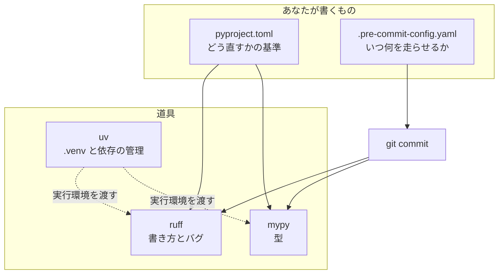
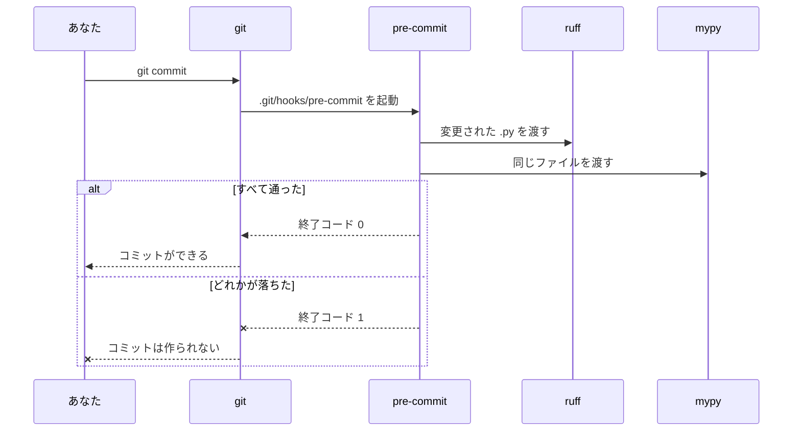
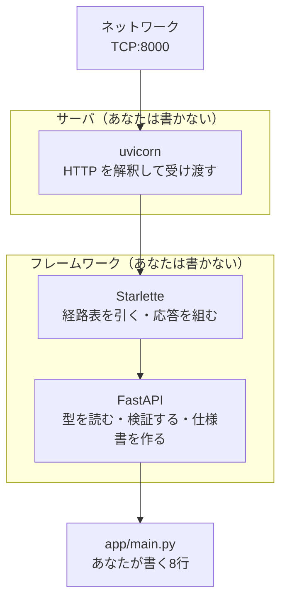
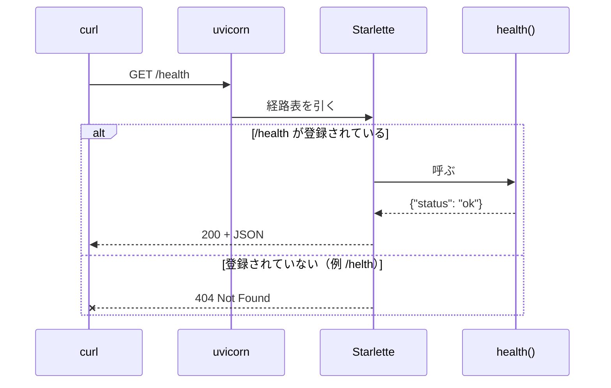
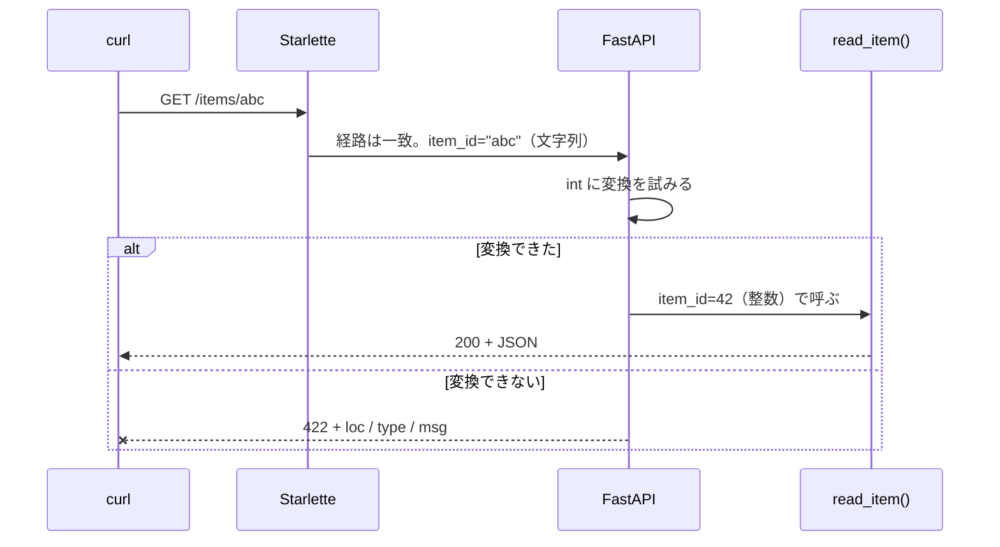
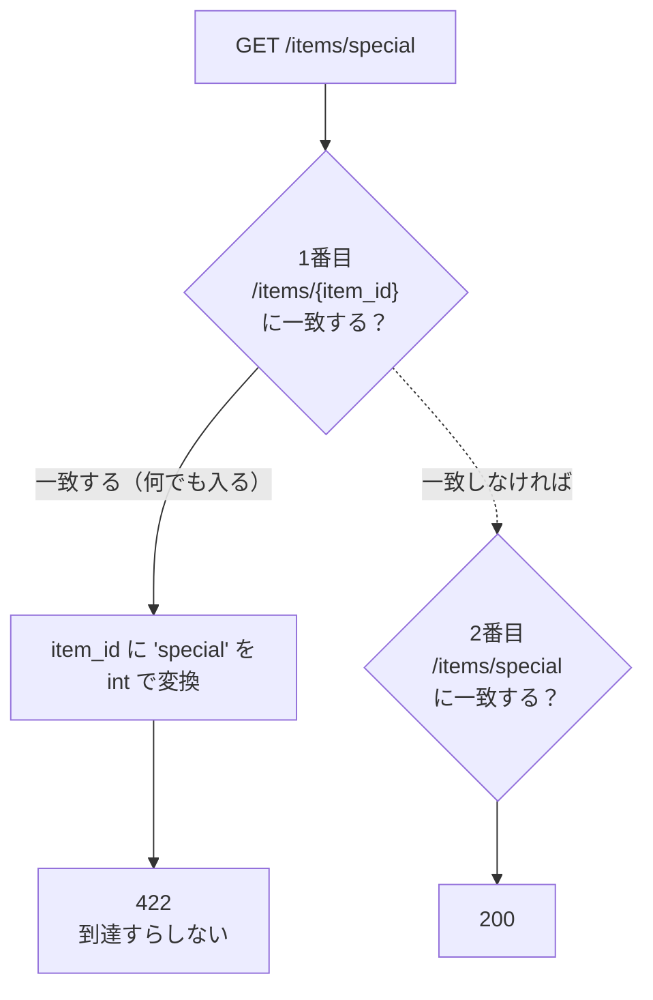

# P1a — 品質ゲートと FastAPI 基礎

`docs/_prompt.md` §6（M1）の出力。1ステップずつ追記していく。

---

## P1-1: 品質ゲートを先に立てる

**作るもの**: `git commit` したときに ruff と mypy が自動で走り、**通らなければコミットが止まる**状態
**重要度**: 🔴 毎日使う — この後の全ステップが「この2つを通ったコードしか載せない」前提で書かれるため（§4.6）
**前ステップとの接続**: 最初のステップ。**Python のコードはまだ1行も書かない**

### 1-0. このステップの初出トークン

| 系統 | トークン |
| --- | --- |
| **FastAPI** | —（このステップでは出ない） |
| **Python** | —（`.py` ファイルをまだ作らないため） |
| **【道具】** | `uv run` と `.venv`（§4.3.1-1） |
| **開発ツール** | `pyproject.toml` / `ruff` / `mypy` / `pre-commit` |
| **周辺** | — |

> 最初のステップに FastAPI が1つも出ないのは意図的。**後から入れると、それまでに書いたコードを一斉に直すことになる**（§2.4）。

---

### 1-1. コード

#### (1) `pyproject.toml` — **末尾に追記**（既存の `[project]` と `[dependency-groups]` はそのまま）

```toml
[tool.ruff]
# 1行の長さの上限。ruff format がこの幅で折り返す
line-length = 100
# 3.12 として解釈する（古い書き方を「古い」と判定できるようになる）
target-version = "py312"

[tool.ruff.lint]
# E: 書き方の統一 / F: 実際のバグ / I: import の並び順
select = ["E", "F", "I"]

[tool.mypy]
python_version = "3.12"
# 型の付いていない関数定義を許さない（P1 の段階ではこれだけ）
disallow_untyped_defs = true
```

**なぜこの4項目だけなのか**（設定名を並べるだけにしない。§4.12-14）

| 設定 | 何のために足すか |
| --- | --- |
| `line-length = 100` | 既定は 88。3つの引数に型を書くと 88 はすぐ超える。**折り返しが増えると差分が読みにくくなる**ので少し広げた |
| `target-version = "py312"` | これが無いと ruff は「どの版として読むか」を推測する。3.12 と伝えると、古い書き方の指摘が正確になる |
| `select = ["E", "F", "I"]` | 既定は `F` と `E` の一部だけ。**`I`（import の並び）を足すのが主目的**。並び順が人によって違うと、中身を変えていないのに差分が出る |
| `disallow_untyped_defs` | **P1 の段階ではこれだけ。** 関数に型を書く習慣をつけるのが狙い。P3 と P6 で段階的に締める（§2.4） |

> ⏭️ **後で回収**: mypy を `strict = true` にするのは **P6-4**。いきなり strict にすると、動かない設定として外されて終わるため。今は「関数に型を書く」だけを強制する。

#### (2) `.pre-commit-config.yaml` — **新規作成・全文**（リポジトリのルート）

```yaml
# コミットのたびに何を走らせるかの一覧
repos:
  - repo: local
    hooks:
      - id: ruff-check
        name: ruff (lint) — バグと書き方を見る
        entry: uv run ruff check --fix
        language: system
        types_or: [python, pyi]
        require_serial: true

      - id: ruff-format
        name: ruff (format) — 見た目を揃える
        entry: uv run ruff format
        language: system
        types_or: [python, pyi]
        require_serial: true

      - id: mypy
        name: mypy — 型が合っているか見る
        entry: uv run mypy
        language: system
        types_or: [python, pyi]
        require_serial: true
```

#### (3) フックを仕掛ける

```bash
uv run pre-commit install
uv run pre-commit run --all-files
```

✅ 検証済み: macOS / uv 0.12.17 / Python 3.12.13 / ruff 0.16.8 / mypy 2.3.1 / pre-commit 4.6.2。
`--all-files` の実際の出力は **1-6** に貼った。

---

### 1-1b. 📊 図解

#### (a) 誰が何を持っているか



✅ 描画確認済み: mermaid 12.0.0 でパース通過。

**読みどころは、設定ファイルが2つに分かれていること。** `pyproject.toml` は「**どう直すか**」の基準、
`.pre-commit-config.yaml` は「**いつ走らせるか**」。片方だけでは動かない。
`pre-commit install` でコミットが止まったのに `.pre-commit-config.yaml` が無かったのは、
**入れ物だけ置いて中身が空**だったから。

#### (b) `git commit` を叩いたとき、中で何が起きるか



✅ 描画確認済み: mermaid 12.0.0 でパース通過。

**`--x` の側（下）が、このステップで作っているもの。** 成功経路だけなら、フックを入れる意味がない。

---

### 1-2a. 🔤 入口の2行

#### 🔤 `pyproject.toml`
**読み方**: 「パイプロジェクト・トムル」
**要するに**: このプロジェクトの**身分証と設定をまとめた1枚の紙**。名前・必要な部品・道具の設定が全部ここに書いてある。

#### 🔤 `uv`
**読み方**: 「ユー・ブイ」
**要するに**: **部品の買い出し係**。必要なものを取ってきて、このプロジェクト専用の箱（`.venv`）に入れる。

#### 🔤 `ruff`
**読み方**: 「ラフ」
**要するに**: **書き方の見張り番**。間違い探しと、見た目の揃え直しを両方やる。

#### 🔤 `mypy`
**読み方**: 「マイ・パイ」
**要するに**: **型の見張り番**。「数を入れる約束の場所に文字を入れていないか」を、動かす前に調べる。

#### 🔤 `pre-commit`
**読み方**: 「プリ・コミット」
**要するに**: **コミットの直前に見張り番を呼ぶ係**。呼ぶ相手は `.pre-commit-config.yaml` に書いておく。

---

### 1-2. 🔬 仕組み解剖

| 部品 | 正式名称 | 実行時に何が起きるか |
| --- | --- | --- |
| `[tool.ruff]` | TOML のテーブル（セクション） | **ruff を起動した瞬間に**読まれる。`pyproject.toml` は複数の道具の設定を同居させる場所で、`[tool.<道具名>]` が各道具の取り分。ruff は `[tool.ruff]` しか見ず、mypy は `[tool.mypy]` しか見ない |
| `repo: local` | pre-commit のリポジトリ指定 | フックの**取得元**。`local` は「取ってこない。この環境にあるものを使う」の意味。起動のたびに `entry` のコマンドをそのまま実行する |
| `language: system` | フックの実行環境の指定 | pre-commit が**専用の環境を作らず**、いまの PATH でコマンドを実行する。`uv run` を書いているので、結果として**このプロジェクトの `.venv`** が使われる |
| `types_or: [python, pyi]` | ファイル種別のフィルタ | pre-commit が渡すファイルを `.py` / `.pyi` に絞る。**該当が0件ならフックは実行されず `Skipped`** になる（1-6 の実出力を参照） |
| `pre-commit install` | フックのインストール | `.git/hooks/pre-commit` に**起動用のスクリプトを1枚置く**。中身は「pre-commit を呼べ」だけで、**何を走らせるかは書かれていない** |

**いつ評価されるか**: `pyproject.toml` は各道具の**起動時**。`.pre-commit-config.yaml` は**コミットのたび**。

**どの道具の責務か**: 並び順の修正は ruff、型は mypy、**呼ぶタイミングだけが pre-commit**、`.venv` の用意は uv。
pre-commit 自身は lint も型チェックもしない。

**失敗したらどうなるか**: どれか1つでも終了コードが 0 以外なら、git は**コミットを作らずに中断する**。
`--fix` で自動修正できた場合も、**ファイルを書き換えた時点で失敗扱い**になる（1-6 の Q3）。

---

### 1-3. 🐍 Python解説

**このステップでは Python の文法は1つも出てこない。** 書いたのは TOML と YAML だけ。
Python の文法は **P1-2** の `app/main.py` から始まる。

---

### 1-3a. 🐍 Python の道具立て: `uv run` と `.venv`（§4.3.1-1）

**現象**: `python main.py` と打つと、入れたはずの FastAPI が「無い」と言われる。

```
ModuleNotFoundError: No module named 'fastapi'
```

**なぜそうなるか**

Python は**1台のパソコンに何個でも入る**。そして**入っている Python ごとに、持っている部品が違う**。

- あなたのパソコン全体の Python は **3.14.3**（`python3 --version` で確認済み）
- このプロジェクトの Python は **3.12.13**。`.venv/` という箱の中にいる

`uv add fastapi` で入れた FastAPI は、**`.venv/` の中の 3.12.13 にだけ**入っている。
`python main.py` と打つと、パソコン全体の 3.14.3 が動いてしまうので、「そんな部品は無い」になる。

**たとえ**: `.venv/` は**このプロジェクト専用の道具箱**。`uv run` は「**その道具箱を開けてから実行して**」という指示。
道具箱を開けずに作業を始めると、道具が見つからない。

**どう直すか**: 頭に `uv run` を付ける。これだけ。

```bash
uv run python main.py     # ← .venv の中の Python 3.12.13 が動く
uv run ruff check         # ← .venv の中の ruff が動く
uv run pytest             # ← P6 でも同じ
```

> **`source .venv/bin/activate` は覚えなくていい。** 昔ながらの「道具箱を開けっぱなしにする」やり方で、
> 今でも動くが、**開けたことを忘れて別のプロジェクトで作業すると事故る**。`uv run` は毎回その場で開けて閉じるので、忘れようがない。

**TS で言えば**: `.venv/` が `node_modules/`、`uv run` が `npx` にあたる。
違いは、Node は `node_modules/` を**自動で探しに行く**が、**Python は探しに行かない**こと。だから明示的に `uv run` が要る。

⚠️ **この教材では、Python がらみのコマンドは全部 `uv run` から始まる。** 例外はない。

---

### 1-3b. 🧩 周辺注

なし（Docker / MySQL はこのステップでは出ない。P2-1 から）。

---

### 1-4. 解説 — なぜこう設計するか

#### 🪜 なぜなぜ: なぜ「手で実行する」ではなく、git に仕掛けるのか

**なぜ① そもそも `git commit` のときに、なぜ勝手にコマンドが走るのか**
→ git には**フック**という仕組みがあり、`.git/hooks/pre-commit` という名前の実行ファイルが置いてあると、
コミットを作る直前に必ずそれを起動する。**終了コードが 0 以外ならコミットを中断する**。
`pre-commit install` がやったのは、このファイルを1枚置くことだけ。

**なぜ② なぜ git に任せるのか。自分で `ruff check` を打てばいいのでは**
→ **人間は忘れるから**、ではない（それもあるが本質ではない）。本質は**いつ止めるか**。
手で打つ場合、止まるのは「打ったとき」。CI に任せる場合、止まるのは「push した後」。
**コミットの時点で止めれば、壊れたコードがそもそも歴史に残らない。**
後から「このコミットは lint が通っていない」と分かっても、履歴は書き換えられない。

**なぜ③ では、フックを入れると何を失うのか** 🤔 まず自分で考える

<details><summary>答え</summary>

3つ失う。

1. **速さ。** コミットのたびに数秒待つ。ファイル数が増えるほど伸びる
2. **逃げ道が生まれる。** 急いでいるときに `git commit --no-verify` で飛ばせてしまう。
   飛ばしたことは**コミットには残らない**ので、後から分からない
3. **環境差が事故になる。** `language: system` はこの環境の道具をそのまま使うので、
   道具の版が違う人と一緒に作業すると、**自分の環境だけ落ちる／自分の環境だけ通る**が起きうる

3 は実際には `uv.lock` が版を固定しているので、**`uv run` 経由なら揃う**。
これが「`uv run` を必ず頭に付ける」ルールのもう1つの理由。

**ここから先は git 自体の設計思想の領域**（フックはあくまでローカルの仕組みで、強制力は持たせない）なので、ここで止める。
根拠: https://git-scm.com/docs/githooks
</details>

> 🧠 **考え方**: 品質ゲートは「いい行いをする道具」ではなく「**悪い状態を歴史に残さない関所**」。
> だから**一番最初**に立てる。後から立てると、関所の後ろに既に壊れたものが溜まっている。

---

### 1-5. 🏢 実務メモ ／ ⚠️ アンチパターン

> 🏢 **実務メモ**: フックの書き方には「配布元から取ってくる（`repo: https://...`）」やり方もあるが、
> ここでは **`repo: local` + `language: system`** にした。理由は **mypy がプロジェクトの `.venv` を見る必要がある**から。
> 取ってくる方式だと mypy は隔離された別の環境で動き、**FastAPI や SQLAlchemy の型が見えず**、P3 以降で誤検知が出る。
> 根拠: https://pre-commit.com/#repository-local-hooks

> ⚠️ **アンチパターン**: `git commit --no-verify` を常用する。
> 1回使うぶんには逃げ道として正しいが、常用すると**フックが入っていないのと同じ**になる。
> しかも「飛ばした」記録がコミットに残らないので、後から追えない。
> 根拠: https://git-scm.com/docs/git-commit#Documentation/git-commit.txt---no-verify

---

### 1-6. 🔮 予測 → 動作確認

**先に予想してから実行する。**

1. `.py` ファイルが1つも無い状態で `pre-commit run --all-files` を叩くと、3つのフックはどうなるか
2. 型の無い関数を書いてコミットしようとすると、**3つのうちどれが**止めるか。コミットは作られるか
3. 未使用 import のように **ruff が自動で直せる**問題のとき、コミットは成功するか失敗するか

<details><summary>1 の実行と結果</summary>

```bash
uv run pre-commit run --all-files
```

```
ruff (lint) — バグと書き方を見る.....................(no files to check)Skipped
ruff (format) — 見た目を揃える.......................(no files to check)Skipped
mypy — 型が合っているか見る..........................(no files to check)Skipped
→ 終了コード: 0
```

✅ 検証済み。**`Skipped` であって `Passed` ではない。** `types_or` で `.py` に絞っているので、
対象0件なら**そもそも起動しない**。「通った」のではなく「見ていない」。
</details>

<details><summary>2・3 の実行と結果</summary>

わざと壊れたファイルを作る。

```bash
cat > _scratch_bad.py <<'PY'
import sys
import os


def add(a, b):
    return a + b
PY
git add _scratch_bad.py
uv run pre-commit run --files _scratch_bad.py
```

```
ruff (lint) — バグと書き方を見る.........................................Failed
- hook id: ruff-check
- files were modified by this hook
Found 2 errors (2 fixed, 0 remaining).

ruff (format) — 見た目を揃える...........................................Failed
- hook id: ruff-format
- files were modified by this hook
1 file reformatted

mypy — 型が合っているか見る..............................................Failed
- hook id: mypy
- exit code: 1
_scratch_bad.py:1: error: Function is missing a type annotation  [no-untyped-def]

→ 終了コード: 1
```

✅ 検証済み。**3つとも落ちた。コミットは作られない。**

**3 の答えが要点**: ruff は未使用 import を**自動で直した**（`2 fixed`）のに、**Failed になっている**。
`files were modified by this hook` — 直したこと自体が失敗扱い。
**理由**: 直った後のファイルは、あなたが `git add` した内容と違う。
勝手に書き換えたものを黙ってコミットしたら、**あなたが見ていないコードが履歴に入る**。
だから一度止めて、「直したので、確認して `git add` し直してください」と促している。

後片付け:

```bash
git restore --staged _scratch_bad.py && rm _scratch_bad.py
```

> 💡 **補足**: mypy は既定で結果をキャッシュする（incremental mode）。
> 他の道具が同じファイルを書き換えた直後などに、結果が実態と合わないことがある。
> **おかしいと思ったら `rm -rf .mypy_cache` して再実行する。**
> 根拠: https://mypy.readthedocs.io/en/stable/command_line.html#incremental-mode
</details>

---

### 1-6b. 🧾 OpenAPI スキーマの差分

**対象外。** OpenAPI スキーマを読むのは **P1-6** から（§4.14）。ここではまだアプリが存在しない。

---

### 1-7. ✅ 想起チェック

1. `pyproject.toml` と `.pre-commit-config.yaml` は、それぞれ何を決めているか
2. `pre-commit install` を実行したのに `.pre-commit-config.yaml` が無いと、何が起きるか
3. `uv run` を付け忘れると、なぜ `ModuleNotFoundError` になるのか
4. ruff が問題を**自動で直した**とき、コミットは成功するか

<details><summary>答え</summary>

1. `pyproject.toml` = **どう直すか**の基準（ruff / mypy の設定）。`.pre-commit-config.yaml` = **いつ何を走らせるか**。
2. `git commit` が必ず失敗する。`No .pre-commit-config.yaml file was found`。
   フックは**入れ物**で、中身は設定ファイルにしかないため。
3. `uv run` 無しではパソコン全体の Python（3.14.3）が動く。FastAPI は `.venv` の中の 3.12.13 にしか入っていないため。
4. **失敗する。** 直した結果はあなたが `git add` した内容と違うので、一度止めて確認させる。
   `git add` し直してもう一度コミットすれば通る。
</details>

---

### 1-8. 初出トークンの回収確認

| トークン | 扱い |
| --- | --- |
| `pyproject.toml` | 1-2a で入口の2行 / 1-2 で仕組み解剖 |
| `ruff` | 1-2a で入口の2行 / 1-1 で設定の各項目 |
| `mypy` | 1-2a で入口の2行 / ⏭️ `strict = true` は **P6-4** で回収 |
| `pre-commit` | 1-2a で入口の2行 / 1-2 で仕組み解剖 |
| `uv run` と `.venv` | **1-3a で道具立て**（§4.3.1-1） |
| `repo: local` / `language: system` | 1-2 で仕組み解剖 / 1-5 で実務メモ |
| `types_or` | 1-2 で仕組み解剖 / 1-6 の Q1 で実挙動を確認 |

**未回収: 0件**（`⏭️` 宣言した `strict = true` のみ P6-4 に持ち越し）

---

### 1-9. 📌 進捗の更新

`README.md` の進捗表 P1a を「P1-1 完了」、次の一手を `M1: P1 ステップ2` に更新した。

**次のステップ**: P1-2「最小のエンドポイント」。`GET /health` が 200 を返すところまで作り、
**初めて Python の文法が出てくる**（`def` / デコレータ `@` / 型アノテーション）。

---

## P1-2: 最小のエンドポイント

**作るもの**: `GET /health` を叩くと `{"status":"ok"}` が 200 で返るサーバ
**重要度**: 🔴 毎日使う — `@app.get()` と型アノテーションは、この先**すべてのエンドポイントの入口**になるため
**前ステップとの接続**: P1-1 で立てた品質ゲートを、**初めて実際の Python コードに通す**

### 2-0. このステップの初出トークン

| 系統 | トークン |
| --- | --- |
| **FastAPI** | `FastAPI()` / `@app.get()` / `uvicorn app.main:app`（3つ = 上限） |
| **Python** | `from ... import ...` / `=`（代入）/ `@`（デコレータ）/ `def` / `->` / `dict[str, str]` / 行末の `:` / 字下げ / `return` / `{...}`（辞書） |
| **【道具】** | トレースバックの読み方（§4.3.1-3）/ インデントエラー（§4.3.1-4） |
| **周辺** | — |

> Python が一気に増えるが、**FastAPI 側は3つに抑えてある**（§4.5）。
> 文法が多いのは、Python のファイルを初めて書くから。ステップを割る理由にはしない（§6.3）。

---

### 2-1. コード

#### (1) `app/__init__.py` — **新規作成・中身は空**

```bash
mkdir -p app
touch app/__init__.py
```

空のファイルを1つ置く。**なぜ空のファイルが要るのか**は 2-3a で扱う。

#### (2) `app/main.py` — **新規作成・全文**

```python
from fastapi import FastAPI

app = FastAPI()


@app.get("/health")
def health() -> dict[str, str]:
    return {"status": "ok"}
```

**たった8行（空行込み）。** この8行に、Python の文法が10個入っている。1つずつ 2-3 で潰す。

#### (3) 起動する

```bash
uv run uvicorn app.main:app --port 8000
```

開発中はファイルを保存するたびに再起動してほしいので、こちらを使う。

```bash
uv run uvicorn app.main:app --port 8000 --reload
```

> ⚠️ **P1-9（デバッガ）では `--reload` を外す。** リローダーは**子プロセス**でアプリを動かすため、
> 親に接続したデバッガではブレークポイントが止まらない。**用途で2つ使い分ける**（§2.5）。

✅ 検証済み: macOS / Python 3.12.13 / FastAPI 0.141.1 / uvicorn 0.53.0 / ruff 0.16.8 / mypy 2.3.1。
`uv run ruff check app/` = `All checks passed!`、`uv run mypy app/` = `Success: no issues found in 2 source files`。
実レスポンスは 2-6 に貼った。

---

### 2-1b. 📊 図解

#### (a) uvicorn と FastAPI と Starlette は何が違うのか

新しく3つ名前が出たので、先に役割を分ける（§4.13）。



✅ 描画確認済み: mermaid 12.0.0 でパース通過。

**読みどころは、あなたが書くのが一番奥の1枚だけということ。** 手前の3つは全部もらいもの。
`uvicorn app.main:app` というコマンドは、**この鎖を外から内へ繋ぐ指示**になっている。

#### (b) `curl` を叩いてから返るまで（失敗する道も描く）



✅ 描画確認済み: mermaid 12.0.0 でパース通過。

**`/helth` の側では、矢印が `health()` まで届いていない。** 打ち間違えたとき、
あなたの関数は**呼ばれてすらいない**。「関数の中を直しても直らない」のはこのため（2-6 の Q1）。

---

### 2-2a. 🔤 入口の2行

#### 🔤 `FastAPI()`
**読み方**: 「ファストエーピーアイ、かっこ」
**要するに**: アプリ本体を1つ作る。**これから作るお店の、建物そのもの**。

#### 🔤 `@app.get("/health")`
**読み方**: 「アット・アップ・ドット・ゲット、かっこ、スラッシュ・ヘルス」
**要するに**: **「この住所に GET で来たら、下の関数を呼んでね」という貼り紙**。

#### 🔤 `uvicorn app.main:app`
**読み方**: 「ユビコーン、アップ・ドット・メイン、コロン、アップ」
**要するに**: 「`app` フォルダの `main.py` の中にある `app` という名前のものを動かして」という指示。

---

### 2-2. 🔬 仕組み解剖

| 部品 | 正式名称 | 実行時に何が起きるか |
| --- | --- | --- |
| `FastAPI()` | アプリケーションインスタンスの生成 | **ファイルが読み込まれた瞬間**に1回だけ動く。中身が空の**経路表**を持ったアプリが1つできる。Starlette のアプリを継承しているので、この時点で ASGI アプリとして完成している |
| `@app.get("/health")` | パスオペレーションデコレータ | **起動時に1回**動く。`health` 関数を受け取り、`("GET", "/health") → health` を経路表に**登録**して、関数をそのまま返す。ついでに `-> dict[str, str]` を読み、OpenAPI スキーマの下書きも作る。**リクエストのたびに動くのではない** |
| `uvicorn app.main:app` | ASGI サーバの起動コマンド | `:` の**左が読み込むファイル**（`app/main.py`）、**右が変数名**（`app`）。uvicorn は HTTP を解釈して ASGI という形に直し、その `app` に渡す |

**いつ評価されるか**: 3つとも**起動時**。リクエストのたびに動くのは、登録された `health()` だけ。

**どの道具の責務か**: HTTP の解釈は uvicorn、経路表の照合は Starlette、型を読んで仕様書を作るのが FastAPI。
**あなたの関数が受け取るのは、全部済んだ後の状態**。

**失敗したらどうなるか**

| 失敗 | 結果 |
| --- | --- |
| 登録していないパス（`/helth`） | **404** `{"detail":"Not Found"}`。関数は呼ばれない |
| 登録はあるがメソッド違い（`POST /health`） | **405** Method Not Allowed |
| ファイルに構文エラー | **起動そのものが失敗**（終了コード 1）。2-3a を参照 |

**既知スタックとの対応**: Express の `app.get("/health", handler)` に近い。
違いは、**ハンドラを引数で渡さず、関数の真上に貼る**こと。理由は 2-4 で掘る。

---

### 2-3. 🐍 Python解説

初めての Python ファイルなので、8行を**1つ残らず**潰す。

#### 🐍 `from fastapi import FastAPI`

**読み方**: 「フロム・ファストエーピーアイ、インポート・ファストエーピーアイ」

**たとえ**: **道具箱から、使う道具を1つだけ出して机に置く**こと。
「`fastapi` という箱の中から、`FastAPI` という道具を出して使えるようにして」。

**正確には**:
- `from <どこから> import <なにを>` の形。左が箱（モジュール／パッケージ）、右が取り出すもの
- 小文字の `fastapi` が**ライブラリ名**、大文字の `FastAPI` が**その中のクラス名**。**別物**
- 取り出すと、そのファイルの中で `FastAPI` という名前で呼べるようになる

**TS なら**: `import { FastAPI } from "fastapi";` とほぼ同じ。`{}` が無く、順番が逆（`from` が先）。

#### 🐍 `app = FastAPI()`

**読み方**: 「アップ・イコール・ファストエーピーアイ、かっこ」

**たとえ**: **道具を実際に使って、モノを1つ作り、名札を付ける**。`app` が名札。

**正確には**:
- `=` は**代入**。右で作ったものに、左の名前を付ける。数学の「等しい」ではない
- `FastAPI()` の**末尾の `()` が「実行しろ」の合図**。付けないとモノは作られず、設計図のまま
- Python に**変数宣言のキーワードは無い**（`let` / `const` / `var` にあたるものが無い）。いきなり名前を書く

**TS なら**: `const app = new FastAPI();`
違いは2つ。**`const` にあたる語が無い**ことと、**`new` が要らない**こと（`()` だけでモノができる）。

> ⚠️ **`app` という名前は2か所で一致していないといけない。** ここで付けた名札と、
> 起動コマンド `uvicorn app.main:app` の**右側の `app`** は同じもの。名前を変えるなら両方変える。

#### 🐍 `@app.get("/health")` — デコレータ（§4.3 の「特に丁寧に扱う」）

**読み方**: 「アット」。この `@` で始まる書き方を**デコレータ**と呼ぶ。

**たとえ**: **関数に貼る付箋**。関数そのものは変えず、上から1枚貼って「この関数はこういう扱いにして」と伝える。

**正確には**: `@X` を関数の真上に書くと、**その関数が定義された直後に `X(その関数)` が自動で実行される**。つまり下の2つは同じ意味。

```python
@app.get("/health")
def health() -> dict[str, str]:
    return {"status": "ok"}
```

```python
def health() -> dict[str, str]:
    return {"status": "ok"}

health = app.get("/health")(health)   # ← デコレータはこれの短縮形
```

**2段階ある**のがつまずきどころ。`app.get("/health")` がまず実行されて**関数を受け取る関数**が返り、
それに `health` が渡される。だから `("/health")` の括弧が必要になる。

**いつ動くか**: **起動時に1回だけ**。リクエストのたびではない。ここが最大の勘違いポイント。

**TS なら**: 実験段階のデコレータ（`@Component` など）が近い。Angular や NestJS を触ったことがあれば同じ感覚。
触ったことがなければ「**関数を定義した直後に、その関数を引数にして呼ばれる仕掛け**」と覚えれば足りる。

#### 🐍 `def health() -> dict[str, str]:`

**読み方**: 「デフ・ヘルス、かっこかっこ、アロー、ディクト・ストリング・ストリング、コロン」

**たとえ**: **自動販売機の説明書き**。`def` が「この機械の名前」、`()` が「入れるものは無し」、
`-> dict[str, str]` が「出てくるものの形」、末尾の `:` が「ここから下が中身です」の合図。

**正確には**:
- `def` = 関数を定義する語。**この行の下の、字下げされた範囲**が中身
- `()` が空 = **引数なし**。P1-3 からここに引数が入る
- `->` = 戻り値の**型アノテーション**。矢印の右が「返ってくるものの型」
- `dict[str, str]` = 「**鍵が文字列、値も文字列の辞書**」。`[]` の中が中身の型
- **行末の `:` は必須**。`def` / `if` / `for` / `class` すべてに要る。忘れると構文エラー

**TS なら**: `function health(): Record<string, string> { ... }`
違いは3つ。戻り値の型が `:` ではなく **`->`**、`{}` が無く**字下げが範囲を決める**、そして `Record` ではなく `dict`。

> 🔴 **この `->` が、この教材の中心。** FastAPI はこの型を**飾りではなく実行時の仕様**として読む。
> P1-5 で `-> TodoRead` と書くと、**モデルに無いフィールドが自動で落ちる**ようになる。今はまだ効果が見えない。

#### 🐍 `return {"status": "ok"}`

**読み方**: 「リターン、なみかっこ、スターテス、コロン、オーケー」

**たとえ**: **自動販売機から商品が出てくる**ところ。`{...}` は**ラベル付きの引き出し**。

**正確には**:
- `return` = 関数の答えを返して、そこで関数を終える
- `{"鍵": "値"}` = **辞書**（dict）。鍵で値を取り出す入れ物
- FastAPI は、返ってきた辞書を**自動で JSON に変換**して返す。`json.dumps` を書く必要はない

**TS なら**: `return { status: "ok" };`
違いは1つ。**鍵をクォートで囲む必要がある**（`{"status": ...}`）。JS のように裸で書けない。

#### 🐍 字下げ（インデント）

**正確には**: Python は `{}` を使わず、**字下げそのものがブロックの範囲**を表す。
**半角スペース4つ**で統一する（ruff が自動で直すので、自分で数えなくてよい）。

**TS なら**: `{}` の役割を、空白が担っていると思えばよい。**見た目の整形ではなく、文法そのもの**。

---

### 2-3a. 🐍 Python の道具立て

#### (1) なぜ空の `app/__init__.py` が要るのか（§4.3.1-2 の予告）

**たとえ**: フォルダに貼る「**ここは Python の部品置き場です**」という札。

**正確には**: `__init__.py`（「ダンダー・イニット」と読む）があると、そのフォルダは
**パッケージ**として扱われ、`app.main` のような `.` 区切りの名前で呼べるようになる。
`uvicorn app.main:app` の `app.main` が、まさにこの呼び方。

> ⏭️ **後で回収**: import を本格的に使うのは **P1-8**（`app/routers/todos.py` に分割する回）。
> 今は「フォルダを Python の部品置き場だと宣言する札」とだけ理解して進む。

#### (2) トレースバックの読み方（§4.3.1-3）— **下から読む**

字下げを忘れて起動すると、こうなる。

```
  File "<frozen importlib._bootstrap>", line 1387, in _gcd_import
  File "<frozen importlib._bootstrap>", line 1360, in _find_and_load
  File "<frozen importlib._bootstrap>", line 1331, in _find_and_load_unlocked
  File "<frozen importlib._bootstrap>", line 935, in _load_unlocked
  File "<frozen importlib._bootstrap_external>", line 995, in exec_module
  File "<frozen importlib._bootstrap_external>", line 1133, in get_code
  File "<frozen importlib._bootstrap_external>", line 1063, in source_to_code
  File "<frozen importlib._bootstrap>", line 488, in _call_with_frames_removed
  File "/Users/.../roadmap-sh-fastapi/app/main.py", line 8
    return {"status": "ok"}
    ^^^^^^
IndentationError: expected an indented block after function definition on line 7
```

✅ 検証済み（実際に出した出力）。

**読む順番はこう。**

| 順 | どこを見るか | 何が分かるか |
| --- | --- | --- |
| **1** | **一番下の行** | **何が起きたか**。`IndentationError` = 字下げの問題 |
| **2** | その上の `File "..." line 8` | **どこで起きたか**。自分のファイルの8行目 |
| **3** | `^^^^^^` | **その行のどこか** |
| 4 | さらに上 | そこに至る道のり。**ほとんど読まなくていい** |

**上の10行は全部 `<frozen importlib._bootstrap>`**、つまり Python 自身の内部。
**あなたのファイル名が出てくる行までは、読み飛ばしてよい。**

> 🧠 **考え方**: トレースバックは「**下が結論、上が経緯**」。新聞と逆で、**最後の行から読む**。
> 慣れるまでは「自分のファイル名が出ている一番下の行」を探すだけでいい。

**TS との違い**: JS のスタックトレースは**エラーメッセージが先頭**に出る。Python は**最後**。上下が逆。

#### (3) インデントエラー（§4.3.1-4）

**現象**: 上の `IndentationError`。**起動そのものが失敗**し、サーバは立たない（終了コード 1）。

**どう直すか**: 字下げを入れる。ただし**その前に ruff が教えてくれる**。

```
invalid-syntax: Expected an indented block after function definition
 --> app/main.py:8:1
  |
6 | @app.get("/health")
7 | def health() -> dict[str, str]:
8 | return {"status": "ok"}
  | ^^^^^^
```

✅ 検証済み。**P1-1 で品質ゲートを先に立てた効果がここで出る。**
起動して10行のトレースバックを読むより、`uv run ruff check app/` のほうが速い。

> ⚠️ **タブと半角スペースを混ぜない。** 見た目が同じでも Python には別物で、`TabError` になる。
> エディタの設定を「タブをスペースに変換」にしておけば起きない。

#### (4) `uv run python app/main.py` では起動しない

```bash
uv run python app/main.py
# 終了コード: 0 ← エラーも出ず、サーバも立たない
```

✅ 検証済み。**エラーが出ないぶん、かえって厄介。**

**なぜか**: `app/main.py` がやっているのは「アプリを**作って** `app` という名札を付ける」ところまで。
**待ち受ける処理は1行も書いていない**。だからファイルを最後まで実行して、何事もなく終わる。

待ち受けるのは uvicorn の仕事。だから `uv run uvicorn app.main:app` と、**uvicorn 側から呼ぶ**。

---

### 2-3b. 🧩 周辺注

なし（Docker / MySQL は P2-1 から）。

---

### 2-4. 解説 — なぜこう設計するか

#### 🔄 素材からの変更: 公式は `async def`、本教材は `def`

【入力素材】の公式チュートリアルは、**最初の例から `async def`** で書かれている。本教材は `def` を使う。

> ⏭️ **後で回収**: 理由は **P3-1** で仕組み解剖として扱う。
> ごく短く言うと、このプロジェクトは**同期の DB ドライバ**で統一するため（§4.7）。
> `def` で書くと Starlette が別スレッドで実行してくれるので、DB 待ちでサーバ全体が止まらない。
>
> **公式を読んで `async def` を見ても、自分が間違えたわけではない。** どちらも動く。選択が違うだけ。

#### 🪜 なぜなぜ: なぜ関数の**真上**に貼るのか

**なぜ① `@app.get("/health")` と書くだけで、なぜ経路が繋がるのか**
→ デコレータは**起動時に実行される**。`app.get("/health")` が「関数を受け取る関数」を返し、
それが `health` を受け取って、`("GET", "/health") → health` という**対応表の1行**をアプリの中に書き込む。
リクエストが来たとき Starlette はこの表を引くだけ。**繋ぐ作業は、起動時にもう終わっている。**

**なぜ② なぜ設定ファイルに経路をまとめないのか。そのほうが一覧できるのでは**
→ **経路と処理が離れると、片方だけ直す事故が起きるから。** URL を変えたのに設定側を直し忘れる、
関数を消したのに経路が残る、といった食い違いは、2か所に分かれている限り必ず起きる。
真上に貼ってあれば、**関数を消せば経路も一緒に消える**。近くにあるものは、一緒に直る。

**なぜ③ では、真上に貼る方式は何を失うのか** 🤔 まず自分で考える

<details><summary>答え</summary>

3つ失う。

1. **一覧性。** 「この API に経路がいくつあるか」は、**ファイルを読み込んでみるまで分からない**。
   経路表が埋まるのは、デコレータが実行された後だから。設定ファイル方式なら1枚見れば済む。
   → ただし**手当てが2つある**（§4.2.1 ルール6）。

   | 手当て | やり方 | 扱うステップ |
   | --- | --- | --- |
   | 起動して見る | `/openapi.json` を `jq` で読む | **P1-6** |
   | 起動せずに見る | `app.routes` を読む（import だけで経路表は埋まる） | **P1-8** |

   「静的に読めない代わりに、**読み込みさえすれば正確な一覧が出る**」という取り引き。
   ドキュメントと実装がズレないのは、一覧が実装そのものから出ているため。
2. **順序の制御。** 経路が登録される順番は、**ファイルが読み込まれる順番**に縛られる。
   `/users/me` と `/users/{id}` のように**衝突しうる経路**では、書いた順が結果を変える（P1-3 で実際に踏む）。
3. **経路の動的な差し替え。** 起動後に経路を増やしたり消したりする道は、実質的に用意されていない。

> 3 は失ったというより**捨てた**もの。「宣言がそのまま仕様である」を優先した結果で、
> これは §4.14 の OpenAPI スキーマ生成とも一体になっている。
> 根拠: https://fastapi.tiangolo.com/tutorial/first-steps/
</details>

> 🧠 **FastAPI の考え方**: 宣言は**その場に書く**。経路も型も、離れた設定ファイルではなく
> **使う場所の真上**に置く。すると「直し忘れ」という失敗の種類そのものが消える。

---

### 2-5. 🏢 実務メモ ／ ⚠️ アンチパターン

> 🏢 **実務メモ**: `--reload` は**開発専用**。ファイル変更を監視するために別プロセスを動かし続けるので、
> 本番では使わない。公式も本番での使用を想定していないと明記している。
> 根拠: https://www.uvicorn.org/settings/

> ⚠️ **アンチパターン**: `app/main.py` の末尾に `uvicorn.run(...)` を書いて `python app/main.py` で起動する。
> 動くが、**アプリの定義ファイルが起動方法まで抱え込む**。起動の仕方（ポート・ワーカー数・リロード）は
> 環境ごとに変わるもので、アプリ本体に埋め込むと差し替えられなくなる。**起動はコマンド側に置く。**
> 根拠: https://fastapi.tiangolo.com/deployment/manually/

---

### 2-6. 🔮 予測 → 動作確認

**先に予想してから実行する。**

1. `/helth` と打ち間違えたら、何が返るか。**`health()` 関数は呼ばれるか**
2. `POST /health` を叩いたら、404 か、別の何かか
3. 字下げを忘れたとき、失敗するのは**起動時か、リクエストが来たときか**

<details><summary>実行と結果</summary>

サーバを起動しておく。

```bash
uv run uvicorn app.main:app --port 8000
```

**1 と 2**

```bash
curl -sS -i http://127.0.0.1:8000/health
```
```
HTTP/1.1 200 OK
server: uvicorn
content-type: application/json

{"status":"ok"}
```

```bash
curl -sS -i http://127.0.0.1:8000/helth
```
```
HTTP/1.1 404 Not Found
content-type: application/json

{"detail":"Not Found"}
```

```bash
curl -sS -i -X POST http://127.0.0.1:8000/health
```
```
HTTP/1.1 405 Method Not Allowed
content-type: application/json
```

✅ 検証済み。

**1 の答え**: `health()` は**呼ばれない**。経路表に `/helth` が無いので、Starlette が照合の時点で打ち切る。
**関数の中をいくら直しても直らない**のはこのため（2-1b の図を参照）。

**2 の答え**: 404 ではなく **405**。パスは存在するが**メソッドが違う**ことを、経路表は区別している。
「404 が返らない＝パスは合っている」と読めるので、切り分けに使える。

**3 の答え**: **起動時**。Python はファイルを読み込む時点で構文を検査するので、
リクエストを待たずに落ちる（終了コード 1）。実際の出力は 2-3a(2) に貼った。
</details>

---

### 2-6b. 🧾 OpenAPI スキーマの差分

**まだ対象外**（差分を出し始めるのは P1-6 から。§4.14）。

ただし `/docs` は**この時点で既に見られる**。

```bash
curl -sS -o /dev/null -w '%{http_code}\n' http://127.0.0.1:8000/docs
# 200
```

✅ 検証済み。

> ⏭️ **後で回収**: `/docs`・`/redoc`・`/openapi.json` の**違いと読み方**は **P1-6**。
> 今は「`@app.get` と `-> dict[str, str]` を書いただけで、仕様書が勝手に生えている」とだけ確認して進む。

---

### 2-7. ✅ 想起チェック

1. `@app.get("/health")` はいつ実行されるか。リクエストのたびか、起動時に1回か
2. `uvicorn app.main:app` の `:` の左と右は、それぞれ何を指すか
3. `->` の右に書いたものは、何に使われるか
4. `uv run python app/main.py` を叩くと何が起きるか。なぜか
5. トレースバックは、どこから読むか

<details><summary>答え</summary>

1. **起動時に1回だけ。** 経路表に `("GET", "/health") → health` を登録して終わり。
   リクエストのたびに動くのは `health()` 本体。
2. **左が読み込むファイル**（`app/main.py`）、**右がその中の変数名**（`app = FastAPI()` で付けた名札）。
3. **戻り値の型アノテーション。** 今は mypy が見るだけだが、P1-5 以降は FastAPI が
   **レスポンスの形の宣言**として実行時に使う（モデルに無いフィールドが落ちる）。
4. **何も起きずに終了コード 0 で終わる。** ファイルにはアプリを作る処理しかなく、
   待ち受ける処理が無いため。待ち受けは uvicorn の仕事。
5. **一番下から。** 下が結論（エラーの種類）、その上が場所。上のほうの `<frozen importlib...>` は
   Python 内部なので読み飛ばす。**自分のファイル名が出る行**を探す。
</details>

---

### 2-8. 初出トークンの回収確認

| トークン | 扱い |
| --- | --- |
| `FastAPI()` | 2-2a で入口の2行 / 2-2 で仕組み解剖 |
| `@app.get()` | 2-2a / 2-2 で仕組み解剖 / 2-4 で なぜなぜ3段（代償の手当ては ⏭️ **P1-6 / P1-8** で回収） |
| `uvicorn app.main:app` | 2-2a / 2-2 で仕組み解剖（`:` の左右）/ 2-3a(4) |
| `from ... import ...` | 2-3 で Python解説 |
| `=`（代入） | 2-3 で Python解説（`const` も `new` も無い） |
| `@`（デコレータ） | 2-3 で Python解説（§4.3「特に丁寧に扱う」該当。展開形も併記） |
| `def` / 行末の `:` / 字下げ | 2-3 で Python解説 |
| `->` / `dict[str, str]` | 2-3 で Python解説 / ⏭️ **実行時の効果は P1-5 で回収** |
| `return` / `{...}`（辞書） | 2-3 で Python解説 |
| `app/__init__.py` | 2-3a(1) で道具立て / ⏭️ **import 本番は P1-8 で回収** |
| トレースバックの読み方 | **2-3a(2) で道具立て**（実出力つき） |
| インデントエラー | **2-3a(3) で道具立て**（実出力つき） |
| `async def` との差 | 2-4 で 🔄 素材からの変更 / ⏭️ **P3-1 で回収** |
| `/docs` | 2-6b で存在だけ確認 / ⏭️ **P1-6 で回収** |

**未回収: 0件**（`⏭️` 宣言は4件、すべて回収先を明示）

---

### 2-9. 📌 進捗の更新

`README.md` の進捗表 P1a を「P1-2 完了」、次の一手を `M1: P1 ステップ3` に更新した。

**次のステップ**: P1-3「パスとクエリの受け取り」。`GET /items/{id}?q=` で**引数を受け取る**。
ここで初めて `()` の中身が埋まり、**型を書くだけで文字列が数値に変換される**ところを見る。
2-4 の なぜなぜ③ で触れた「**経路の順番が結果を変える**」も、ここで実際に踏む。

---

## P1-3: パスとクエリの受け取り

**作るもの**: `GET /items/{item_id}?q=` が**型どおりに変換**され、変換できなければ 422 を返す
**重要度**: 🔴 毎日使う — 引数の受け取り方は、この先すべてのエンドポイントの入口になるため
**前ステップとの接続**: P1-2 で**空だった `()`** に、初めて中身が入る

### 3-0. このステップの初出トークン

| 系統 | トークン |
| --- | --- |
| **FastAPI** | パスパラメータ宣言（`{item_id}` と `item_id: int`）/ `Query()` / **422 の自動応答**（3つ = 上限） |
| **Python** | `Annotated` / `|`（ユニオン型）/ `None` / 既定値つき引数 / 引数の複数行書き |
| **【道具】** | —（該当なし） |
| **周辺** | — |

---

### 3-1. コード

#### `app/main.py` — **全文**（`/items/{item_id}` を追加）

```python
from typing import Annotated

from fastapi import FastAPI, Query

app = FastAPI()


@app.get("/health")
def health() -> dict[str, str]:
    return {"status": "ok"}


@app.get("/items/{item_id}")
def read_item(
    item_id: int,
    q: Annotated[str | None, Query(max_length=20)] = None,
) -> dict[str, int | str | None]:
    return {"item_id": item_id, "q": q}
```

✅ 検証済み: Python 3.12.13 / FastAPI 0.141.1 / uvicorn 0.53.0。
`uv run ruff check app/` = `All checks passed!`、`uv run mypy app/` = `Success`。実レスポンスは 3-6。

> 💡 **補足**: `/items/` は**練習用**のエンドポイント。P1-4 で `/todos` を作り始めたら**削除する**。
> ここで TODO を使わないのは、まだ**データを置く場所が無い**（メモリ上のリストは P1-4 から）ため。

> 🔄 **素材からの変更**: 公式チュートリアルは `Annotated` を使う形を推奨しており、本教材もそれに合わせた。
> ただし**ネット上の記事の多くは `q: str = Query(default=None, max_length=20)` という古い形**で書かれている。
> **どちらも動き、生成される OpenAPI も完全に同一**（実際に両方で生成して比較し、一致を確認した）。
> 見かけても間違いではない。新しく書くときは `Annotated` を使う。
> 根拠: https://fastapi.tiangolo.com/tutorial/query-params-str-validations/

---

### 3-1b. 📊 図解

#### (a) 型を書くと、リクエストが来たとき何が起きるか



✅ 描画確認済み: mermaid 12.0.0 でパース通過。

**読みどころは、URL から来る値が最初は必ず「文字列」であること。** HTTP に整数という概念は無い。
`item_id: int` と書くことで、**FastAPI が文字列 → 整数の変換を引き受ける**。
失敗した側の矢印は `read_item()` に**届いていない**。

#### (b) 経路表は上から順に照合される



✅ 描画確認済み: mermaid 12.0.0 でパース通過。

**`{item_id}` は「何でも一致する」ので、先に書くと後ろが永久に届かない。**
点線のルートには入れない。これが P1-2 の なぜなぜ③ で挙げた「**順序の制御**」という代償の実物（3-6 の Q3）。

---

### 3-2a. 🔤 入口の2行

#### 🔤 `@app.get("/items/{item_id}")`
**読み方**: 「スラッシュ・アイテムズ・スラッシュ、なみかっこ・アイテム・アイディー」
**要するに**: **住所の一部を穴あきにした貼り紙**。`{}` の場所に何が来ても受け取り、その中身に名前を付ける。

#### 🔤 `Query(max_length=20)`
**読み方**: 「クエリ、マックス・レングス・イコール・にじゅう」
**要するに**: **`?` の後ろから来る値への注文票**。「最大20文字まで」のような条件をここに書く。

---

### 3-2. 🔬 仕組み解剖

| 部品 | 正式名称 | 実行時に何が起きるか |
| --- | --- | --- |
| `{item_id}` + `item_id: int` | パスパラメータ | **起動時**に「パスの `{}` と同じ名前の引数」を突き合わせ、変換器を用意する。**リクエストごと**に、URL から切り出した**文字列**を `int` に変換して渡す。`{}` の中と引数名が**一致していないと起動時にエラー**になる |
| `q: Annotated[str | None, Query(...)] = None` | クエリパラメータ | **パスに無い名前の引数は、自動でクエリ扱い**になる。`Query()` は「注文票」で、`max_length` などの条件をここに書く。既定値があるので**省略可能**、無ければ必須になる |
| 422 の自動応答 | RequestValidationError → 422 | 変換や条件チェックに失敗すると、**ハンドラを呼ばずに**422 を返す。ボディは `detail` の配列で、各要素に `type` / `loc` / `msg` / `input` が入る |

**いつ評価されるか**: 型の読み取りと変換器の用意は**起動時**。変換と検証は**リクエストごと**。

**どの道具の責務か**: 経路の照合は Starlette、**型の変換と検証は Pydantic**、その結果を 422 に組み立てるのが FastAPI。

**失敗したらどうなるか**: 下の3つは**全部 422**で、`loc` の1つ目が違う。

| 失敗 | `type` | `loc` |
| --- | --- | --- |
| `/items/abc` | `int_parsing` | `["path", "item_id"]` |
| `?q=`（21文字） | `string_too_long` | `["query", "q"]` |
| （P1-4 で出る）ボディの型違い | — | `["body", ...]` |

**`loc` の1つ目が「どこで起きたか」を指している。** path / query / body の3つを見分けるのが、422 を読む第一歩。

**既知スタックとの対応**: Express の `req.params.id`（常に文字列。自分で `Number()` する）と、
zod の `z.coerce.number()` を**足したもの**が近い。違いは、**変換と検証を関数の外に出している**こと。

---

### 3-3. 🐍 Python解説

#### 🐍 `str | None`（ユニオン型）

**読み方**: 「ストリング・または・ノン」。`|` は「パイプ」または「バーティカルバー」。

**たとえ**: **「文字列が入っているか、空っぽか、そのどちらか」**という札。

**正確には**:
- `A | B` = 「A か B のどちらか」を表す型。**型の世界での「または」**
- `None` は「値が無い」ことを表す**専用の値**。0 でも空文字でもない
- `str | None` は「文字列が来るか、何も来ないか」

**TS なら**: `string | null` とほぼ同じ。**記号まで同じ**。違いは `null` が `None` になること。

> JSON に変換されると `None` は `null` になる。3-6 で `{"item_id":42,"q":null}` が返るのはこのため。

#### 🐍 `= None`（既定値つき引数）

**読み方**: 「イコール・ノン」

**たとえ**: **注文票の「未記入なら、こう扱う」欄**。

**正確には**:
- 引数に `= 値` を付けると、呼ぶ側が省略したときその値になる
- **FastAPI では、これが「省略可能かどうか」の判定に直結する。** 既定値があれば任意、無ければ必須
- 既定値つきの引数は、既定値の無い引数**より後ろ**に書く（Python の決まり）

**TS なら**: `function f(q: string | null = null)` と同じ。

#### 🐍 `Annotated[str | None, Query(max_length=20)]`

**読み方**: 「アノテイテッド、ストリング・または・ノン、カンマ、クエリ、マックスレングス・にじゅう」

**たとえ**: **荷物に札を2枚貼る**。1枚目が「中身は何か」（`str | None`）、2枚目が「取り扱いの注意」（`Query(max_length=20)`）。

**正確には**:
- `Annotated[型, 追加の情報...]` の形。**1つ目が本当の型**で、2つ目以降は**おまけの情報**
- Python 自身は2つ目以降を**無視する**。読むのは、読みたい道具（ここでは FastAPI）だけ
- だから **mypy は `str | None` としてだけ見る**。`Query(...)` は型チェックに影響しない

**なぜこんな回りくどい形なのか**: 型と「その型への注文」を**1か所にまとめられる**から。
古い形（`q: str | None = Query(default=None)`）だと、**既定値を書く場所が `Query()` に奪われて**しまい、
「省略時は何になるのか」が読みにくかった。`Annotated` なら `= None` が素直に右端に残る。

**TS なら**: **対応物なし。** TS には「型に注釈を貼って、実行時に別のライブラリが読む」仕組みが無い
（デコレータ + `reflect-metadata` が近いが、言語標準ではない）。

#### 🐍 引数を複数行に分ける

```python
def read_item(
    item_id: int,
    q: Annotated[str | None, Query(max_length=20)] = None,
) -> dict[str, int | str | None]:
```

**正確には**: `(` の後ろで改行すると、`)` まで1行として扱われる。
**最後の引数の後ろにもカンマを付ける**（末尾カンマ）のが慣習で、ruff format が自動で付ける。
引数を1つ足したときに**差分が1行で済む**ため。

**TS なら**: 同じことができる。末尾カンマの理由も同じ。

#### 🐍 `dict[str, int | str | None]`

**正確には**: 「鍵は文字列、値は**整数か文字列か空っぽ**の辞書」。
`{"item_id": 42, "q": "hello"}` の値が2種類あるので、`|` で並べている。

> ⏭️ **後で回収**: 戻り値をこうやって手で書くのは**今回が最後**。
> P1-5 で **Pydantic モデル**を戻り値にすると、この宣言がもっと正確で短くなる。

---

### 3-3a. 🐍 Python の道具立て ／ 3-3b. 🧩 周辺注

このステップでは該当なし。

---

### 3-4. 解説 — なぜこう設計するか

#### 🪜 なぜなぜ: なぜ型を書くだけで変換され、失敗が 422 になるのか

**なぜ① `item_id: int` と書いただけで、なぜ文字列が整数になるのか**
→ **URL から来る値は、必ず文字列**。HTTP に整数という型は無く、`/items/42` の `42` はただの2文字。
FastAPI は**起動時**に引数の型を読み、「この引数は `int` に直してから渡す」という変換器を用意しておく。
リクエストごとに Pydantic がその変換を実行する。

**なぜ② なぜハンドラの中で `int(item_id)` を書かせないのか**
→ 3つ困るから。(1) **全ハンドラに同じ `try / except` が並ぶ**。(2) 失敗時に返す形が
**書いた人ごとにバラバラ**になり、クライアントが対応できない。(3) 何よりも、
**仕様書に出ない**。ハンドラの中の `int()` は外から見えないが、`item_id: int` は
OpenAPI スキーマに `"type": "integer"` として現れる。**宣言だから機械に読める。**

**なぜ③ では、この「宣言でしか書けない」方式は何を失うのか** 🤔 まず自分で考える

<details><summary>答え</summary>

3つ失う。**そして3つとも、この教材の中で手当てがある**（§4.2.1 ルール6）。

| 失うもの | 具体的に | 手当て |
| --- | --- | --- |
| **型で表せない条件が書けない** | 「`start` は `end` より前」のような**2つの値をまたぐ**条件は、1つの引数の型では表せない | **P1-4** の `Field()` と、モデル単位の検証で一部を回収 |
| **エラーメッセージを自由にできない** | `"Input should be a valid integer"` は Pydantic の文面。日本語にしたい、独自コードを付けたい、が直接はできない | **P5-3** の例外ハンドラ一元化で、422 の形ごと作り替える |
| **宣言できる範囲に設計が縛られる** | 「この条件のときだけ別の形を受ける」が書きにくい | **手当てしない。** 宣言主義を選んだ以上の当然の帰結で、避けるなら FastAPI を使う意味が薄れる |

3つ目を正直に「手当てしない」と書けるのが、この方式の強さでもある。
**何ができないかがはっきりしている**ほうが、設計の判断はしやすい。
根拠: https://fastapi.tiangolo.com/tutorial/path-params/
</details>

> 🧠 **FastAPI の考え方**: 変換と検証は**関数の外**でやる。
> ハンドラが動き始めた時点で、**引数はもう正しい**という前提に立てる。
> だからハンドラの中に「値が変かどうか」を調べるコードが要らなくなる。

---

### 3-5. 🏢 実務メモ ／ ⚠️ アンチパターン

> 🏢 **実務メモ**: パスパラメータには**必ず型を付ける**。`item_id` と型なしで書くと**文字列のまま**渡り、
> `/items/abc` も 200 で通ってしまう。**422 が返らないエンドポイントは、型を付け忘れている**と疑う。
> 根拠: https://fastapi.tiangolo.com/tutorial/path-params/

> ⚠️ **アンチパターン**: `/items/{item_id}` を書いた**後ろ**に `/items/special` のような固定パスを書く。
> `{}` は何にでも一致するので、後ろの固定パスには**永久に到達しない**。
> **固定パスは、穴あきパスより先に書く。**
> 根拠: https://fastapi.tiangolo.com/tutorial/path-params/#order-matters

---

### 3-6. 🔮 予測 → 動作確認

**先に予想してから実行する。**

1. `/items/abc` を叩くと、**404 か 422 か**。`read_item()` は呼ばれるか
2. `?q=` に21文字を渡すと、何が返るか。`loc` はどうなるか
3. `/items/special` という固定パスを `{item_id}` の**後ろ**に足すと、`/items/special` は **200 / 404 / 422** のどれか

<details><summary>実行と結果</summary>

```bash
uv run uvicorn app.main:app --port 8000 --reload
```

**正常系**

```bash
curl -sS http://127.0.0.1:8000/items/42
curl -sS "http://127.0.0.1:8000/items/42?q=hello"
```
```
{"item_id":42,"q":null}
{"item_id":42,"q":"hello"}
```

`q` を省略すると `None` になり、JSON では `null` として出る。

**1 の答え: 422**（404 ではない）

```bash
curl -sS http://127.0.0.1:8000/items/abc
```
```json
{"detail":[{"type":"int_parsing","loc":["path","item_id"],
"msg":"Input should be a valid integer, unable to parse string as an integer","input":"abc"}]}
```

**経路としては一致している**（`/items/` の後ろに何かある）ので 404 にはならない。
一致した後の**変換で落ちて 422**。`read_item()` は**呼ばれていない**。

**2 の答え: 422、`loc` は `["query","q"]`**

```bash
curl -sS "http://127.0.0.1:8000/items/42?q=123456789012345678901"
```
```json
{"detail":[{"type":"string_too_long","loc":["query","q"],
"msg":"String should have at most 20 characters","input":"123456789012345678901",
"ctx":{"max_length":20}}]}
```

**`loc` の1つ目が `path` から `query` に変わっている。** どこで落ちたかが、ここで分かる。

**3 の答え: 422**（200 でも 404 でもない）

`{item_id}` の後ろに置いた場合:
```json
{"detail":[{"type":"int_parsing","loc":["path","item_id"],
"msg":"Input should be a valid integer, unable to parse string as an integer","input":"special"}]}
```

**`"input":"special"`** が出ている。`/items/{item_id}` が先に一致してしまい、
`"special"` を整数に変換しようとして落ちている。`read_special()` には**到達すらしていない**。

固定パスを**先に**書き直すと:
```
GET /items/special → {"item_id":"special"}  status=200
GET /items/42      → {"item_id":42,"q":null} status=200
```

両方通る。**順番だけが違い、コードは1文字も変えていない。**
</details>

✅ 検証済み（上の出力はすべて実行して取得）。

---

### 3-6b. 🧾 OpenAPI スキーマの差分

**まだ対象外**（差分を出し始めるのは P1-6 から。§4.14）。

> ⏭️ **後で回収**: いま追加した `item_id` と `q` が、仕様書の `parameters` に
> `"in": "path"` / `"in": "query"` としてどう現れるかは **P1-6** で読む。
> `max_length=20` も `"maxLength": 20` として出ている。

---

### 3-7. ✅ 想起チェック

1. `/items/abc` が 404 ではなく 422 になるのはなぜか
2. 422 のボディの `loc` の1つ目には、何が入るか。種類を3つ
3. `q` を必須にするには、どこをどう変えるか
4. `Annotated[str | None, Query(max_length=20)]` の1つ目と2つ目は、それぞれ誰が読むか
5. 固定パスと穴あきパスは、どちらを先に書くか。なぜか

<details><summary>答え</summary>

1. **経路の照合には成功しているから。** `/items/` の後ろに値はある。落ちたのは**その後の型変換**。
   404 は「経路が無い」、422 は「経路はあるが中身が不正」。
2. **`path` / `query` / `body`**（body は P1-4 から）。**どこで落ちたか**を指す。
3. **`= None` を消す。** 既定値が無くなると必須になる。型も `str` にする。
4. **1つ目（`str | None`）は Python と mypy。2つ目（`Query(...)`）は FastAPI だけ。**
   Python 自身は2つ目を無視する。
5. **固定パスが先。** `{}` は何にでも一致するので、先に書くと後ろの固定パスに永久に到達しない。
</details>

---

### 3-8. 初出トークンの回収確認

| トークン | 扱い |
| --- | --- |
| パスパラメータ（`{item_id}` + `item_id: int`） | 3-2a で入口の2行 / 3-2 で仕組み解剖 / 3-6 の Q1 で実挙動 |
| `Query()` | 3-2a / 3-2 で仕組み解剖 / 3-6 の Q2 で実挙動 |
| 422 の自動応答 | 3-2 で仕組み解剖（`loc` の3種類）/ ⏭️ **ボディの 422 は P1-4**、**形の作り替えは P5-3** で回収 |
| `Annotated` | 3-3 で Python解説（なぜこの形かも含む） |
| `|`（ユニオン型） | 3-3 で Python解説（TS の `\|` と同じ記号） |
| `None` | 3-3 で Python解説（JSON では `null`） |
| 既定値つき引数（`= None`） | 3-3 で Python解説（**省略可能かの判定に直結**） |
| 引数の複数行書き・末尾カンマ | 3-3 で Python解説 |
| `dict[str, int | str | None]` | 3-3 で Python解説 / ⏭️ **P1-5 で Pydantic モデルに置き換える** |
| 経路の順序 | 3-1b(b) の図 / 3-5 のアンチパターン / 3-6 の Q3（**P1-2 なぜなぜ③ の代償を回収**） |

**未回収: 0件**（`⏭️` 宣言は3件、すべて回収先を明示）

---

### 3-9. 📌 進捗の更新

`README.md` の進捗表 P1a を「P1-3 完了」、次の一手を `M1: P1 ステップ4` に更新した。

**次のステップ**: P1-4「リクエストボディと 422」。`POST /todos` を作り、**Pydantic モデル**で
ボディを受け取る。`loc` の3つ目 `body` がここで出る。`/items/` は役目を終えるので**削除する**。
