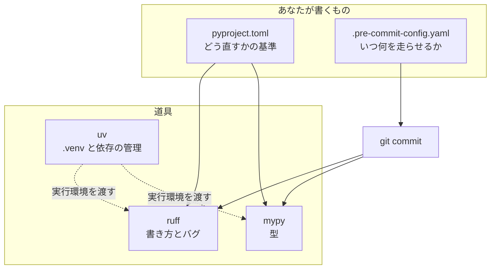
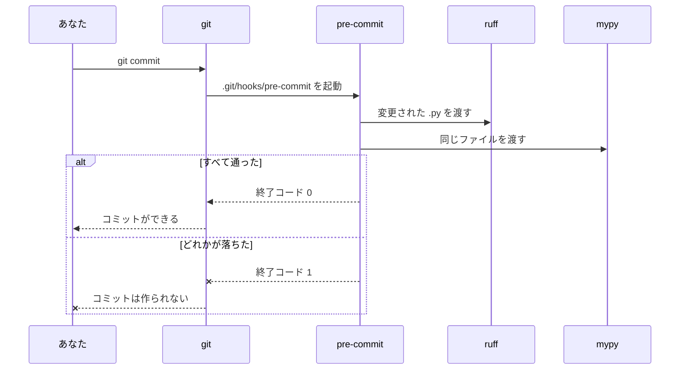

# P1a — 品質ゲートと FastAPI 基礎

`docs/_prompt.md` §6（M1）の出力。1ステップずつ追記していく。

---

## P1-1: 品質ゲートを先に立てる

**作るもの**: `git commit` したときに ruff と mypy が自動で走り、**通らなければコミットが止まる**状態
**重要度**: 🔴 毎日使う — この後の全ステップが「この2つを通ったコードしか載せない」前提で書かれるため（§4.6）
**前ステップとの接続**: 最初のステップ。**Python のコードはまだ1行も書かない**

### 1-0. このステップの初出トークン

| 系統 | トークン |
| --- | --- |
| **FastAPI** | —（このステップでは出ない） |
| **Python** | —（`.py` ファイルをまだ作らないため） |
| **【道具】** | `uv run` と `.venv`（§4.3.1-1） |
| **開発ツール** | `pyproject.toml` / `ruff` / `mypy` / `pre-commit` |
| **周辺** | — |

> 最初のステップに FastAPI が1つも出ないのは意図的。**後から入れると、それまでに書いたコードを一斉に直すことになる**（§2.4）。

---

### 1-1. コード

#### (1) `pyproject.toml` — **末尾に追記**（既存の `[project]` と `[dependency-groups]` はそのまま）

```toml
[tool.ruff]
# 1行の長さの上限。ruff format がこの幅で折り返す
line-length = 100
# 3.12 として解釈する（古い書き方を「古い」と判定できるようになる）
target-version = "py312"

[tool.ruff.lint]
# E: 書き方の統一 / F: 実際のバグ / I: import の並び順
select = ["E", "F", "I"]

[tool.mypy]
python_version = "3.12"
# 型の付いていない関数定義を許さない（P1 の段階ではこれだけ）
disallow_untyped_defs = true
```

**なぜこの4項目だけなのか**（設定名を並べるだけにしない。§4.12-14）

| 設定 | 何のために足すか |
| --- | --- |
| `line-length = 100` | 既定は 88。3つの引数に型を書くと 88 はすぐ超える。**折り返しが増えると差分が読みにくくなる**ので少し広げた |
| `target-version = "py312"` | これが無いと ruff は「どの版として読むか」を推測する。3.12 と伝えると、古い書き方の指摘が正確になる |
| `select = ["E", "F", "I"]` | 既定は `F` と `E` の一部だけ。**`I`（import の並び）を足すのが主目的**。並び順が人によって違うと、中身を変えていないのに差分が出る |
| `disallow_untyped_defs` | **P1 の段階ではこれだけ。** 関数に型を書く習慣をつけるのが狙い。P3 と P6 で段階的に締める（§2.4） |

> ⏭️ **後で回収**: mypy を `strict = true` にするのは **P6-4**。いきなり strict にすると、動かない設定として外されて終わるため。今は「関数に型を書く」だけを強制する。

#### (2) `.pre-commit-config.yaml` — **新規作成・全文**（リポジトリのルート）

```yaml
# コミットのたびに何を走らせるかの一覧
repos:
  - repo: local
    hooks:
      - id: ruff-check
        name: ruff (lint) — バグと書き方を見る
        entry: uv run ruff check --fix
        language: system
        types_or: [python, pyi]
        require_serial: true

      - id: ruff-format
        name: ruff (format) — 見た目を揃える
        entry: uv run ruff format
        language: system
        types_or: [python, pyi]
        require_serial: true

      - id: mypy
        name: mypy — 型が合っているか見る
        entry: uv run mypy
        language: system
        types_or: [python, pyi]
        require_serial: true
```

#### (3) フックを仕掛ける

```bash
uv run pre-commit install
uv run pre-commit run --all-files
```

✅ 検証済み: macOS / uv 0.12.17 / Python 3.12.13 / ruff 0.16.8 / mypy 2.3.1 / pre-commit 4.6.2。
`--all-files` の実際の出力は **1-6** に貼った。

---

### 1-1b. 📊 図解

#### (a) 誰が何を持っているか



✅ 描画確認済み: mermaid 12.0.0 でパース通過。

**読みどころは、設定ファイルが2つに分かれていること。** `pyproject.toml` は「**どう直すか**」の基準、
`.pre-commit-config.yaml` は「**いつ走らせるか**」。片方だけでは動かない。
`pre-commit install` でコミットが止まったのに `.pre-commit-config.yaml` が無かったのは、
**入れ物だけ置いて中身が空**だったから。

#### (b) `git commit` を叩いたとき、中で何が起きるか



✅ 描画確認済み: mermaid 12.0.0 でパース通過。

**`--x` の側（下）が、このステップで作っているもの。** 成功経路だけなら、フックを入れる意味がない。

---

### 1-2a. 🔤 入口の2行

#### 🔤 `pyproject.toml`
**読み方**: 「パイプロジェクト・トムル」
**要するに**: このプロジェクトの**身分証と設定をまとめた1枚の紙**。名前・必要な部品・道具の設定が全部ここに書いてある。

#### 🔤 `uv`
**読み方**: 「ユー・ブイ」
**要するに**: **部品の買い出し係**。必要なものを取ってきて、このプロジェクト専用の箱（`.venv`）に入れる。

#### 🔤 `ruff`
**読み方**: 「ラフ」
**要するに**: **書き方の見張り番**。間違い探しと、見た目の揃え直しを両方やる。

#### 🔤 `mypy`
**読み方**: 「マイ・パイ」
**要するに**: **型の見張り番**。「数を入れる約束の場所に文字を入れていないか」を、動かす前に調べる。

#### 🔤 `pre-commit`
**読み方**: 「プリ・コミット」
**要するに**: **コミットの直前に見張り番を呼ぶ係**。呼ぶ相手は `.pre-commit-config.yaml` に書いておく。

---

### 1-2. 🔬 仕組み解剖

| 部品 | 正式名称 | 実行時に何が起きるか |
| --- | --- | --- |
| `[tool.ruff]` | TOML のテーブル（セクション） | **ruff を起動した瞬間に**読まれる。`pyproject.toml` は複数の道具の設定を同居させる場所で、`[tool.<道具名>]` が各道具の取り分。ruff は `[tool.ruff]` しか見ず、mypy は `[tool.mypy]` しか見ない |
| `repo: local` | pre-commit のリポジトリ指定 | フックの**取得元**。`local` は「取ってこない。この環境にあるものを使う」の意味。起動のたびに `entry` のコマンドをそのまま実行する |
| `language: system` | フックの実行環境の指定 | pre-commit が**専用の環境を作らず**、いまの PATH でコマンドを実行する。`uv run` を書いているので、結果として**このプロジェクトの `.venv`** が使われる |
| `types_or: [python, pyi]` | ファイル種別のフィルタ | pre-commit が渡すファイルを `.py` / `.pyi` に絞る。**該当が0件ならフックは実行されず `Skipped`** になる（1-6 の実出力を参照） |
| `pre-commit install` | フックのインストール | `.git/hooks/pre-commit` に**起動用のスクリプトを1枚置く**。中身は「pre-commit を呼べ」だけで、**何を走らせるかは書かれていない** |

**いつ評価されるか**: `pyproject.toml` は各道具の**起動時**。`.pre-commit-config.yaml` は**コミットのたび**。

**どの道具の責務か**: 並び順の修正は ruff、型は mypy、**呼ぶタイミングだけが pre-commit**、`.venv` の用意は uv。
pre-commit 自身は lint も型チェックもしない。

**失敗したらどうなるか**: どれか1つでも終了コードが 0 以外なら、git は**コミットを作らずに中断する**。
`--fix` で自動修正できた場合も、**ファイルを書き換えた時点で失敗扱い**になる（1-6 の Q3）。

---

### 1-3. 🐍 Python解説

**このステップでは Python の文法は1つも出てこない。** 書いたのは TOML と YAML だけ。
Python の文法は **P1-2** の `app/main.py` から始まる。

---

### 1-3a. 🐍 Python の道具立て: `uv run` と `.venv`（§4.3.1-1）

**現象**: `python main.py` と打つと、入れたはずの FastAPI が「無い」と言われる。

```
ModuleNotFoundError: No module named 'fastapi'
```

**なぜそうなるか**

Python は**1台のパソコンに何個でも入る**。そして**入っている Python ごとに、持っている部品が違う**。

- あなたのパソコン全体の Python は **3.14.3**（`python3 --version` で確認済み）
- このプロジェクトの Python は **3.12.13**。`.venv/` という箱の中にいる

`uv add fastapi` で入れた FastAPI は、**`.venv/` の中の 3.12.13 にだけ**入っている。
`python main.py` と打つと、パソコン全体の 3.14.3 が動いてしまうので、「そんな部品は無い」になる。

**たとえ**: `.venv/` は**このプロジェクト専用の道具箱**。`uv run` は「**その道具箱を開けてから実行して**」という指示。
道具箱を開けずに作業を始めると、道具が見つからない。

**どう直すか**: 頭に `uv run` を付ける。これだけ。

```bash
uv run python main.py     # ← .venv の中の Python 3.12.13 が動く
uv run ruff check         # ← .venv の中の ruff が動く
uv run pytest             # ← P6 でも同じ
```

> **`source .venv/bin/activate` は覚えなくていい。** 昔ながらの「道具箱を開けっぱなしにする」やり方で、
> 今でも動くが、**開けたことを忘れて別のプロジェクトで作業すると事故る**。`uv run` は毎回その場で開けて閉じるので、忘れようがない。

**TS で言えば**: `.venv/` が `node_modules/`、`uv run` が `npx` にあたる。
違いは、Node は `node_modules/` を**自動で探しに行く**が、**Python は探しに行かない**こと。だから明示的に `uv run` が要る。

⚠️ **この教材では、Python がらみのコマンドは全部 `uv run` から始まる。** 例外はない。

---

### 1-3b. 🧩 周辺注

なし（Docker / MySQL はこのステップでは出ない。P2-1 から）。

---

### 1-4. 解説 — なぜこう設計するか

#### 🪜 なぜなぜ: なぜ「手で実行する」ではなく、git に仕掛けるのか

**なぜ① そもそも `git commit` のときに、なぜ勝手にコマンドが走るのか**
→ git には**フック**という仕組みがあり、`.git/hooks/pre-commit` という名前の実行ファイルが置いてあると、
コミットを作る直前に必ずそれを起動する。**終了コードが 0 以外ならコミットを中断する**。
`pre-commit install` がやったのは、このファイルを1枚置くことだけ。

**なぜ② なぜ git に任せるのか。自分で `ruff check` を打てばいいのでは**
→ **人間は忘れるから**、ではない（それもあるが本質ではない）。本質は**いつ止めるか**。
手で打つ場合、止まるのは「打ったとき」。CI に任せる場合、止まるのは「push した後」。
**コミットの時点で止めれば、壊れたコードがそもそも歴史に残らない。**
後から「このコミットは lint が通っていない」と分かっても、履歴は書き換えられない。

**なぜ③ では、フックを入れると何を失うのか** 🤔 まず自分で考える

<details><summary>答え</summary>

3つ失う。

1. **速さ。** コミットのたびに数秒待つ。ファイル数が増えるほど伸びる
2. **逃げ道が生まれる。** 急いでいるときに `git commit --no-verify` で飛ばせてしまう。
   飛ばしたことは**コミットには残らない**ので、後から分からない
3. **環境差が事故になる。** `language: system` はこの環境の道具をそのまま使うので、
   道具の版が違う人と一緒に作業すると、**自分の環境だけ落ちる／自分の環境だけ通る**が起きうる

3 は実際には `uv.lock` が版を固定しているので、**`uv run` 経由なら揃う**。
これが「`uv run` を必ず頭に付ける」ルールのもう1つの理由。

**ここから先は git 自体の設計思想の領域**（フックはあくまでローカルの仕組みで、強制力は持たせない）なので、ここで止める。
根拠: https://git-scm.com/docs/githooks
</details>

> 🧠 **考え方**: 品質ゲートは「いい行いをする道具」ではなく「**悪い状態を歴史に残さない関所**」。
> だから**一番最初**に立てる。後から立てると、関所の後ろに既に壊れたものが溜まっている。

---

### 1-5. 🏢 実務メモ ／ ⚠️ アンチパターン

> 🏢 **実務メモ**: フックの書き方には「配布元から取ってくる（`repo: https://...`）」やり方もあるが、
> ここでは **`repo: local` + `language: system`** にした。理由は **mypy がプロジェクトの `.venv` を見る必要がある**から。
> 取ってくる方式だと mypy は隔離された別の環境で動き、**FastAPI や SQLAlchemy の型が見えず**、P3 以降で誤検知が出る。
> 根拠: https://pre-commit.com/#repository-local-hooks

> ⚠️ **アンチパターン**: `git commit --no-verify` を常用する。
> 1回使うぶんには逃げ道として正しいが、常用すると**フックが入っていないのと同じ**になる。
> しかも「飛ばした」記録がコミットに残らないので、後から追えない。
> 根拠: https://git-scm.com/docs/git-commit#Documentation/git-commit.txt---no-verify

---

### 1-6. 🔮 予測 → 動作確認

**先に予想してから実行する。**

1. `.py` ファイルが1つも無い状態で `pre-commit run --all-files` を叩くと、3つのフックはどうなるか
2. 型の無い関数を書いてコミットしようとすると、**3つのうちどれが**止めるか。コミットは作られるか
3. 未使用 import のように **ruff が自動で直せる**問題のとき、コミットは成功するか失敗するか

<details><summary>1 の実行と結果</summary>

```bash
uv run pre-commit run --all-files
```

```
ruff (lint) — バグと書き方を見る.....................(no files to check)Skipped
ruff (format) — 見た目を揃える.......................(no files to check)Skipped
mypy — 型が合っているか見る..........................(no files to check)Skipped
→ 終了コード: 0
```

✅ 検証済み。**`Skipped` であって `Passed` ではない。** `types_or` で `.py` に絞っているので、
対象0件なら**そもそも起動しない**。「通った」のではなく「見ていない」。
</details>

<details><summary>2・3 の実行と結果</summary>

わざと壊れたファイルを作る。

```bash
cat > _scratch_bad.py <<'PY'
import sys
import os


def add(a, b):
    return a + b
PY
git add _scratch_bad.py
uv run pre-commit run --files _scratch_bad.py
```

```
ruff (lint) — バグと書き方を見る.........................................Failed
- hook id: ruff-check
- files were modified by this hook
Found 2 errors (2 fixed, 0 remaining).

ruff (format) — 見た目を揃える...........................................Failed
- hook id: ruff-format
- files were modified by this hook
1 file reformatted

mypy — 型が合っているか見る..............................................Failed
- hook id: mypy
- exit code: 1
_scratch_bad.py:1: error: Function is missing a type annotation  [no-untyped-def]

→ 終了コード: 1
```

✅ 検証済み。**3つとも落ちた。コミットは作られない。**

**3 の答えが要点**: ruff は未使用 import を**自動で直した**（`2 fixed`）のに、**Failed になっている**。
`files were modified by this hook` — 直したこと自体が失敗扱い。
**理由**: 直った後のファイルは、あなたが `git add` した内容と違う。
勝手に書き換えたものを黙ってコミットしたら、**あなたが見ていないコードが履歴に入る**。
だから一度止めて、「直したので、確認して `git add` し直してください」と促している。

後片付け:

```bash
git restore --staged _scratch_bad.py && rm _scratch_bad.py
```

> 💡 **補足**: mypy は既定で結果をキャッシュする（incremental mode）。
> 他の道具が同じファイルを書き換えた直後などに、結果が実態と合わないことがある。
> **おかしいと思ったら `rm -rf .mypy_cache` して再実行する。**
> 根拠: https://mypy.readthedocs.io/en/stable/command_line.html#incremental-mode
</details>

---

### 1-6b. 🧾 OpenAPI スキーマの差分

**対象外。** OpenAPI スキーマを読むのは **P1-6** から（§4.14）。ここではまだアプリが存在しない。

---

### 1-7. ✅ 想起チェック

1. `pyproject.toml` と `.pre-commit-config.yaml` は、それぞれ何を決めているか
2. `pre-commit install` を実行したのに `.pre-commit-config.yaml` が無いと、何が起きるか
3. `uv run` を付け忘れると、なぜ `ModuleNotFoundError` になるのか
4. ruff が問題を**自動で直した**とき、コミットは成功するか

<details><summary>答え</summary>

1. `pyproject.toml` = **どう直すか**の基準（ruff / mypy の設定）。`.pre-commit-config.yaml` = **いつ何を走らせるか**。
2. `git commit` が必ず失敗する。`No .pre-commit-config.yaml file was found`。
   フックは**入れ物**で、中身は設定ファイルにしかないため。
3. `uv run` 無しではパソコン全体の Python（3.14.3）が動く。FastAPI は `.venv` の中の 3.12.13 にしか入っていないため。
4. **失敗する。** 直した結果はあなたが `git add` した内容と違うので、一度止めて確認させる。
   `git add` し直してもう一度コミットすれば通る。
</details>

---

### 1-8. 初出トークンの回収確認

| トークン | 扱い |
| --- | --- |
| `pyproject.toml` | 1-2a で入口の2行 / 1-2 で仕組み解剖 |
| `ruff` | 1-2a で入口の2行 / 1-1 で設定の各項目 |
| `mypy` | 1-2a で入口の2行 / ⏭️ `strict = true` は **P6-4** で回収 |
| `pre-commit` | 1-2a で入口の2行 / 1-2 で仕組み解剖 |
| `uv run` と `.venv` | **1-3a で道具立て**（§4.3.1-1） |
| `repo: local` / `language: system` | 1-2 で仕組み解剖 / 1-5 で実務メモ |
| `types_or` | 1-2 で仕組み解剖 / 1-6 の Q1 で実挙動を確認 |

**未回収: 0件**（`⏭️` 宣言した `strict = true` のみ P6-4 に持ち越し）

---

### 1-9. 📌 進捗の更新

`README.md` の進捗表 P1a を「P1-1 完了」、次の一手を `M1: P1 ステップ2` に更新した。

**次のステップ**: P1-2「最小のエンドポイント」。`GET /health` が 200 を返すところまで作り、
**初めて Python の文法が出てくる**（`def` / デコレータ `@` / 型アノテーション）。
