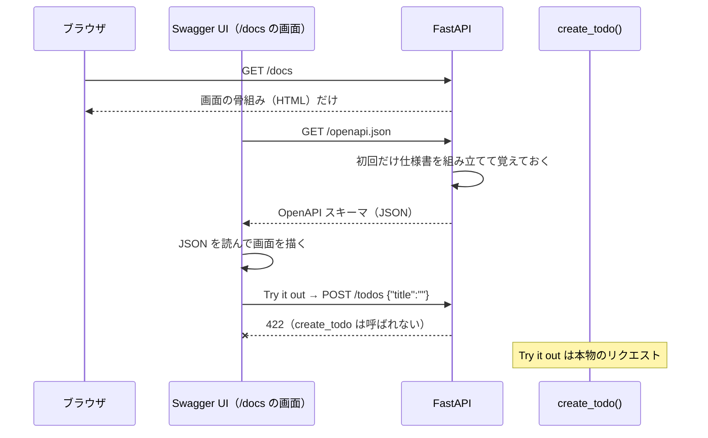
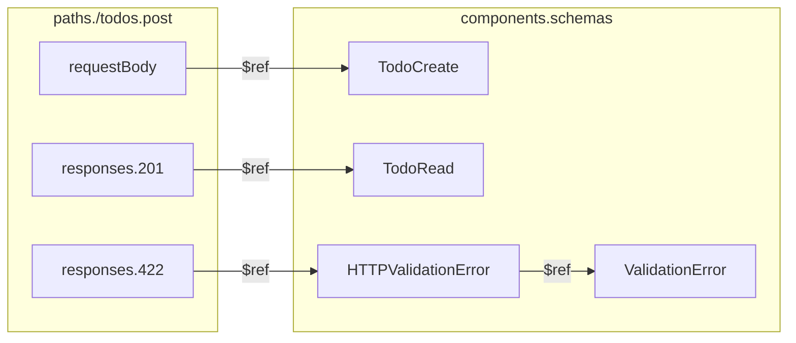
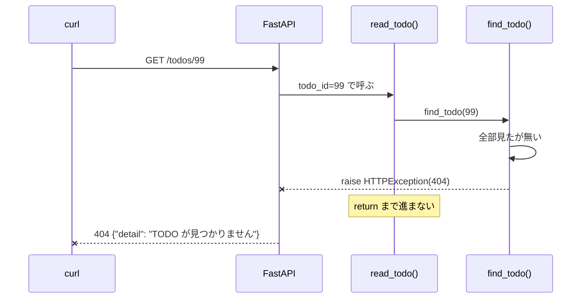
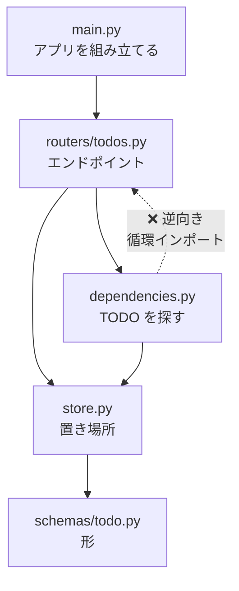
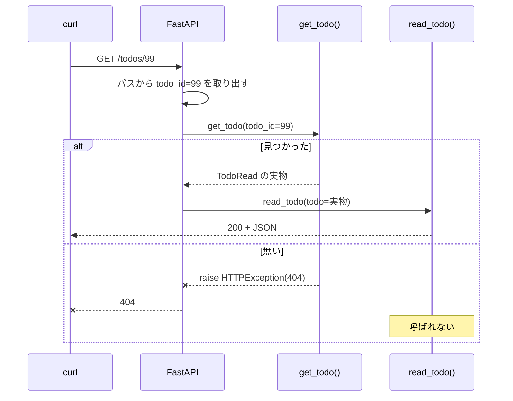
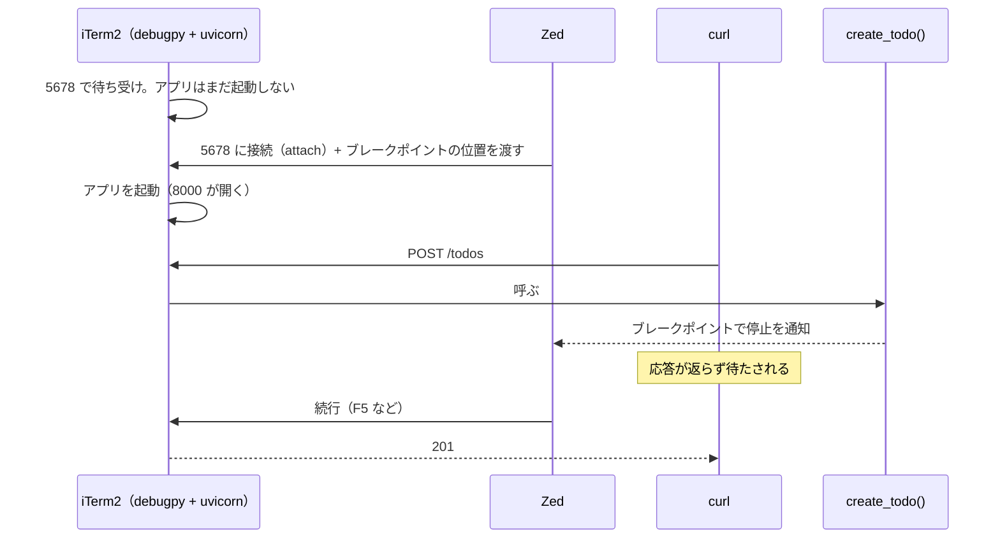
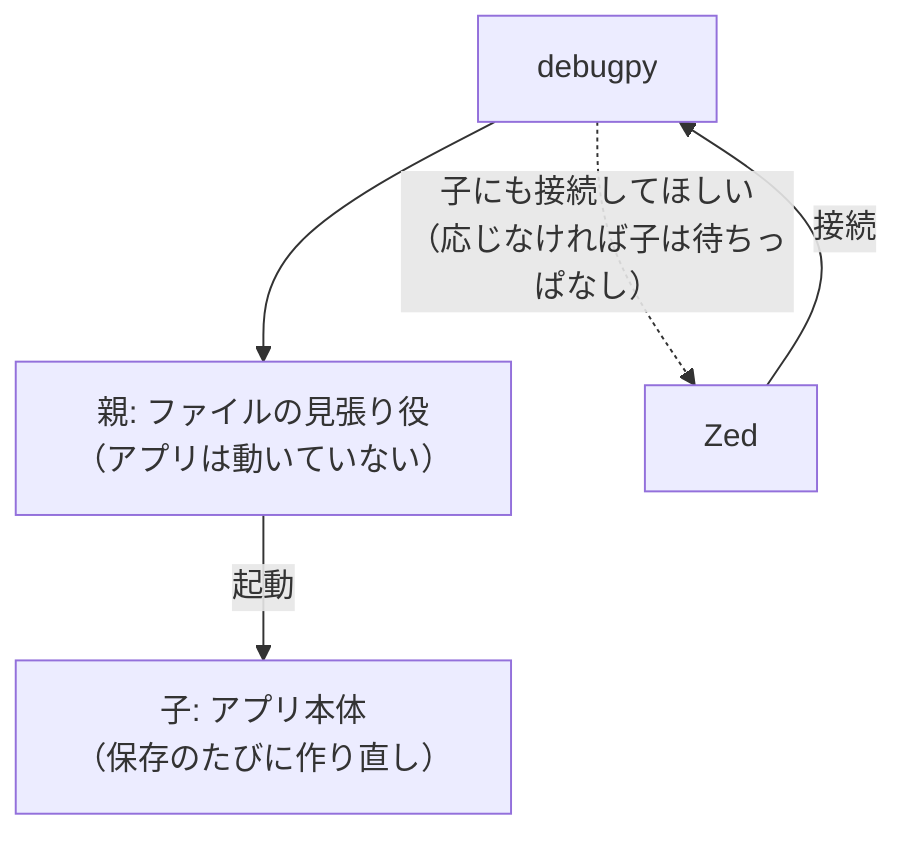

# P1b — 生成物を読めるようになる

P1a では**宣言を書いた**。P1b では、その宣言から FastAPI が**何を生成したか**を読み、
残りの CRUD・ファイル分割・デバッガまで進む。

| # | タイトル |
| --- | --- |
| P1-6 | 生成された仕様書を読む |
| P1-7 | 残りの CRUD と 404 |
| P1-8 | ルーター分割と依存性注入 |
| P1-9 | Zed からブレークポイントで止める |
| P1-10 | 欄をまたぐ条件を書く（v11 で追加） |

---

## P1-6: 生成された仕様書を読む

**作るもの**: `/openapi.json` を `jq` で読み、**書いたコードの1行1行が仕様書のどこに現れているか**を対応づける。コードは `tags=` / `summary=` / docstring を足すだけ
**重要度**: 🔴 毎日使う — 仕様書はフロントエンドや他チームとの**約束そのもの**で、コードを変えるたびに「約束がどう変わったか」を確かめることになるため
**前ステップとの接続**: P1-2 から「仕様書が勝手に生えている」とだけ言って先送りしてきた（2-6b / 3-6b / 4-6b / 5-6b）。**入口の形（P1-4）と出口の形（P1-5）がそろった**ので、ここでまとめて読む

### 6-0. このステップの初出トークン

| 系統 | トークン |
| --- | --- |
| **FastAPI** | `GET /openapi.json`（と `/docs` / `/redoc`）/ `components.schemas` と `$ref` / `tags=` / `summary=`（3つ = 上限） |
| **Python** | `"""..."""`（docstring） |
| **【道具】** | `jq` の読み方（`.キー` / `."/todos"` / `keys` / `\|` / `-c` / `-r`） |
| **周辺** | — |

> `jq` は P1-5 で「整形する道具」として出しただけだった。今回は**主役の道具**なので、周辺注ではなく 6-2b で読み方をまとめて扱う。

---

### 6-1. コード

**今回のコード変更は小さい。** 主役は 6-6 の「読む」ほう。

#### 要件

1. 3つのエンドポイントに **`tags=`** を付ける。`/health` は `"health"`、`/todos` の2つは `"todos"`
2. 3つに **`summary=`** で日本語の短い説明を付ける
3. `create_todo` に **docstring**（関数の説明文）を書く。複数行で、箇条書きを1つ以上含める
4. ruff / mypy が通る

#### 骨組み: `app/main.py`（変わる部分だけ）

```python
@app.get("/health")  # TODO: tags と summary
def health() -> dict[str, str]:
    return {"status": "ok"}


@app.post("/todos", status_code=201)  # TODO: tags と summary
def create_todo(todo: TodoCreate) -> TodoRead:
    # TODO: ここに docstring（関数の最初の行に置く）
    new_todo = TodoRead(id=len(todos) + 1, title=todo.title, done=todo.done)
    todos.append(new_todo)
    return new_todo


@app.get("/todos")  # TODO: tags と summary
def list_todos() -> list[TodoRead]:
    return todos
```

<details><summary>完成形（自分で書いてから開く）</summary>

`app/main.py`（全文）

```python
from fastapi import FastAPI

from app.schemas.todo import TodoCreate, TodoRead

app = FastAPI()

todos: list[TodoRead] = []


@app.get("/health", tags=["health"], summary="死活確認")
def health() -> dict[str, str]:
    return {"status": "ok"}


@app.post("/todos", status_code=201, tags=["todos"], summary="TODO を1件作る")
def create_todo(todo: TodoCreate) -> TodoRead:
    """
    タイトルを受け取り、ID を振って保存する。

    - 知らない欄を送ると 422
    - 成功すると 201
    """
    new_todo = TodoRead(id=len(todos) + 1, title=todo.title, done=todo.done)
    todos.append(new_todo)
    return new_todo


@app.get("/todos", tags=["todos"], summary="TODO の一覧")
def list_todos() -> list[TodoRead]:
    return todos
```

</details>

✅ 検証済み: Python 3.12.13 / FastAPI 0.141.1 / Pydantic 2.13.5 / jq 1.8.2。
完成形を別の場所にコピーして `ruff check` = `All checks passed!`、`ruff format --check` = `4 files already formatted`、
`mypy` = `Success: no issues found in 4 source files`。`jq` の出力はすべて 6-6 に実物を貼った。

> 💡 **補足**: 6-6 の Q1〜Q3 は、**コードを変える前**（P1-5 の状態）でも同じ結果になる。先に読んで、最後に `tags=` を足して差分を見る（6-6b）順番でもよい。

---

### 6-1b. 📊 図解

#### (a) 4つの名前は、それぞれどこにいるか



✅ 描画確認済み: mermaid 12.0.0 でパース通過。

**Swagger UI は FastAPI の一部ではなく、ブラウザで動く「JSON を絵にする道具」。**
`/docs` が返すのは空っぽの画面で、中身は**ブラウザが改めて `/openapi.json` を取りに行って**描いている。
だから「コードを直したのに画面が変わらない」ときは、**まず `/openapi.json` を `jq` で見る**。JSON が変わっていなければコード側（あるいはサーバの再起動）、JSON が変わっていれば画面側（ブラウザの再読み込み）の問題、と切り分けられる。

#### (b) `$ref` は「実体はあっち」という矢印



✅ 描画確認済み: mermaid 12.0.0 でパース通過。

**`paths` の中には形の実体が無い。** 全部が `components.schemas` を指す矢印になっている。
`TodoRead` は `POST` の 201 からも `GET` の 200 からも指されているが、**実体は1か所**。
右下の `HTTPValidationError → ValidationError` は、**あなたが書いていないのに FastAPI が足した**もの（422 の形）。

---

### 6-2a. 🔤 入口の2行

#### 🔤 `GET /openapi.json`
**読み方**: 「オープン・エーピーアイ・ドット・ジェイソン」
**要するに**: **この API の取扱説明書を、機械が読める形で1枚にしたもの**。書いたコードから自動で作られる。

#### 🔤 `components.schemas` と `$ref`
**読み方**: 「コンポーネンツ・ドット・スキーマズ」「ダラー・レフ」（レフは reference の略）
**要するに**: `components.schemas` は**データの形の見本帳**。`$ref` は「**形は見本帳の何ページ目を見て**」という付箋。

#### 🔤 `tags=["todos"]` / `summary="..."`
**読み方**: 「タグズ・イコール…」「サマリー・イコール…」
**要するに**: 取扱説明書の**章分け**と、各ページの**見出し**。動きは何も変わらない。

---

### 6-2b. 🧰 【道具】`jq` の読み方（このステップで使う分だけ）

`jq` は **JSON を上から順にたどって、欲しいところだけ取り出す**道具。書き方はフォルダをたどるのに近い。

| 書き方 | 意味 | 例 |
| --- | --- | --- |
| `.` | 全体（そのまま整形して出す） | `jq .` |
| `.キー` | そのキーの中へ入る | `.info` → `{"title":"FastAPI","version":"0.1.0"}` |
| `.a.b` | 続けて入る | `.info.title` → `"FastAPI"` |
| `."/todos"` | **記号を含むキーは `""` で囲む** | `.paths."/todos"` |
| `keys` | 中にあるキーの**名前だけ**を並べる | `.paths \| keys` → `["/health","/todos"]` |
| `\|` | 左の結果を右に渡す（シェルのパイプと同じ考え方） | `.paths \| keys` |
| `-c` | 1行に詰めて出す（Compact） | `jq -c .info` |
| `-r` | 文字列の `""` を外して出す（Raw） | `jq -r .info.title` → `FastAPI` |

**いちばん転ぶところ**: `/` や `$` を含むキーを `""` で囲み忘れる。実際のエラーはこうなる。

```
$ jq '.paths./todos' openapi.json
jq: error: syntax error, unexpected '/', expecting FORMAT or QQSTRING_START or '[' at <top-level>, line 1, column 8:
    .paths./todos
           ^

$ jq '...schema.$ref' openapi.json
jq: error: syntax error, unexpected BINDING, expecting FORMAT or QQSTRING_START or '[' ...
```

✅ 検証済み: jq 1.8.2 で実際に出した出力。

`$ref` の `$` は、jq の中では「変数」の印なので、`."$ref"` と囲まないと別物として読まれる。
**`QQSTRING_START`（= `"` が来るはずだった）と言われたら、囲み忘れ**と覚えておく。

> 💡 コマンド全体は `'...'`（シングルクォート）で囲む。こうすると、中の `"` と `$` をシェルが勝手に解釈しない。

---

### 6-2. 🔬 仕組み解剖

| 部品 | 正式名称 | 実行時に何が起きるか |
| --- | --- | --- |
| `GET /openapi.json` | OpenAPI スキーマ | `FastAPI()` を作った時点で、この経路が**自動で経路表に入っている**。**最初に叩かれたとき**に、経路表と各経路の型・デコレータの引数をすべて読んで JSON を組み立て、`app.openapi_schema` に**覚えておく**。2回目からは覚えたものを返すだけ |
| `components.schemas` / `$ref` | 再利用される形の定義 / 参照 | Pydantic がモデルごとに **JSON Schema**（JSON の形を書くための別の決まり）を作り、FastAPI がそれを `components.schemas` に1つずつ並べる。使う場所には実体ではなく `{"$ref": "#/components/schemas/名前"}` を置く |
| `tags=` / `summary=` / docstring | パスオペレーションのメタデータ | 起動時にデコレータが受け取り、経路表の行にメモとして付くだけ。**リクエストの処理には一切使われない**。`summary=` を省くと関数名から作られ（`create_todo` → `"Create Todo"`）、docstring は `description` になる |

**いつ評価されるか**: 型やデコレータの引数を読むのは起動時。JSON に組み立てるのは**最初に `/openapi.json` が叩かれたとき**（以後は使い回し。`--reload` で再起動すれば作り直される）。

**どの道具の責務か**: モデル1つぶんの形（`properties` / `required` / `minLength`）は **Pydantic** が JSON Schema として作る。
それを `paths` と組み合わせて1枚にまとめ、422 の形を足すのが **FastAPI**。画面に描くのは **Swagger UI / ReDoc**（ブラウザ側）。

**失敗したらどうなるか**: 読む側の失敗は無い。怖いのは**書いてあることと実際が違う**ほう。6-4 のなぜなぜ③で扱う。

#### 用語を分ける（§4.14）

| 呼び名 | 何を指すか | どこにあるか |
| --- | --- | --- |
| **OpenAPI** | API の仕様書を書くための**決まりそのもの**（昔は Swagger Specification と呼ばれていた） | 仕様の文書 |
| **OpenAPI スキーマ** | その決まりに従って FastAPI が**生成した JSON** | `GET /openapi.json` |
| **Swagger UI** | その JSON を読んで**画面に描き、試し打ちもできる道具** | `GET /docs` |
| **ReDoc** | 同じ JSON を**読み物の見た目**で描く道具（試し打ちは無い） | `GET /redoc` |

**「Swagger を見て」は、この4つのどれかが曖昧。** この教材では必ず4つの名前で呼び分ける。
根拠: https://fastapi.tiangolo.com/tutorial/first-steps/#openapi ／ https://swagger.io/specification/

#### コードの1行が、スキーマのどこに出るか

| コード | スキーマ上の場所と値 |
| --- | --- |
| `@app.post("/todos")` | `paths."/todos".post` |
| 関数名 `create_todo` | `operationId: "create_todo_todos_post"`（関数名 + パス + メソッド） |
| `todo: TodoCreate` | `requestBody` → `$ref: TodoCreate`、`"required": true` |
| `Field(min_length=1, max_length=200)` | `TodoCreate.properties.title` の `"minLength": 1` / `"maxLength": 200` |
| `done: bool = False` | `"default": false`、そして `required` に**入らない** |
| `extra="forbid"` | `"additionalProperties": false` |
| `status_code=201` | `responses."201"`（200 は**消える**） |
| `-> TodoRead` | `responses."201"` → `$ref: TodoRead` |
| （書いていない） | `responses."422"` → `$ref: HTTPValidationError` |
| `-> list[TodoRead]` | `"type": "array"`、`"items"` → `$ref: TodoRead` |
| `-> dict[str, str]` | `"type": "object"`、`"additionalProperties": {"type": "string"}` |

**P1a で書いた宣言は、ほぼ全部ここに出ている。** 6-6 で1つずつ `jq` で確かめる。

---

### 6-3. 🐍 Python解説

#### 🐍 `"""..."""`（docstring）

```python
def create_todo(todo: TodoCreate) -> TodoRead:
    """
    タイトルを受け取り、ID を振って保存する。

    - 知らない欄を送ると 422
    """
```

**読み方**: 「トリプル・クォート」。中身は「ドックストリング」（documentation string の略）

**たとえ**: 関数に付ける**取扱説明の貼り紙**。`#` のメモは Python が捨ててしまうが、こちらは**関数に貼り付いたまま残る**。

**正確には**:
- `"""` で始めて `"""` で閉じると、**改行を含む文字列**を書ける（`"..."` は1行だけ）
- その文字列を**関数の中身の一番最初**に置くと、特別に **docstring** として扱われ、関数にくっついて保存される。2行目以降に置くと、ただの捨てられる文字列になる
- **FastAPI はこれを読んで、仕様書の `description` にする**。字下げは自動で取り除かれ、Markdown（`- ` の箇条書きなど）としても解釈される
- `#` のコメントとの使い分け: `#` は**コードを読む人**へのメモ、docstring は**関数を使う人**への説明

**TS なら**: 関数の上に書く `/** ... */`（JSDoc）が近い。違いは**置く場所が関数の中**であることと、**実行中のプログラムから読める**こと（JSDoc はコンパイル後には残らない）。

> 💡 あなたがブランクページ再現で `"""Health check endpoint"""` と書いていたのが、まさにこれ。
> `/health` に付けていれば、`paths."/health".get.description` に `"Health check endpoint"` が出る。

---

### 6-3a. 🐍 Python の道具立て ／ 6-3b. 🧩 周辺注

このステップでは該当なし（`jq` は 6-2b で扱った）。

---

### 6-4. 解説 — なぜこう設計するか

#### 🪜 なぜなぜ: なぜ仕様書を手で書かず、コードから作るのか

**なぜ① `/openapi.json` の中身は、どこから来ているのか**
→ **起動時に経路表に登録されたもの全部**から。デコレータの引数（`status_code=` / `tags=`）、引数の型（`TodoCreate`）、戻り値の型（`TodoRead`）を、FastAPI が最初の `/openapi.json` のときにまとめて読み、1枚の JSON に組み立てる。
**あなたは仕様書を1行も書いていない**のに、`minLength` まで入っていたのはそのため。

**なぜ② 仕様書を別に手で書く（`openapi.yaml` を用意する）のでは、なぜだめなのか**
→ **2か所に書いたものは、いつか必ずズレる**から（P1-2 の なぜなぜ② と同じ理屈）。
`max_length` を 200 から 100 に変えたのに `openapi.yaml` を直し忘れると、フロントエンドは古い約束のまま作り続ける。
コードから作れば、**仕様書は実装の写し**になり、ズレようがない。P1-3 のなぜなぜ② で「宣言だから機械に読める」と書いたのは、ここに繋がっている。
根拠: https://fastapi.tiangolo.com/features/#automatic-docs

**なぜ③ では、コードから作る方式は何を失うのか** 🤔 まず自分で考える

<details><summary>答え</summary>

2つ失う。

**1. 宣言していないことは、仕様書に出ない。**
「実装の写し」と言ったが、正確には**宣言の写し**。宣言の外で起きることは写らない。

- P1-5 の 5-6 Q3 で起こした **500** は、`responses` のどこにも無い（6-6 の Q3 で確かめる）
- 次の P1-7 で `HTTPException(404)` を投げるようにしても、**投げるだけでは 404 は仕様書に出ない**

→ **手当て**（§4.2.1 ルール6）: **P1-7** で `responses=` を使い、「このエンドポイントは 404 も返す」と**宣言として**書き足す。
仕様書に出したいことは、**型かデコレータの引数で宣言する**。これが FastAPI で仕様書を正しく保つための唯一の方法。

**2. 「先に仕様書を決めてから作る」進め方がしにくい。**
フロントエンドと先に約束だけを決めて、並行して作りたい場面がある（**スキーマファースト**と呼ばれる進め方）。
コードから作る方式では、**コードを書くまで仕様書が存在しない**。

→ **この教材では手当てしない。** 仕様書から Python のコードを生成する道具はあるが、FastAPI の中心的な使い方から外れる。
代わりに、**中身が空のエンドポイント（型だけ書いて `...`）を先に作って仕様書を渡す**、という逃げ方はできる。
</details>

> 🧠 **FastAPI の考え方**: 仕様書は「書くもの」ではなく「**宣言から出てくるもの**」。
> だから仕様書に載せたいことは、**コメントではなく宣言として書く**。宣言していないことは、仕様書にとって存在しない。

---

### 6-5. 🏢 実務メモ ／ ⚠️ アンチパターン

> 🏢 **実務メモ**: `tags=` は**リソース単位**（`todos` / `users`）で付ける。Swagger UI はタグごとにエンドポイントをまとめて表示し、
> OpenAPI スキーマからクライアントのコードを自動生成する道具の多くも、**タグ単位でファイルやクラスを分ける**。
> 根拠: https://fastapi.tiangolo.com/advanced/generate-clients/#generate-a-typescript-client-with-tags

> ⚠️ **アンチパターン**: 仕様書に載せたい条件を、**docstring にだけ**書く（「title は 200 文字まで」と説明文に書いて、`max_length=200` を書かない）。
> docstring は人間が読む説明で、**検証もされず、機械も読めない**。条件は `Field()` に、説明は docstring に、と分ける。
> 根拠: https://fastapi.tiangolo.com/tutorial/path-operation-configuration/#description-from-docstring

---

### 6-6. 🔮 予測 → 動作確認

**先に予想してから実行する。**

1. `/openapi.json` の一番上の階層には、キーがいくつあるか。`TodoCreate` の `required` には何が入っているか
2. `POST /todos` の `responses` のキーは何か。**P1-5 の 5-6 Q3 で起こした 500 は入っているか**
3. `components.schemas` には、いくつの形が載っているか。**自分で書いていないもの**はあるか

サーバを起動しておく。

```bash
uv run uvicorn app.main:app --port 8000 --reload
```

<details><summary>実行と結果</summary>

**1 の答え: 4つ。`required` は `["title"]` だけ**

```bash
curl -s http://127.0.0.1:8000/openapi.json | jq 'keys'
```
```json
["components", "info", "openapi", "paths"]
```

上から順に読む（§4.14）。

```bash
curl -s http://127.0.0.1:8000/openapi.json | jq -c '{openapi, info}'
curl -s http://127.0.0.1:8000/openapi.json | jq -c '.paths | keys'
```
```
{"openapi":"3.1.0","info":{"title":"FastAPI","version":"0.1.0"}}
["/health","/todos"]
```

- `openapi`: 準拠している OpenAPI の版。FastAPI が決める
- `info`: API の名前と版。`FastAPI()` に何も渡していないので既定値のまま（この教材では変えない）
- `paths`: P1-3 で作った `/items/` は、**消したので載っていない**

`TodoCreate` の中身:

```bash
curl -s http://127.0.0.1:8000/openapi.json | jq '.components.schemas.TodoCreate'
```
```json
{
  "properties": {
    "title": { "type": "string", "maxLength": 200, "minLength": 1, "title": "Title" },
    "done": { "type": "boolean", "title": "Done", "default": false }
  },
  "additionalProperties": false,
  "type": "object",
  "required": ["title"],
  "title": "TodoCreate"
}
```

（読みやすさのため、`properties` の中だけ1行に詰めて貼った）

**`done` は `= False` があるので `required` に入らない。** P1-4 の「既定値があれば任意」が、そのまま仕様書に写っている。
`extra="forbid"` は `"additionalProperties": false` になった。**仕様書を読むだけで、フロントエンドは「余計な欄を送ると弾かれる」と分かる。**

**2 の答え: `["201", "422"]`。500 は入っていない**

```bash
curl -s http://127.0.0.1:8000/openapi.json | jq '.paths."/todos".post.responses | keys'
```
```json
["201", "422"]
```

- `201`: `status_code=201` を書いたので、既定の `200` が**置き換わった**
- `422`: **書いていないのに入っている**。ボディを受け取る以上、形が合わないことがありうるので、FastAPI が自動で足す
- **500 は無い。** P1-5 で実際に 500 を返せたのに、仕様書には一言も書かれていない。**宣言の外で起きたことは写らない**（6-4 のなぜなぜ③）

`$ref` をたどってみる。

```bash
curl -s http://127.0.0.1:8000/openapi.json \
  | jq -r '.paths."/todos".post.requestBody.content."application/json".schema."$ref"'
```
```
#/components/schemas/TodoCreate
```

**この文字列は、そのまま jq の道順になっている。** `#` が「この JSON の一番上」、`/` が「中へ入る」。

```
#/components/schemas/TodoCreate
 → jq '.components.schemas.TodoCreate'
```

**3 の答え: 4つ。そのうち2つは自分で書いていない**

```bash
curl -s http://127.0.0.1:8000/openapi.json | jq -c '.components.schemas | keys'
```
```json
["HTTPValidationError","TodoCreate","TodoRead","ValidationError"]
```

`TodoCreate` と `TodoRead` はあなたのクラス。**`HTTPValidationError` と `ValidationError` は FastAPI が足した 422 の形**。

```bash
curl -s http://127.0.0.1:8000/openapi.json | jq -c '.components.schemas.ValidationError.required'
```
```json
["loc","msg","type"]
```

**P1-3 から読んできた 422 の `loc` / `msg` / `type` は、ここで「必ずある欄」として約束されていた。** `input` と `ctx` は `required` に入っていない（無いこともある）。

**おまけ: 戻り値の型も写っている**

```bash
curl -s http://127.0.0.1:8000/openapi.json | jq -c '.paths."/todos".get.responses."200".content."application/json".schema'
```
```json
{"items":{"$ref":"#/components/schemas/TodoRead"},"type":"array","title":"Response List Todos Todos Get"}
```

`-> list[TodoRead]` が「`TodoRead` を並べた配列」として書かれている。
</details>

✅ 検証済み（上の出力はすべて実行して取得。`TodoCreate` の出力だけ、`properties` の中を1行に詰めて貼った）。

#### Swagger UI / ReDoc で見る — 🧑 読者が検証

**Swagger UI の画面操作は生成側では実行できない**ので、手順と判定基準を書く（§4.6(c)）。

1. ブラウザで `http://127.0.0.1:8000/docs` を開く
2. **`health` と `todos` の2つの見出しに分かれている**ことを確かめる（`tags=` を付けた後。付ける前は `default` 1つにまとまっている）
3. `POST /todos` を開き、見出しの横に **`TODO を1件作る`**（`summary=`）、その下に **docstring の箇条書き**が出ていることを確かめる
4. **Try it out** → Request body を `{"title": ""}` に書き換える → **Execute**
5. **判定基準**: Responses の **Server response** に `422` と、`"loc": ["body", "title"]` を含むボディが出る。
   その上の **Curl** 欄に、実際に送ったコマンドが出ている（自分で書いた `curl` と見比べる）
6. 同じ手順で `{"title": "牛乳を買う"}` を送り、**`201`** と `"id"` を含むボディが返ることを確かめる
7. 画面の一番下の **Schemas** に、`TodoCreate` / `TodoRead` / `HTTPValidationError` / `ValidationError` の4つが並んでいることを確かめる（6-6 の Q3 と同じもの）
8. `http://127.0.0.1:8000/redoc` も開き、**同じ内容が、試し打ちボタンの無い読み物の形**で出ることを確かめる

**スクリーンショット**: 手順5で 422 が返った状態の、**Responses の Server response の部分**（ステータス `422` とボディが両方入る範囲）を撮り、
`docs/images/p1-6-swagger-try-it-out-422.png` に保存する。


> ⚠️ **Try it out は本物のリクエスト**。手順6で作った TODO は、`GET /todos` にも本当に増えている。

---

### 6-6b. 🧾 OpenAPI スキーマの差分

**今回からは毎回、コードの変更で仕様書がどう変わったかを見る**（§4.14）。
`tags=` / `summary=` / docstring を足す前と後で、`POST /todos` の見出しまわりを比べる。

```bash
curl -s http://127.0.0.1:8000/openapi.json \
  | jq '.paths."/todos".post | {tags, summary, description, operationId}'
```

**足す前（P1-5 の状態）**
```json
{ "tags": null, "summary": "Create Todo", "description": null, "operationId": "create_todo_todos_post" }
```

**足した後**
```json
{
  "tags": ["todos"],
  "summary": "TODO を1件作る",
  "description": "タイトルを受け取り、ID を振って保存する。\n\n- 知らない欄を送ると 422\n- 成功すると 201",
  "operationId": "create_todo_todos_post"
}
```

✅ 検証済み（「足す前」は1行に詰めて貼った）。

- `summary` は、書かなければ**関数名から自動で作られていた**（`create_todo` → `Create Todo`）
- `description` は docstring から。**先頭の字下げは取り除かれている**
- `operationId` は**変わらない**。関数名とパスとメソッドから作られるので、`summary=` とは無関係
- `null` と出ているのは「そのキーが**無い**」という意味（jq が無いキーを `null` として見せている）

**変わったのは見出しまわりだけで、`requestBody` と `responses` は1文字も変わっていない。** `tags=` と `summary=` は**動きを変えない**ことが、差分からも分かる。

---

### 6-7. ✅ 想起チェック

1. OpenAPI / OpenAPI スキーマ / Swagger UI / ReDoc を、それぞれ1行で区別せよ
2. `"$ref": "#/components/schemas/TodoRead"` を `jq` で開くには、どう書くか
3. `TodoCreate` の `required` に `done` が入っていないのはなぜか
4. `POST /todos` は 500 を返しうるのに、`responses` に 500 が無いのはなぜか
5. 「コードを直したのに Swagger UI が変わらない」とき、最初に何を確かめるか

<details><summary>答え</summary>

1. **OpenAPI** = 仕様書の書き方の決まり ／ **OpenAPI スキーマ** = FastAPI が作った JSON（`/openapi.json`）／
   **Swagger UI** = その JSON を画面にして試し打ちできる道具（`/docs`）／ **ReDoc** = 同じ JSON を読み物にする道具（`/redoc`）
2. `jq '.components.schemas.TodoRead'`。`#` が一番上、`/` が「中へ入る」
3. **`= False` という既定値があるから。** 既定値があれば任意、という P1-4 の規則がそのまま写っている
4. **仕様書は宣言の写しで、500 はどこにも宣言していないから。** 出したいなら `responses=` で宣言する（P1-7）
5. **`/openapi.json` を `jq` で見る。** JSON が古ければサーバ側（再起動されているか）、JSON が新しければブラウザ側（再読み込み）
</details>

---

### 6-8. 初出トークンの回収確認

| トークン | 扱い |
| --- | --- |
| `GET /openapi.json`（と `/docs` / `/redoc`） | 6-2a / 6-2 で仕組み解剖（初回に組み立てて覚える）/ 用語の表 / 6-6 / 🧑 Swagger UI の手順 |
| `components.schemas` と `$ref` | 6-2a / 6-1b(b) の図 / 6-6 の Q1〜Q3 で実物をたどる |
| `tags=` / `summary=` | 6-2a / 6-2 / 6-5 実務メモ / 6-6b で差分 |
| `"""..."""`（docstring） | 6-3 で Python解説 / 6-6b で `description` になるのを確認 |
| `jq` の読み方 | 6-2b（実際のエラー出力つき）/ **P1-5 の ⏭️「jq の書き方は P1-6」を回収** |
| 以前の ⏭️ | **P1-2 の `/docs`、P1-3 の `parameters`、P1-4 の `requestBody` と `minLength`、P1-5 の `["201","422"]` を 6-6 でまとめて回収** |
| 宣言していないものは出ない | 6-4 なぜなぜ③ / 6-6 Q2 / ⏭️ **P1-7 の `responses=` で回収** |

> P1-3 の 3-6b で予告した `parameters`（`"in": "path"` / `"in": "query"`）は、`/items/` を P1-4 で消したので**今の仕様書には無い**。
> P1-7 で `GET /todos/{todo_id}` を作ると、`"in": "path"` として再び現れる。そこで確かめる。

**未回収: 0件**（`⏭️` 宣言は2件、どちらも P1-7 で回収）

---

### 6-9. 📌 進捗の更新

`README.md` の進捗表 P1b を「**P1-6 完了**（5ステップ中1。v11 で P1-10 が増えた）」、次の一手を `M1: P1 ステップ7` に更新した。

**次のステップ**: P1-7「残りの CRUD と 404」。`GET /todos/{todo_id}` / `PUT` / `DELETE` を足し、見つからないときに **404** を返す。
**404 を返すだけでは仕様書に出ない**ことを 6-6b の差分で確かめ、`responses=` で宣言して出す。
P1-5 の 🔓 で予告した「`DELETE` の後に `id` が重なる」も、ここで予測問題として踏む。

---

## P1-7: 残りの CRUD と 404

**作るもの**: `GET /todos/{todo_id}` / `PUT /todos/{todo_id}` / `DELETE /todos/{todo_id}` を足し、**無い ID には 404** を返す。そのうえで 404 を**仕様書にも載せる**
**重要度**: 🔴 毎日使う — 「1件取る・直す・消す」と「無ければ 404」は、どの API にも必ずある形のため
**前ステップとの接続**: P1-6 の なぜなぜ③ で「**宣言していないことは仕様書に出ない**」と書いた。その実物をここで作り、`responses=` で直す。P1-5 の 🔓 で予告した **ID の重なり**もここで踏む

### 7-0. このステップの初出トークン

| 系統 | トークン |
| --- | --- |
| **FastAPI** | `HTTPException` / `status` 定数（`status.HTTP_404_NOT_FOUND` など）/ `responses=`（3つ = 上限） |
| **Python** | `for ... in ...:` / `if ...:` / `==` / `raise` / 途中の `return` / `todo.title = ...`（欄への代入）/ `.remove()` / `-> None` / `from itertools import count` と `next()` |
| **【道具】** | —（該当なし） |
| **周辺** | — |

> `@app.put` と `@app.delete` は、`@app.post` の**メソッド違い**なので初出に数えない（P1-4 の 4-2 と同じ仕組み）。

---

### 7-1. コード（段階1: まず動かす）

**2段階で書く。** 段階1では「404 を投げるだけ」「ID の振り方は今のまま」で動かし、7-6 で**その問題を2つ踏んでから**段階2で直す。

#### 要件（段階1）

1. `find_todo(todo_id)` という**普通の関数**（`@` の貼り紙なし）を作る。リストから ID が一致する TODO を探して返し、**無ければ 404 を投げる**
2. `GET /todos/{todo_id}`: 1件返す
3. `PUT /todos/{todo_id}`: ボディは `TodoCreate`。**`title` と `done` を丸ごと置き換えて**、置き換えた後の TODO を返す
4. `DELETE /todos/{todo_id}`: 消して **204**（ボディ無し）を返す
5. 3つとも、無い ID なら **404**、ボディは `{"detail": "TODO が見つかりません"}`
6. ステータス番号は**数字で書かず** `status.HTTP_201_CREATED` のような定数で書く（既存の `201` も置き換える）
7. `id` の振り方（`len(todos) + 1`）は**まだ変えない**

#### 骨組み: `app/main.py`（足す部分だけ）

```python
from fastapi import FastAPI, HTTPException, status


def find_todo(todo_id: int) -> TodoRead:
    # TODO: todos を1件ずつ見て、id が一致したらそれを返す
    # TODO: 最後まで見つからなければ 404 の HTTPException を raise する
    ...


@app.get("/todos/{todo_id}")  # TODO: tags / summary
def read_todo(todo_id: int) -> TodoRead:
    ...


@app.put("/todos/{todo_id}")  # TODO: tags / summary
def update_todo(todo_id: int, body: TodoCreate) -> TodoRead:
    # TODO: find_todo で取ってきて、title と done を body の値で書き換えて返す
    ...


@app.delete("/todos/{todo_id}")  # TODO: 204 / tags / summary
def delete_todo(todo_id: int) -> None:
    # TODO: find_todo で取ってきて、リストから取り除く（return は書かない）
    ...
```

<details><summary>段階1の完成形（自分で書いてから開く）</summary>

`app/main.py`（全文）

```python
from fastapi import FastAPI, HTTPException, status

from app.schemas.todo import TodoCreate, TodoRead

app = FastAPI()

todos: list[TodoRead] = []


def find_todo(todo_id: int) -> TodoRead:
    for todo in todos:
        if todo.id == todo_id:
            return todo
    raise HTTPException(status_code=status.HTTP_404_NOT_FOUND, detail="TODO が見つかりません")


@app.get("/health", tags=["health"], summary="死活確認")
def health() -> dict[str, str]:
    return {"status": "ok"}


@app.post(
    "/todos",
    status_code=status.HTTP_201_CREATED,
    tags=["todos"],
    summary="TODO を1件作る",
)
def create_todo(todo: TodoCreate) -> TodoRead:
    new_todo = TodoRead(id=len(todos) + 1, title=todo.title, done=todo.done)
    todos.append(new_todo)
    return new_todo


@app.get("/todos", tags=["todos"], summary="TODO 一覧を取得")
def list_todos() -> list[TodoRead]:
    return todos


@app.get("/todos/{todo_id}", tags=["todos"], summary="TODO を1件取得")
def read_todo(todo_id: int) -> TodoRead:
    return find_todo(todo_id)


@app.put("/todos/{todo_id}", tags=["todos"], summary="TODO を丸ごと置き換える")
def update_todo(todo_id: int, body: TodoCreate) -> TodoRead:
    todo = find_todo(todo_id)
    todo.title = body.title
    todo.done = body.done
    return todo


@app.delete(
    "/todos/{todo_id}",
    status_code=status.HTTP_204_NO_CONTENT,
    tags=["todos"],
    summary="TODO を削除する",
)
def delete_todo(todo_id: int) -> None:
    todo = find_todo(todo_id)
    todos.remove(todo)
```

（`create_todo` の docstring は紙幅のため省いた。残しておいてよい）

</details>

✅ 検証済み: Python 3.12.13 / FastAPI 0.141.1 / Pydantic 2.13.5 / jq 1.8.2。
段階1・段階2の完成形をそれぞれ別の場所にコピーして `ruff check` / `ruff format --check` / `mypy` がすべて通ることを確認。実レスポンスは 7-6。

---

### 7-1b. 📊 図解

#### (a) `raise` は、呼んだ関数を飛び越えて FastAPI まで届く



✅ 描画確認済み: mermaid 12.0.0 でパース通過。

**`find_todo` から投げた 404 は、`read_todo` の中を素通りして FastAPI まで届く。** `read_todo` の `return` は実行されない。
`read_todo` の側に「見つからなかったら…」という `if` が1行も無いのは、このため。

#### (b) `len(todos) + 1` で番号を振ると、なぜ重なるのか


✅ 描画確認済み: mermaid 12.0.0 でパース通過。

**「件数 + 1」は、消さないうちだけ「最後の番号 + 1」と一致する。** 消した瞬間にずれる。7-6 の Q3 で実際に起こす。

---

### 7-2a. 🔤 入口の2行

#### 🔤 `raise HTTPException(status_code=404, detail="...")`
**読み方**: 「レイズ・エイチティーティーピー・エクセプション、ステータスコード…、ディテール…」
**要するに**: **「この話はここで打ち切り。お客さんにはこの番号とこの一言を返して」**と、途中から店長に伝える非常ボタン。

#### 🔤 `status.HTTP_404_NOT_FOUND`
**読み方**: 「ステータス・ドット・エイチティーティーピー・よんまるよん・ノット・ファウンド」
**要するに**: **番号に名札を付けたもの**。中身はただの `404` だが、読んだだけで意味が分かる。

#### 🔤 `responses={404: {"description": "..."}}`
**読み方**: 「レスポンシズ・イコール…」
**要するに**: 取扱説明書に「**こういう失敗の返事もあります**」と書き足す欄。動きは変えない。

---

### 7-2. 🔬 仕組み解剖

| 部品 | 正式名称 | 実行時に何が起きるか |
| --- | --- | --- |
| `raise HTTPException(...)` | HTTP エラーの例外 | 投げた瞬間に、その関数も**呼び出し元の関数も**途中で止まる。FastAPI（正確には Starlette の例外の受け口）が受け取り、`{"detail": ...}` の JSON と指定の番号に変える。**`detail` は文字列そのまま**（422 の `detail` は配列だった。読み分ける） |
| `status.HTTP_404_NOT_FOUND` | ステータスコードの定数 | 中身は整数の `404`。**実行時の違いは一切無い**。違いは**読みやすさ**と**エディタの補完**。⚠️ ただし打ち間違い（`HTTP_404_NOT_FUOND`）は **ruff も mypy も止めない**（下の注） |
| `responses={...}` | 追加のレスポンス | **起動時に**デコレータが受け取り、仕様書の `responses` に1行足すだけ。**404 を返す動き自体は `raise` が作っている**。`responses=` を書かなくても 404 は返るし、書いても `raise` が無ければ返らない |

**いつ評価されるか**: `responses=` と `status_code=` は起動時。`raise` はリクエストごと（見つからなかったときだけ）。

> ⚠️ **定数の打ち間違いは、実行されるまで見つからない**（実際に試して確認した）
> `status` の中身は Starlette が用意していて、**古い名前でも動くようにする仕組み**（名前を受け取って整数を返す関数）を持っている。
> そのため mypy には「`status.` の後ろには**どんな名前でも**整数がある」ように見え、`HTTP_404_NOT_FUOND` も通してしまう。
> 実行すると `AttributeError: module 'starlette.status' has no attribute 'HTTP_404_NOT_FUOND'` になる。
> - **デコレータの中**（`status_code=...`）で打ち間違えた → **起動時に**落ちるので、すぐ気づく
> - **`raise` の中**で打ち間違えた → **404 になるはずのリクエストが来たときに初めて**落ち、しかも **500** になる
>
> 後者は、正常系しか試していないと気づけない。**失敗の道も1回は叩く**（7-6 がまさにそれ）。P6 のテストで 404 のケースを書くのは、これを自動で見つけるため。

**どの道具の責務か**: 例外を投げるのは**あなたのコード**、受け取って JSON に変えるのは **Starlette / FastAPI**、仕様書に書くのは **`responses=` を読んだ FastAPI**。
**動き（`raise`）と宣言（`responses=`）が別の場所にある**のが、このステップの要点。

**失敗したらどうなるか**: 3つを区別する。

| リクエスト | 番号 | どこで決まったか |
| --- | --- | --- |
| `GET /todos/99` | **404** `{"detail":"TODO が見つかりません"}` | あなたの `raise` |
| `GET /todos/abc` | **422** `loc: ["path","todo_id"]` | 入口の門（ハンドラは呼ばれない。P1-3 と同じ） |
| `PUT /todos`（ID 無し） | **405** | 経路表（パスはあるがメソッドが違う。P1-2 と同じ） |

**既知スタックとの対応**: Express の `res.status(404).json({...}); return;` が近い。
違いは、Express では**呼んだ関数の中からは返せない**（`res` を渡すか、戻り値で知らせて呼び出し元で分岐する）のに対し、
`raise` は**何段下の関数からでも**一気に FastAPI まで届くこと。NestJS の `throw new NotFoundException()` は、ほぼ同じ考え方。

---

### 7-3. 🐍 Python解説

#### 🐍 `for todo in todos:`

**読み方**: 「フォー・トゥードゥー・イン・トゥードゥーズ」

**たとえ**: ファイルに綴じた用紙を、**上から1枚ずつめくって見る**。いまめくっている1枚を `todo` と呼ぶ。

**正確には**:
- `for 名前 in 入れ物:` = 入れ物の中身を**先頭から1つずつ**取り出し、そのたびに字下げされた範囲を実行する
- `todo` という名前は**ここで初めて作られる**。1周ごとに、次の中身を指すように付け替わる
- 最後まで見終わると、`for` の下（字下げが戻った行）に進む
- 行末の `:` と字下げは `def` / `class` と同じ（P1-2 の 2-3）

**TS なら**: `for (const todo of todos) { ... }`。**`of` ではなく `in`**、`()` と `{}` が無く字下げで範囲を表す。
⚠️ TS の `for...in` はキー（添え字）を回すが、**Python の `for...in` は中身そのもの**を回す。名前が同じで意味が違うので注意。

#### 🐍 `if todo.id == todo_id:`

**読み方**: 「イフ・トゥードゥー・ドット・アイディー・イコールイコール・トゥードゥー・アイディー」

**たとえ**: 「**もし番号が一致したら**、下の作業をする」。一致しなければ飛ばす。

**正確には**:
- `if 条件:` = 条件が成り立つときだけ、字下げされた範囲を実行する
- `==` = 左右が**同じ値か**を調べる。`=`（名前を付ける）とは別物。`if todo.id = todo_id:` と書くと**文法エラー**で起動しない
- TS の `===` にあたる。Python には `===` は無く、`==` が「型も含めて同じか」を見る（`1 == "1"` は `False`）

**TS なら**: `if (todo.id === todoId) { ... }`。`()` と `{}` が無い。

#### 🐍 途中の `return` と、最後の `raise`

```python
    for todo in todos:
        if todo.id == todo_id:
            return todo
    raise HTTPException(...)
```

**正確には**:
- `return` は**その場で関数を終わらせる**（P1-2 の 2-3）。`for` の途中でも、見つかった時点で抜ける
- だから `raise` の行に来るのは、**最後まで見て一度も `return` しなかったとき**だけ
- `raise 例外` = **例外（「もう続けられない」という知らせ）を投げる**。投げた瞬間に関数が止まり、呼んだ側の関数も止まり、**受け取る人がいるところまで**一気に戻る。FastAPI では、受け取るのは FastAPI 自身

**TS なら**: `raise` は `throw`。`HTTPException(...)` の前に `new` は付けない（P1-5 の 5-3）。

#### 🐍 `todo.title = body.title`（欄への代入）

**正確には**: P1-5 の `todo.title` は**欄を読む**だった。左側に置いて `=` を付けると、**欄の中身を書き換える**。
`find_todo` が返したのは**リストに入っているのと同じ1枚**（コピーではない）なので、書き換えればリストの中身も変わっている。TS のオブジェクトと同じ。

⚠️ **Pydantic は、この代入では検証しない**（既定の設定）。`todo.title = ""` と書いても通ってしまう。
ここでは `body` が入口の門を通った後なので安全だが、「代入でも検証されている」と思い込まない。

#### 🐍 `todos.remove(todo)` と `-> None`

**正確には**:
- `.remove(x)` = リストから **x と同じものを1つ**取り除く（`append` の逆）。リストそのものが変わる
- `-> None` = 「**何も返さない**」関数の印。`return` を書かないと、関数は自動で `None` を返す
- FastAPI は `status_code=204` と `None` の組み合わせで、**ボディの無い**レスポンスを返す

**TS なら**: `.remove` に直接の対応物は無い（`splice(indexOf(x), 1)`）。`-> None` は `: void`。

#### 🐍 `from itertools import count` / `next(todo_ids)`（段階2で使う）

**読み方**: 「フロム・イターツールズ・インポート・カウント」「ネクスト」

**たとえ**: 銀行の**番号札の発券機**。ボタンを押すたびに 1, 2, 3, ... と1枚ずつ出てくる。**前の人が帰っても、番号は戻らない**。

**正確には**:
- `count(1)` = 1 から始まる番号を**1つずつ出せる**ものを作る。まだ番号は出ていない
- `next(x)` = x から**次の1つ**を取り出す。`count` に対して呼ぶたびに、1, 2, 3, ... と増える
- `itertools` は Python に**最初から付いている**部品箱（`uv add` は要らない）

**TS なら**: 対応物なし（ジェネレータ関数 `function*` で自作すれば近いものは作れる）。単に `let nextId = 1; nextId++` と書くのが一番近い。
Python で同じことを関数の中から書き換えるには別の文法（`global`）が要るので、ここでは発券機を使う。

---

### 7-3a. 🐍 Python の道具立て ／ 7-3b. 🧩 周辺注

このステップでは該当なし。

---

### 7-4. 解説 — なぜこう設計するか

#### 🪜 なぜなぜ: なぜ 404 は `return` せずに `raise` するのか

**なぜ① `find_todo` の中で `raise` すると、なぜ `read_todo` を飛び越えて 404 になるのか**
→ 例外は**受け取る人がいるところまで、呼び出しの道を逆向きに一気に戻る**（Python の言語の決まり）。
`read_todo` にも `find_todo` にも受け取る仕組みが無いので素通りし、その外側で待っている **FastAPI（Starlette）の例外の受け口**に届く。
受け口は `HTTPException` を見ると、中の `status_code` と `detail` から JSON のレスポンスを作る。
根拠: https://fastapi.tiangolo.com/tutorial/handling-errors/#use-httpexception

**なぜ② `return` で「404 です」と返すのでは、なぜだめなのか**
→ **`return` は呼んだ関数にしか届かない**から。`find_todo` が「404 です」と `return` すると、受け取るのは `read_todo` で、
`read_todo` / `update_todo` / `delete_todo` の3か所すべてに「404 が返ってきたら…」という `if` が要る。
さらに `find_todo` の戻り値の型が「`TodoRead` か、404 か」になり、**`-> TodoRead` と書けなくなる**（mypy が使う側に毎回の確認を求める）。
`raise` なら、**戻り値の型は「見つかった場合」だけを表し**、見つからない場合は別の道で FastAPI に直接届く。

**なぜ③ では、`raise` で飛ばす方式は何を失うのか** 🤔 まず自分で考える

<details><summary>答え</summary>

**「この関数は 404 を投げるかもしれない」が、どこにも書かれない。**
`def find_todo(todo_id: int) -> TodoRead:` を見ても、404 の可能性は読み取れない。mypy も知らない。
そして**仕様書にも出ない**（7-6 の Q2 で確かめる）。P1-6 の なぜなぜ③ で挙げた「宣言していないことは仕様書に出ない」の典型。

**手当て**（§4.2.1 ルール6）

| 失うもの | 手当て | 扱う場所 |
| --- | --- | --- |
| 仕様書に出ない | `responses=` で**宣言として**書き足す | **このステップの段階2** |
| 投げる場所が散らばる | 例外ハンドラで、例外 → レスポンスの変換を**1か所**にまとめる | **P5-3** |
| 関数の型に出ない | **この教材では手当てしない。** Python の型には「投げうる例外」を書く欄が無い（言語の設計）。関数名（`find_...` / `get_or_404` など）と docstring で伝えるのが慣習 |

</details>

> 🧠 **FastAPI の考え方**: **動きは `raise`、約束は `responses=`。** 別々に書くので、片方だけ直すとズレる。
> 404 を投げるコードを足したら、同じ PR で `responses=` も足す。

---

### 7-5. 🏢 実務メモ ／ ⚠️ アンチパターン ／ 🔓 教材用の簡略化

> 🏢 **実務メモ**: ステータス番号は `status.HTTP_404_NOT_FOUND` のような**定数で書く**。中身は同じ整数だが、
> 読んだだけで意味が分かり、エディタが候補を出してくれる。FastAPI の公式もこの書き方を「名前を覚えるための近道」として紹介している。
> （打ち間違いは静的チェックでは見つからない。7-2 の注）
> 根拠: https://fastapi.tiangolo.com/tutorial/response-status-code/#shortcut-to-remember-the-names

> ⚠️ **アンチパターン**: 見つからないときに **200 と `null`** を返す。クライアントは「成功して中身が空」と「そもそも無い」を区別できない。
> HTTP の仕様は、対象が見つからないことを 404 で表すと定めている。
> 根拠: https://www.rfc-editor.org/rfc/rfc9110#name-404-not-found

> 🔓 **教材用の簡略化**: 段階2の発券機（`count`）は**サーバを再起動すると 1 に戻る**。リストも消えるので今は困らないが、
> データだけが残る仕組み（DB）にすると番号が重なる。
> **本番では**: 番号は DB に振らせる（**P3** の自動採番）。
> 根拠: https://dev.mysql.com/doc/refman/8.0/en/example-auto-increment.html

---

### 7-6. 🔮 予測 → 動作確認（段階1のコードで）

**先に予想してから実行する。**

1. `done: true` にした TODO に、`PUT` で `{"title":"..."}` だけを送ると、`done` はどうなるか
2. `GET /todos/{todo_id}` の `responses` のキーは何か。**404 は入っているか**
3. 3件作り、`id` 1 を消してから1件作る。**新しい TODO の `id` は何か**。その後 `GET /todos/3` は何を返すか

サーバを起動し、3件作っておく。

```bash
uv run uvicorn app.main:app --port 8000 --reload
```
```bash
for t in 牛乳 卵 パン; do
  curl -sS -X POST http://127.0.0.1:8000/todos \
    -H 'Content-Type: application/json' -d "{\"title\":\"$t\"}" | jq -c
done
```
```
{"id":1,"title":"牛乳","done":false}
{"id":2,"title":"卵","done":false}
{"id":3,"title":"パン","done":false}
```

（`for ... in ...; do ...; done` はシェルの繰り返し。Python の `for` と考え方は同じ。`-d` の中で `$t` を使うため、外側を `"` で囲んでいる）

<details><summary>実行と結果</summary>

**まず 404 / 422 / 405 の3つを見分ける**

```bash
curl -sS -w '%{stderr}%{http_code}\n' http://127.0.0.1:8000/todos/99 | jq -c
curl -sS -w '%{stderr}%{http_code}\n' http://127.0.0.1:8000/todos/abc | jq -c
curl -sS -w '%{stderr}%{http_code}\n' -X PUT http://127.0.0.1:8000/todos \
  -H 'Content-Type: application/json' -d '{"title":"x"}' | jq -c
```
```
404
{"detail":"TODO が見つかりません"}
422
{"detail":[{"type":"int_parsing","loc":["path","todo_id"],"msg":"Input should be a valid integer, unable to parse string as an integer","input":"abc"}]}
405
{"detail":"Method Not Allowed"}
```

**`detail` の形が違う。** 404 は**文字列**（あなたが `detail=` に書いたもの）、422 は**配列**（Pydantic の失敗の一覧）。
クライアント側でエラーを表示するときは、この2つを読み分ける必要がある（揃えたくなったら **P5-3**）。

**1 の答え: `false` に戻る**

```bash
curl -sS -X PUT http://127.0.0.1:8000/todos/2 \
  -H 'Content-Type: application/json' -d '{"title":"卵を2パック","done":true}' | jq -c
curl -sS -X PUT http://127.0.0.1:8000/todos/2 \
  -H 'Content-Type: application/json' -d '{"title":"卵を3パック"}' | jq -c
```
```
{"id":2,"title":"卵を2パック","done":true}
{"id":2,"title":"卵を3パック","done":false}
```

ボディは `TodoCreate` なので、`done` を送らなければ**既定値の `false`** が入り、それで**丸ごと置き換え**られた。
これが PUT の意味（**送った内容で置き換える**）。一部だけ直したいなら PATCH という別のメソッドを使うのが普通だが、この教材では扱わない。
根拠: https://www.rfc-editor.org/rfc/rfc9110#name-put

**2 の答え: `["200", "422"]`。404 は入っていない**

```bash
curl -s http://127.0.0.1:8000/openapi.json | jq -c '.paths."/todos/{todo_id}".get.responses | keys'
```
```json
["200","422"]
```

**さっき実際に 404 を返したのに、仕様書には無い。** `raise` は動きであって宣言ではないから（7-4 のなぜなぜ③）。

**3 の答え: 新しい TODO も `id: 3`。`GET /todos/3` は古いほうを返す**

```bash
curl -sS -w '%{stderr}%{http_code}\n' -X DELETE http://127.0.0.1:8000/todos/1 | jq -c
curl -sS -X POST http://127.0.0.1:8000/todos \
  -H 'Content-Type: application/json' -d '{"title":"りんご"}' | jq -c
curl -sS http://127.0.0.1:8000/todos | jq -c
curl -sS http://127.0.0.1:8000/todos/3 | jq -c
```
```
204
{"id":3,"title":"りんご","done":false}
[{"id":2,"title":"卵を3パック","done":false},{"id":3,"title":"パン","done":false},{"id":3,"title":"りんご","done":false}]
{"id":3,"title":"パン","done":false}
```

- `DELETE` は `204` だけが出て、**JSON は何も出ない**（ボディが空なので `jq` は何もせずに終わる）
- `id: 3` が**2件**ある。残り2件なので `len(todos) + 1 = 3`
- `GET /todos/3` は `find_todo` が**先に見つけたほう**（パン）を返す。**りんごには、もう ID で届かない**
- 同じ `DELETE /todos/1` をもう一度送ると `404`（もう無いので）
</details>

✅ 検証済み（上の出力はすべて段階1のコードを実行して取得）。

### 7-6a. 段階2: 見つけた2つの問題を直す

#### 要件（段階2）

1. 3つのエンドポイントに `responses=` で **404 を宣言**する（説明文は「指定した ID の TODO が無い」）
2. `id` を**発券機**（`itertools.count`）で振り、**消しても番号が戻らない**ようにする

<details><summary>段階2の完成形（変わる部分だけ）</summary>

```python
from itertools import count

from fastapi import FastAPI, HTTPException, status

from app.schemas.todo import TodoCreate, TodoRead

app = FastAPI()

todos: list[TodoRead] = []
# 1, 2, 3, ... と番号を1枚ずつ出す発券機。消しても番号は戻らない
todo_ids = count(1)

# （find_todo と /health は段階1のまま）


@app.post(
    "/todos",
    status_code=status.HTTP_201_CREATED,
    tags=["todos"],
    summary="TODO を1件作る",
)
def create_todo(todo: TodoCreate) -> TodoRead:
    new_todo = TodoRead(id=next(todo_ids), title=todo.title, done=todo.done)
    todos.append(new_todo)
    return new_todo


@app.get(
    "/todos/{todo_id}",
    tags=["todos"],
    summary="TODO を1件取得",
    responses={status.HTTP_404_NOT_FOUND: {"description": "指定した ID の TODO が無い"}},
)
def read_todo(todo_id: int) -> TodoRead:
    return find_todo(todo_id)
```

`update_todo` と `delete_todo` にも、同じ `responses=...` の1行を足す。

</details>

✅ 検証済み: 段階2で同じ手順を踏むと、`id` 1 を消した後の新しい TODO は **`id: 4`**、さらに `id` 4 を消した後は **`id: 5`**。重ならない。

> ⚠️ **やりがち**: 3か所に同じ `responses=` を書くのが嫌で、辞書を変数に入れて使い回すと、**mypy が止める**。
> ```
> app/main.py:45: error: Argument "responses" to "get" of "FastAPI" has incompatible type "dict[int, dict[str, str]]"; expected "dict[int | str, dict[str, Any]] | None"  [arg-type]
> ```
> ✅ 検証済み（実際に出した出力）。
> 変数に入れると、mypy が中身から**狭い型**（`dict[int, dict[str, str]]`）を決めてしまい、FastAPI が求める**広い型**と合わなくなる。
> デコレータの中に直接書けば、mypy は「FastAPI が求める型として」中身を読むので通る。
> **今は3か所に書く。** 同じものを何度も書く問題は、次の **P1-8** で片付ける。
> （当初は「`APIRouter` 側にまとめる」と予告していたが、実際に試すと**仕様書が嘘になる**ことが分かったので、P1-8 では別の形で解く。理由は P1-8 の 8-6 Q3）

---

### 7-6b. 🧾 OpenAPI スキーマの差分

`responses=` を足す前（段階1）と後（段階2）で、`/todos/{todo_id}` の3つのメソッドの `responses` を比べる。

```bash
curl -s http://127.0.0.1:8000/openapi.json \
  | jq -c '.paths."/todos/{todo_id}" | map_values(.responses | keys)'
```

**段階1**
```json
{"get":["200","422"],"put":["200","422"],"delete":["204","422"]}
```

**段階2**
```json
{"get":["200","404","422"],"put":["200","404","422"],"delete":["204","404","422"]}
```

```bash
curl -s http://127.0.0.1:8000/openapi.json | jq -c '.paths."/todos/{todo_id}".get.responses."404"'
```
```json
{"description":"指定した ID の TODO が無い"}
```

✅ 検証済み（段階1・段階2のそれぞれで実行して取得。`map_values` は「各キーの中身に同じ処理をする」jq の書き方で、3メソッドを1行で比べるために使った）。

- **動き（404 を返すこと）は段階1から変わっていない。変わったのは仕様書だけ。**
- `404` には `description` しか無く、**ボディの形（`content`）が無い**。`{"detail": "..."}` という形までは宣言していないため。
  形まで載せる書き方（`responses={404: {"model": ...}}`）もあるが、この教材では扱わない
- P1-6 の 3-6b で予告した `parameters` が戻ってきた:

```bash
curl -s http://127.0.0.1:8000/openapi.json | jq -c '.paths."/todos/{todo_id}".get.parameters'
```
```json
[{"name":"todo_id","in":"path","required":true,"schema":{"type":"integer","title":"Todo Id"}}]
```

`"in": "path"` と `"type": "integer"`。P1-3 で書いた「パスにある名前の引数 → path、`int` → integer」が、そのまま写っている。

---

### 7-7. ✅ 想起チェック

1. `find_todo` の中で `raise` した 404 は、`read_todo` のどの行を実行せずに FastAPI に届くか
2. 404 の `detail` と 422 の `detail` は、形がどう違うか
3. `responses=` を書かずに 404 を返すと何が起きるか。`responses=` だけ書いて `raise` しないと何が起きるか
4. `len(todos) + 1` で番号を振ると、どういう手順で重なるか
5. `PUT` で `done` を送らないと `false` に戻るのはなぜか

<details><summary>答え</summary>

1. **`return find_todo(todo_id)` の `return`**。`find_todo` が戻ってこないので、`read_todo` はそこで止まる
2. **404 は文字列**（`detail=` に書いたもの）、**422 は配列**（Pydantic の失敗の一覧で、各要素に `loc` / `msg` / `type`）
3. 前者: **404 は返るが仕様書に載らない**。後者: **仕様書に 404 と書いてあるのに、実際には返らない**。どちらも「約束と動きのズレ」
4. 3件作る（1, 2, 3）→ 1 を消す（残り 2 件）→ `2 + 1 = 3` → **3 が2件**
5. **ボディが `TodoCreate` で、`done` の既定値が `False` だから。** PUT は送った内容で丸ごと置き換える
</details>

---

### 7-8. 初出トークンの回収確認

| トークン | 扱い |
| --- | --- |
| `HTTPException` | 7-2a / 7-2 で仕組み解剖 / 7-1b(a) の図 / 7-4 なぜなぜ（代償の手当ては段階2・**P5-3**） |
| `status` 定数 | 7-2a / 7-2（打ち間違いが静的チェックを抜ける注つき）/ 7-5 実務メモ |
| `responses=` | 7-2a / 7-2 / 7-6a / 7-6b で差分（**P1-6 の ⏭️「P1-7 の `responses=` で回収」を回収**） |
| `for` / `if` / `==` / 途中の `return` / `raise` | 7-3 で Python解説 |
| 欄への代入 / `.remove()` / `-> None` | 7-3 で Python解説（代入は検証されない注意つき） |
| `itertools.count` / `next()` | 7-3 で Python解説 / 7-6a で使用 |
| ID の重なり | 7-1b(b) / 7-6 の Q3 で実際に踏み、7-6a で修正（**P1-5 の 🔓 を回収**） |
| `parameters`（`"in": "path"`） | 7-6b（**P1-3 の 3-6b、P1-6 の 6-8 の予告を回収**） |
| 同じ `responses=` を3回書く | ⏭️ **P1-8** で `APIRouter` にまとめる |

**未回収: 0件**（`⏭️` 宣言は2件: P1-8 / P5-3）

---

### 7-9. 📌 進捗の更新

`README.md` の進捗表 P1b を「**P1-7 完了**（5ステップ中2）」、次の一手を `M1: P1 ステップ8` に更新した。

**次のステップ**: P1-8「ルーター分割と依存性注入」。`/todos` の5つを `app/routers/todos.py` に移し、`app/main.py` を薄くする。
**`__init__.py` と import がここで本番**（壊れたときの読み方も）。`find_todo` を**依存（`Depends()`）**に変え、ハンドラの引数で受け取る形にする。
3回書いた `tags=` は `APIRouter` 側にまとめる（`responses=` の扱いは P1-8 の 8-6 Q3）。最後に経路の一覧を起動せずに確かめる（P1-2 の なぜなぜ③ の2つ目の手当て）。

---

## P1-8: ルーター分割と依存性注入

**作るもの**: `/todos` の5つを `app/routers/todos.py` に移し、`app/main.py` を**組み立てるだけ**の薄いファイルにする。`find_todo` は**依存（`Depends()`）**に変え、ハンドラは「欲しいもの」を引数に書くだけにする
**重要度**: 🔴 毎日使う — 実務の FastAPI は必ずファイルが分かれていて、DB 接続（P3）も現在のユーザー（P4）も、この「依存」の形で受け取るため
**前ステップとの接続**: P1-7 で `app/main.py` が 76 行になり、`find_todo(todo_id)` を3か所で呼んでいる。**動きは1つも変えずに**置き場所だけを変える。変えていないことは、仕様書の差分で証明する（8-6b）

### 8-0. このステップの初出トークン

| 系統 | トークン |
| --- | --- |
| **FastAPI** | `APIRouter(prefix=..., tags=...)` / `app.include_router()` / `Depends()`（3つ = 上限） |
| **Python** | `TodoDep = Annotated[...]`（型に名前を付ける）/ モジュールを丸ごと import する（`from app.routers import todos` → `todos.router`）/ `NOT_FOUND: dict[int \| str, dict[str, str]]`（辞書に型を書く） |
| **【道具】** | **パッケージと import の本番**（§4.3.1-2）: `ModuleNotFoundError` / 循環インポート / `__init__.py` の本当の役割 |
| **周辺** | — |

---

### 8-1. コード

**ファイルが4つ増える。** まず全体の形を見てから書く。

```
app/
├── __init__.py
├── main.py               ← アプリを作って、ルーターを取り付けるだけ（15行）
├── store.py              ← 新規: TODO の置き場所と発券機（P3 で DB に置き換わる）
├── dependencies.py       ← 新規: 「ID から TODO を探す」依存
├── routers/
│   ├── __init__.py       ← 新規: 空
│   └── todos.py          ← 新規: /todos の5つのエンドポイント
└── schemas/
    ├── __init__.py
    └── todo.py           ← 変更なし
```

#### 要件

1. `app/store.py`: `todos` リストと `todo_ids` 発券機を `main.py` から**移す**
2. `app/dependencies.py`: `find_todo` を **`get_todo`** という名前で移す（中身は同じ）。
   さらに `TodoDep = Annotated[TodoRead, Depends(get_todo)]` を作る
3. `app/routers/todos.py`: `router = APIRouter(prefix="/todos", tags=["todos"])` を作り、5つのエンドポイントを `@router.xxx` で書く
   - パスは `prefix` を**除いた残り**を書く（一覧と作成は `""`、1件は `"/{todo_id}"`）
   - 1件を扱う3つは、引数を `todo_id: int` ではなく **`todo: TodoDep`** にする（`find_todo` を呼ぶ行が消える）
   - 404 の `responses=` は、**型を書いた変数**に入れて3か所で使い回す
4. `app/main.py`: `/health` だけを残し、`app.include_router(todos.router)` で取り付ける
5. **動きと仕様書が P1-7 と完全に同じ**であること（8-6b で確かめる）
6. ruff / mypy が通る

> 🔄 **素材からの変更**: 公式チュートリアルの「大きなアプリ」の章は、`from ..dependencies import ...` のような**相対 import**（`.` で今いる場所から数える書き方）を使っている。
> 本教材は **`from app.dependencies import ...` の絶対 import** に統一する。どのファイルから見ても同じ書き方になり、ruff の import 並べ替えとも素直に噛み合うため。
> **どちらも動く**。公式を読んで `..` を見かけても間違いではない。
> 根拠: https://fastapi.tiangolo.com/tutorial/bigger-applications/#how-relative-imports-work

#### 骨組み: `app/dependencies.py`

```python
from typing import Annotated

from fastapi import Depends, HTTPException, status

from app.schemas.todo import TodoRead
from app.store import todos


def get_todo(todo_id: int) -> TodoRead:
    # TODO: P1-7 の find_todo と同じ中身
    ...


# TODO: TodoDep = Annotated[<受け取る型>, Depends(<呼んでほしい関数>)]
```

#### 骨組み: `app/routers/todos.py`（1件取得まで）

```python
from fastapi import APIRouter, status

from app.dependencies import TodoDep
from app.schemas.todo import TodoCreate, TodoRead
from app.store import todo_ids, todos

router = APIRouter()  # TODO: prefix と tags

NOT_FOUND = {...}  # TODO: 型を書く（P1-7 の「やりがち」で mypy に止められた理由を思い出す）


@router.post("")  # TODO: 201 / summary
def create_todo(todo: TodoCreate) -> TodoRead:
    ...


@router.get("/{todo_id}")  # TODO: summary / responses
def read_todo(todo: TodoDep) -> TodoRead:
    # TODO: 1行だけ
    ...
```

<details><summary>完成形（自分で書いてから開く）</summary>

`app/store.py`（新規）

```python
from itertools import count

from app.schemas.todo import TodoRead

# 教材用の置き場所。サーバを止めると消える（P3 で MySQL に置き換える）
todos: list[TodoRead] = []
# 1, 2, 3, ... と番号を1枚ずつ出す発券機。消しても番号は戻らない
todo_ids = count(1)
```

`app/dependencies.py`（新規）

```python
from typing import Annotated

from fastapi import Depends, HTTPException, status

from app.schemas.todo import TodoRead
from app.store import todos


def get_todo(todo_id: int) -> TodoRead:
    for todo in todos:
        if todo.id == todo_id:
            return todo
    raise HTTPException(status_code=status.HTTP_404_NOT_FOUND, detail="TODO が見つかりません")


# 「パスの todo_id で探した TODO」を受け取る、という宣言に名前を付けたもの
TodoDep = Annotated[TodoRead, Depends(get_todo)]
```

`app/routers/__init__.py`（新規・空）

`app/routers/todos.py`（新規）

```python
from fastapi import APIRouter, status

from app.dependencies import TodoDep
from app.schemas.todo import TodoCreate, TodoRead
from app.store import todo_ids, todos

router = APIRouter(prefix="/todos", tags=["todos"])

NOT_FOUND: dict[int | str, dict[str, str]] = {
    status.HTTP_404_NOT_FOUND: {"description": "指定した ID の TODO が無い"},
}


@router.post("", status_code=status.HTTP_201_CREATED, summary="TODO を1件作る")
def create_todo(todo: TodoCreate) -> TodoRead:
    new_todo = TodoRead(id=next(todo_ids), title=todo.title, done=todo.done)
    todos.append(new_todo)
    return new_todo


@router.get("", summary="TODO 一覧を取得")
def list_todos() -> list[TodoRead]:
    return todos


@router.get("/{todo_id}", summary="TODO を1件取得", responses=NOT_FOUND)
def read_todo(todo: TodoDep) -> TodoRead:
    return todo


@router.put("/{todo_id}", summary="TODO を丸ごと置き換える", responses=NOT_FOUND)
def update_todo(todo: TodoDep, body: TodoCreate) -> TodoRead:
    todo.title = body.title
    todo.done = body.done
    return todo


@router.delete(
    "/{todo_id}",
    status_code=status.HTTP_204_NO_CONTENT,
    summary="TODO を削除する",
    responses=NOT_FOUND,
)
def delete_todo(todo: TodoDep) -> None:
    todos.remove(todo)
```

`app/main.py`（全文）

```python
from fastapi import FastAPI

from app.routers import todos

app = FastAPI()


@app.get("/health", tags=["health"], summary="死活確認")
def health() -> dict[str, str]:
    return {"status": "ok"}


app.include_router(todos.router)
```

（`create_todo` の docstring は紙幅のため省いた。残しておいてよい）

</details>

✅ 検証済み: Python 3.12.13 / FastAPI 0.141.1 / Pydantic 2.13.5 / jq 1.8.2。
完成形を別の場所にコピーして `ruff check` = `All checks passed!`、`ruff format --check` = `8 files already formatted`、
`mypy` = `Success: no issues found in 8 source files`。`curl` の結果は P1-7 と同じ（201 / 200 / 404 / 204）。

> 💡 **P1-7 の「やりがち」の答え**: 変数に入れた辞書で mypy に止められたのは、中身から `dict[int, ...]` という**狭い型**が決まったから。
> `NOT_FOUND: dict[int | str, dict[str, str]]` と**先に型を書いておけば**、mypy は FastAPI が求める形として読むので通る。

---

### 8-1b. 📊 図解

#### (a) import は一方通行にする



✅ 描画確認済み: mermaid 12.0.0 でパース通過。

**矢印は「import している」向き。上から下へしか流れない。**
点線の「`dependencies.py` が `routers/todos.py` から `todos` を import する」を足すと、**輪**ができて起動できなくなる（8-3a(2) で実際に起こす）。
`store.py` を**一番下の独立したファイル**に切り出したのは、この輪を作らないため。

#### (b) `Depends()` のとき、誰が何を呼ぶか



✅ 描画確認済み: mermaid 12.0.0 でパース通過。

**`get_todo` を呼んでいるのは、あなたのコードではなく FastAPI。** `read_todo` の中には `get_todo` という文字が1つも無い。
404 のとき、`read_todo` は**そもそも呼ばれない**（P1-7 では `read_todo` が呼ばれてから、中で 404 が投げられていた）。

---

### 8-2a. 🔤 入口の2行

#### 🔤 `APIRouter(prefix="/todos", tags=["todos"])`
**読み方**: 「エーピーアイ・ルーター、プレフィックス・イコール…、タグズ・イコール…」
**要するに**: **支店の窓口一式**。窓口の住所の頭（`/todos`）と章分け（`todos`）を、窓口ごとに書かずに一度で決める。

#### 🔤 `app.include_router(todos.router)`
**読み方**: 「アップ・ドット・インクルード・ルーター」
**要するに**: 支店を**本店に登録する**。登録しないと、支店の窓口はお客さんから見えない。

#### 🔤 `Depends(get_todo)`
**読み方**: 「ディペンズ・ゲット・トゥードゥー」
**要するに**: 「**これを用意してから呼んで**」という注文。用意するのは FastAPI で、ハンドラは出来上がった物を受け取るだけ。

---

### 8-2. 🔬 仕組み解剖

| 部品 | 正式名称 | 実行時に何が起きるか |
| --- | --- | --- |
| `APIRouter(prefix=, tags=)` | ルーター | `@router.get(...)` は `@app.get` と同じく**起動時に**経路の行を書くが、書き込み先は `app` ではなく**ルーターの表**。`prefix` と `tags` は、取り付けたときに全部の行に足される |
| `app.include_router(router)` | ルーターの取り付け | **起動時に**ルーターの表を `app` に登録する。これを書かないと、ルーターの経路は**無いのと同じ**（404）。`prefix="/todos"` と `""` がつながって `/todos` になる |
| `Annotated[TodoRead, Depends(get_todo)]` | 依存性（Dependency） | **起動時に** FastAPI が `get_todo` の引数も調べ、`todo_id` はパスにあるので path として扱う（**ハンドラの引数に無くても**仕様書の `parameters` に出る）。**リクエストごとに**、ハンドラより先に `get_todo(todo_id=...)` を呼び、戻り値を `todo` に入れてからハンドラを呼ぶ |

**いつ評価されるか**: ルーターの表・取り付け・依存の調査はすべて起動時。`get_todo` を呼ぶのはリクエストごと（ハンドラの直前）。

**どの道具の責務か**: 依存を調べて呼ぶ順番を決めるのは **FastAPI**。`get_todo` の中身と、`raise` による 404 は**あなたのコード**。
`Annotated` の2枚目（`Depends(...)`）を読むのは FastAPI だけで、mypy は1枚目の `TodoRead` だけを見る（P1-3 の 3-3 と同じ）。

**失敗したらどうなるか**: `get_todo` で `raise` すると、ハンドラは**呼ばれずに** 404（図 8-1b(b)）。

**既知スタックとの対応**: NestJS の DI（コンストラクタに書いた型をフレームワークが用意する）や、Express のミドルウェアで `req.todo` に詰めてから次へ渡す形が近い。
違いは、**関数の引数1つ単位で**「何が要るか」を書けることと、それが**型として mypy にも見える**こと（`req.todo` は型が付かない）。
根拠: https://fastapi.tiangolo.com/tutorial/dependencies/#share-annotated-dependencies

---

### 8-3. 🐍 Python解説

#### 🐍 `TodoDep = Annotated[TodoRead, Depends(get_todo)]`（型に名前を付ける）

**読み方**: 「トゥードゥー・デップ・イコール・アノテイテッド…」

**たとえ**: 長い注文を**あだ名で呼べるように**する。「パスの番号で探した TODO をください」と毎回言う代わりに、「いつものやつ」と言えば通じる。

**正確には**:
- `=` の右に**型**を置くと、左の名前はその型の**別名**になる（**型エイリアス**と呼ぶ）。`=` の使い方自体は P1-2 の代入と同じ
- `todo: TodoDep` と書くのは、`todo: Annotated[TodoRead, Depends(get_todo)]` と書くのとまったく同じ意味
- mypy から見れば `todo` は `TodoRead`。だから `todo.title` と書ける
- 名前の最後を `Dep` にするのは、この教材での決まり（「依存で受け取る型」だと一目で分かるように）

**TS なら**: `type TodoDep = ...` の型エイリアスが近い。違いは、**2枚目の札（`Depends`）を実行時に FastAPI が読む**こと。TS の型は実行時には消える。

#### 🐍 `from app.routers import todos` → `todos.router`（モジュールを丸ごと import する）

**正確には**:
- これまでの `from app.schemas.todo import TodoCreate` は、ファイルの**中の名前**を1つ取り出していた
- `from app.routers import todos` は、`app/routers/todos.py` という**ファイルそのもの**を `todos` という名前で取り出す
- 中の名前は `todos.router` のように `.` で読む（P1-5 の「欄を読む `.`」と同じ形）

⚠️ **同じ `todos` という名前が2つある**: `main.py` の `todos` は**ファイル**（`routers/todos.py`）、`routers/todos.py` の中の `todos` は **TODO のリスト**（`store.py` から来たもの）。
**ファイルごとに名前の世界が分かれている**ので、ぶつからない。混乱したら、そのファイルの import 行を見れば、どちらの `todos` かが分かる。

**TS なら**: `import * as todos from "./routers/todos"` が近い。

#### 🐍 `NOT_FOUND: dict[int | str, dict[str, str]] = {...}`（辞書に型を書く）

**正確には**: `変数名: 型 = 値`（P1-4 の `todos: list[TodoCreate] = []` と同じ形）。
値だけを書くと mypy は**中身から一番狭い型**を決める（`{404: ...}` なら鍵は `int`）。**広い型を使いたいときは、先に型を書いて伝える。**
`int | str` は「鍵は整数か文字列」（P1-3 の `|`）。FastAPI の `responses=` が、この広さの型を求めている。

---

### 8-3a. 🐍 Python の道具立て: パッケージと import の本番（§4.3.1-2）

P1-2 の 2-3a(1) で「予告」だけした項目。**ファイルが分かれた今が本番。**

#### (1) `ModuleNotFoundError` — 住所の書き間違い

`main.py` の import を `app.router`（`s` 抜け）と打ち間違えると、起動時にこうなる（上のほうは省略）。

```
  File ".../app/main.py", line 3, in <module>
    from app.router import todos
ModuleNotFoundError: No module named 'app.router'
```

✅ 検証済み（実際に出した出力）。

**読み方（下から）**: 一番下が「`app.router` という部品は無い」、その上が「`main.py` の3行目」。
**直し方**: `app.router` を**フォルダの道順**に読み替えて（`app/router/` か `app/router.py`）、実際にあるか確かめる。今回は `app/routers/`。

mypy も同じ間違いを**起動前に**見つける。

```
app/main.py:3: error: Cannot find implementation or library stub for module named "app.router"  [import-not-found]
```

✅ 検証済み。**コミットすれば pre-commit が止める**ので、この間違いは本番まで届かない。

#### (2) 循環インポート — 輪になった import

`todos` リストを `store.py` に分けず、**`routers/todos.py` に置いたまま**、`dependencies.py` から取りに行くと、こうなる。

```
  File ".../app/main.py", line 3, in <module>
    from app.routers import todos
  File ".../app/routers/todos.py", line 5, in <module>
    from app.dependencies import TodoDep
  File ".../app/dependencies.py", line 6, in <module>
    from app.routers.todos import todos
ImportError: cannot import name 'todos' from partially initialized module 'app.routers.todos' (most likely due to a circular import) (.../app/routers/todos.py)
```

✅ 検証済み（実際に出した出力。パスは `...` で短くした）。

**読み方（下から）**:
- 一番下: 「`app.routers.todos` から `todos` を取り出せない。**読み込みの途中**（partially initialized）のファイルだから。**たぶん輪になっている**（circular import）」
- その上を3つ遡ると、**輪そのもの**が見える: `main.py` → `routers/todos.py`（5行目で `dependencies` を読みに行く）→ `dependencies.py`（6行目で `routers/todos` を読みに行く）→ **まだ5行目までしか読んでいない `routers/todos.py`**。`todos = []` は8行目なので、まだ存在しない

**なぜ起きるか**: Python はファイルを**上から1行ずつ**実行して読み込む。読み込み途中のファイルを別のファイルが取りに来ると、**まだ実行していない行の名前は無い**。

**直し方**: **両方が使うもの（`todos`）を、どちらでもない下のファイル（`store.py`）に移す**。図 8-1b(a) の矢印が一方通行になる。
⚠️ **mypy はこれを見つけない**（`Success` になる。実際に確かめた）。mypy は「名前があるか」は見るが、「読み込む順番」は見ないため。**起動して初めて分かる。**

#### (3) `__init__.py` の本当の役割 — **P1-2 の説明を訂正する**

P1-2 では「`__init__.py` があると、そのフォルダはパッケージとして扱われ、`app.main` のように呼べる」と書いた。
**実際に `app/routers/__init__.py` を消してみると、import も mypy も通る。**

```
import OK
Success: no issues found in 7 source files
```

✅ 検証済み。

**正確には**: 今の Python は、`__init__.py` が無いフォルダも「**名前空間パッケージ**」という別の種類のパッケージとして読める。
これは本来、**1つのパッケージを複数の場所に分けて置く**ための仕組みで、「うっかり忘れても動く」のは副作用に近い。
**この教材では `__init__.py` を置く**（「ここは1か所にまとまった部品置き場だ」と明示し、名前空間パッケージの特殊な振る舞いに頼らない）。
根拠: https://docs.python.org/3.12/reference/import.html#regular-packages ／ https://docs.python.org/3.12/reference/import.html#namespace-packages

> P1-2 の 2-3a(1) の「札」というたとえ自体は正しい（**普通の**パッケージの印）。「無いと呼べない」は言い過ぎだった。

---

### 8-3b. 🧩 周辺注

このステップでは該当なし。

---

### 8-4. 解説 — なぜこう設計するか

#### 🏛 設計パターン: 外から渡す

**① 問題 — ハンドラが「探し方」を知っている**

P1-7 の3つのハンドラは、どれも1行目で `todo = find_todo(todo_id)` を呼んでいた。今は困らないが、先を見ると困る。

- **P3** で置き場所が MySQL になると、`find_todo` には **DB との接続（Session）** が要る。接続を**誰が作り、誰が閉じるか**を、3つのハンドラそれぞれが知ることになる
- **P6** のテストで「DB の代わりに偽物の置き場所を使いたい」とき、ハンドラの中に `find_todo` が**直接書かれている**ので、差し替える場所が無い

**② 解 — ハンドラは「何が要るか」だけを書き、用意は外に任せる**

```python
def read_todo(todo: TodoDep) -> TodoRead:
    return todo
```

ハンドラには**探し方が1文字も無い**。「パスの ID の TODO が要る」とだけ書き、**FastAPI が `get_todo` を呼んで渡してくれる**。
P3 で `get_todo` の中身が DB に変わっても、**ハンドラは1文字も変わらない**。P6 では `get_todo` を偽物に**外から差し替える**（`app.dependency_overrides`）。

**③ 名前** — これには **「依存性注入」（Dependency Injection、DI）** という名前が付いている。
**使う側は、使うものを自分で作らない。外から渡してもらう**、という考え方。

**④ たとえ** — レストランの客は「カルボナーラ」と注文するだけで、卵をどこから仕入れるかは知らない。仕入れ先が変わっても、注文の仕方は変わらない。

**⑤ 使わない判断**
- **リクエストと関係ない、ただの計算**（税込み価格を出す、など）は、普通の関数として呼べばよい。`Depends` は「リクエストごとに FastAPI に呼ばせる」ための仕組みで、それ以外の場面では回り道になる
- **1か所でしか使わず、差し替える予定も無い**処理を依存にすると、「どこで何が呼ばれているか」が読みにくくなるだけ（下の なぜなぜ③）

#### 🪜 なぜなぜ: なぜ `Depends()` には「値」ではなく「関数」を渡すのか

**なぜ① `Depends(get_todo)` と書くと、なぜ `todo_id` まで渡してもらえるのか**
→ FastAPI は**起動時に**、ハンドラの引数だけでなく **`get_todo` の引数も**調べている。`todo_id: int` はパス `"/{todo_id}"` と同じ名前なので path（P1-3 の規則と同じ）。
リクエストが来たら、パスから `todo_id` を取り出して**型を変換し**（`"99"` → `99`）、`get_todo(todo_id=99)` を呼ぶ。
ハンドラの引数に `todo_id` が無いのに、仕様書の `parameters` に `todo_id` が出ているのは、**依存の引数も仕様書に含まれる**から（8-6b で確かめる）。
根拠: https://fastapi.tiangolo.com/tutorial/dependencies/#integrated-with-openapi

**なぜ② なぜ「探した TODO」そのものではなく、「探す関数」を渡すのか**
→ **探した TODO は、リクエストごとに違う**から。起動時には、まだどの ID が来るか分からない。
だから起動時には「**どうやって用意するか**」（関数）だけを預けておき、**いつ呼ぶか**はリクエストが来たときに FastAPI が決める。
関数を預けているので、**預け先を差し替えるだけで**中身を丸ごと入れ替えられる（P6 の `dependency_overrides` はこれを使う）。

**なぜ③ では、FastAPI に呼ばせる方式は何を失うのか** 🤔 まず自分で考える

<details><summary>答え</summary>

**「誰がいつ `get_todo` を呼んでいるか」が、コードを読んでも見えなくなる。**
`read_todo` の中に `get_todo` という文字は無い。呼んでいるのは FastAPI で、**型の2枚目の札**にしか書かれていない。

その結果、**書き忘れても誰も止めない**。`todo: TodoDep` のつもりで `todo: TodoRead` と書くと:

- mypy は通る（1枚目の型は同じ `TodoRead` だから）
- FastAPI は `TodoRead`（`BaseModel` の仲間）を見て、**ボディだと判定する**（P1-4 の規則）
- 結果、`GET /todos/1` が **「ボディが無い」で 422** になる（8-6 の Q1 で実際に起こす）

**手当て**（§4.2.1 ルール6）

| 失うもの | 手当て | 扱う場所 |
| --- | --- | --- |
| 依存の書き忘れに気づけない | 仕様書を見る。`GET` なのに `requestBody` があれば書き忘れ | **P1-6** の読み方（8-6 の Q1） |
| 同上を自動で見つけたい | 404 と 200 のケースをテストに書く | **P6** |
| 依存がどこで呼ばれるか追いにくい | ブレークポイントを `get_todo` に張り、**ハンドラより先に止まる**のを見る | **P1-9** |

</details>

> 🧠 **FastAPI の考え方**: ハンドラは「**何が要るか**」を引数に書き、「**どう用意するか**」は依存に書く。
> 用意の仕方が変わっても（メモリ → DB → テスト用の偽物）、ハンドラは変わらない。

---

### 8-5. 🏢 実務メモ ／ ⚠️ アンチパターン

> 🏢 **実務メモ**: 依存を使う引数は `TodoDep = Annotated[...]` のように**名前を付けて使い回す**。
> 同じ `Annotated[TodoRead, Depends(get_todo)]` を何か所にも書くと、差し替えたいときに全部を直すことになる。公式もこの形を勧めている。
> 根拠: https://fastapi.tiangolo.com/tutorial/dependencies/#share-annotated-dependencies

> ⚠️ **アンチパターン**: 404 の `responses=` を、`APIRouter(..., responses=...)` で**ルーター全体に**付ける。
> 404 を返さない**作成と一覧にまで 404 が載り、仕様書が嘘になる**（8-6 の Q3 で実際に確かめる）。ルーター全体に付けてよいのは、**全部の窓口に本当に当てはまるもの**だけ。
> 根拠: https://fastapi.tiangolo.com/tutorial/bigger-applications/#include-an-apirouter-with-a-custom-prefix-tags-responses-and-dependencies

---

### 8-6. 🔮 予測 → 動作確認

**先に予想してから実行する。**

1. `read_todo(todo: TodoDep)` を `read_todo(todo: TodoRead)` と書き間違えたら、`GET /todos/1` は何番か。mypy は止めるか
2. 一覧のパスを `""` ではなく `"/"` にしたら（`@router.get("/")`）、`GET /todos` は何番か
3. 404 の `responses=` を各エンドポイントではなく `APIRouter(..., responses=NOT_FOUND)` に付けたら、`POST /todos` の仕様書はどうなるか

<details><summary>実行と結果</summary>

**1 の答え: 422。mypy は止めない**

```bash
curl -sS -w '%{stderr}%{http_code}\n' http://127.0.0.1:8000/todos/1 | jq -c
```
```
422
{"detail":[{"type":"missing","loc":["body"],"msg":"Field required","input":null}]}
```

`loc` が `["body"]`。**`GET` なのにボディを要求している。** `TodoRead` を見た FastAPI が「ボディだ」と判定したから（P1-4 の 4-4 の規則）。
仕様書を見ると、はっきり分かる。

```bash
curl -s http://127.0.0.1:8000/openapi.json \
  | jq -c '.paths."/todos/{todo_id}".get | {parameters, requestBody}'
```
```json
{"parameters":null,"requestBody":{"required":true,"content":{"application/json":{"schema":{"$ref":"#/components/schemas/TodoRead"}}}}}
```

`todo_id` が `parameters` から**消え**、代わりに `requestBody` が生えている。**`GET` に `requestBody` があったら、依存の書き忘れを疑う。**
mypy は `Success`（`TodoDep` も `TodoRead` も、mypy から見れば同じ `TodoRead`）。

**2 の答え: 405**

```bash
curl -sS -i http://127.0.0.1:8000/todos | head -4
curl -s http://127.0.0.1:8000/openapi.json | jq -c '.paths | keys'
```
```
HTTP/1.1 405 Method Not Allowed
server: uvicorn
allow: POST
...
["/health","/todos","/todos/","/todos/{todo_id}"]
```

`prefix="/todos"` と `"/"` がつながって、一覧は **`/todos/`**（末尾に `/`）になった。作成は `""` のままなので **`/todos`**。
`GET /todos` は「パスはある（作成用）がメソッドが違う」で 405。`allow: POST` が「このパスで使えるのは POST だけ」と教えている（P1-2 の 405 と同じ読み方）。
**`prefix` を付けたら、ルーター側のパスは `""` か `/` で始まる残りを書く。** 一覧と作成を同じ `/todos` にそろえるなら `""`。

**3 の答え: `POST /todos` にも一覧にも 404 が載る**

```bash
curl -s http://127.0.0.1:8000/openapi.json | jq -c '.paths | map_values(map_values(.responses | keys))'
```
```json
{"/health":{"get":["200"]},"/todos":{"get":["200","404"],"post":["201","404","422"]},"/todos/{todo_id}":{"get":["200","404","422"],"put":["200","404","422"],"delete":["204","404","422"]}}
```

作成と一覧は**絶対に 404 を返さない**のに、仕様書には「返すことがある」と書かれた。**P1-7 とは逆向きのズレ**（あちらは「返すのに書いていない」、こちらは「返さないのに書いてある」）。
だから完成形では、`NOT_FOUND` を**必要な3か所にだけ**付けている。

</details>

✅ 検証済み（上の出力はすべて、完成形を1か所ずつ書き換えて実行して取得）。

> ⚠️ **やりがち: `include_router` を書き忘れる**
> `/todos` は **404**（`{"detail":"Not Found"}`）になる。経路表に登録されていないので、P1-2 の打ち間違いと同じ扱い。
> しかも ruff が `` F401 `app.routers.todos` imported but unused ``（**使っていない import**）と言い、pre-commit の `ruff check --fix` は**その import 行を自動で消してしまう**。
> エラーは消えるが、**`/todos` が無いアプリのままコミットされる**。ruff が「使っていない」と言ったら、**消す前に「本当は使うはずだったのでは」と疑う**。
> ✅ 検証済み（ruff の出力と 404 を実際に出して確認）。

---

### 8-6b. 🧾 OpenAPI スキーマの差分

**今回は「差分が無いこと」が合格の条件。** ファイルを分けて依存に変えただけで、**外から見た約束は1つも変えていない**ことを、機械に確かめさせる。

**分ける前（P1-7 の状態）に**保存しておく。

```bash
uv run python -c "import json; from app.main import app; print(json.dumps(app.openapi()))" | jq -S . > /tmp/openapi-before.json
```

分けた後に、もう一度出して比べる。

```bash
uv run python -c "import json; from app.main import app; print(json.dumps(app.openapi()))" | jq -S . > /tmp/openapi-after.json
diff /tmp/openapi-before.json /tmp/openapi-after.json && echo "差分なし"
```
```
差分なし
```

✅ 検証済み（P1-7 の `app/` と P1-8 の完成形で実際に比べた。333 行が完全に一致）。

- `jq -S` は**キーを並べ替えて**出す指定。並び順の違いで差分が出ないようにする
- ハンドラから `todo_id` が消えたのに、`/todos/{todo_id}` の `parameters` には `todo_id` が**残っている**。依存（`get_todo`）の引数が仕様書に含まれるから（8-4 のなぜなぜ①）
- `tags` は `APIRouter(tags=["todos"])` の1か所に書いただけで、5つ全部に `"todos"` が付いている
- **この比べ方は、今後「動きを変えずに書き方だけ変える」たびに使える**（P3 で置き場所を DB に替えるときにも使う）

#### 経路の一覧を「起動せずに」見る（P1-2 の なぜなぜ③ の2つ目の手当て）

```bash
uv run python -c "import json; from app.main import app; print(json.dumps(app.openapi()))" | jq -c '.paths | map_values(keys)'
```
```json
{"/health":["get"],"/todos":["get","post"],"/todos/{todo_id}":["delete","get","put"]}
```

✅ 検証済み。

**サーバを起動していない。** `app.main` を読み込むだけで、デコレータと `include_router` が実行され、経路表が埋まる（P1-2 の なぜなぜ①）。
`prefix` がどう付いたかも、ここで確かめられる（8-6 の Q2 の `/todos/` もこれで見つかる）。

> 🔄 **計画からの変更**: 計画では `app.routes` を読む予定だった。しかし FastAPI 0.141 では、`include_router` したルーターが
> `app.routes` の中で**展開されず、1つのまとまりのまま**入っている（中の経路は FastAPI の内部用の仕組みを通さないと取り出せない。実際に確かめた）。
> 内部の作りはバージョンで変わるので、**公開されている `app.openapi()` を使う**ことにした。
> 仕様書に出さない経路（`include_in_schema=False`）はこの一覧に出ないが、この教材では使わない。

---

### 8-7. ✅ 想起チェック

1. `APIRouter(prefix="/todos")` のルーターに `@router.get("/{todo_id}")` と書くと、実際のパスは何か
2. `include_router` を書き忘れると何番になるか。そのとき ruff は何と言い、`--fix` は何をするか
3. `todo: TodoDep` と `todo: TodoRead` は、mypy から見て違うか。FastAPI から見て違うか
4. 循環インポートのエラーを見たら、どう直すか
5. `read_todo` の引数に `todo_id` が無いのに、仕様書の `parameters` に `todo_id` が出るのはなぜか

<details><summary>答え</summary>

1. **`/todos/{todo_id}`**。`prefix` とパスがそのままつながる
2. **404**。ruff は「`app.routers.todos` を import しているのに使っていない」（F401）と言い、`--fix` は**その import を消す**。エラーは消えるが、`/todos` の無いアプリになる
3. **mypy から見ると同じ**（どちらも `TodoRead`）。**FastAPI から見ると違う**: `TodoDep` は「依存で用意する」、`TodoRead` は「ボディから読む」
4. **両方が使っているものを、どちらでもない下のファイルに移す**（今回は `todos` を `store.py` へ）。import の矢印を一方通行にする
5. **依存（`get_todo`）の引数も、FastAPI が起動時に調べて仕様書に含めるから**
</details>

---

### 8-8. 初出トークンの回収確認

| トークン | 扱い |
| --- | --- |
| `APIRouter(prefix=, tags=)` | 8-2a / 8-2 で仕組み解剖 / 8-6 の Q2（`prefix` と `"/"`）/ Q3（ルーター全体の `responses=`） |
| `include_router()` | 8-2a / 8-2 / 8-6 のやりがち（書き忘れと ruff の `--fix`） |
| `Depends()` | 8-2a / 8-2 / 8-1b(b) の図 / 8-4 の 🏛 設計パターン（外から渡す）と なぜなぜ / 8-6 の Q1 |
| 型エイリアス（`TodoDep = ...`） | 8-3 で Python解説 / 8-5 実務メモ |
| モジュールを丸ごと import | 8-3 で Python解説（同じ `todos` という名前の区別つき） |
| 辞書に型を書く | 8-3 で Python解説（**P1-7 の「やりがち」を回収**） |
| パッケージと import の本番 | 8-3a(1)〜(3)（`ModuleNotFoundError` / 循環インポート / `__init__.py`）。**P1-2 の ⏭️ を回収**し、P1-2 の説明の言い過ぎを訂正 |
| 経路の一覧を起動せずに見る | 8-6b（`app.openapi()`。**P1-2 なぜなぜ③ の2つ目の手当てを回収**。`app.routes` から変更） |
| 3回書いた `responses=` | 8-1 で型付きの変数に（**P1-7 の ⏭️ を回収**） |

**未回収: 0件**（新しい `⏭️` は、P3 の DB 差し替えと P6 の `dependency_overrides`。どちらも計画どおり）

---

### 8-9. 📌 進捗の更新

`README.md` の進捗表 P1b を「**P1-8 完了**（5ステップ中3）」、次の一手を `M1: P1 ステップ9` に更新した。

**次のステップ**: P1-9「Zed からブレークポイントで止める」。`.zed/debug.json` を書き、`debugpy` で起動したサーバに Zed から接続する。
`POST /todos` を止めて**変数ペインでボディの中身を見る**のが合格の条件。8-4 のなぜなぜ③の手当てとして、`get_todo` に張ったブレークポイントが**ハンドラより先に止まる**ことも確かめる。
Zed の画面操作は生成側では実行できないので、`🧑 読者が検証` の手順と判定基準を書く。

---

## P1-9: Zed からブレークポイントで止める

**作るもの**: `.zed/debug.json`。iTerm2 で `debugpy` 付きでサーバを起動し、Zed から**接続（attach）**して、`POST /todos` を**止めてボディの中身を見る**
**重要度**: 🔴 毎日使う — `print` を足して再起動する往復が消える。P1-8 で「見えなくなった呼び出し」（依存）も、止めれば順番が見える
**前ステップとの接続**: P1-8 の なぜなぜ③ で「`get_todo` がいつ呼ばれるかはコードを読んでも見えない」と書き、**手当ては P1-9** とした。ここで、`get_todo` が**ハンドラより先に**止まるのを自分の目で見る

### 9-0. このステップの初出トークン

| 系統 | トークン |
| --- | --- |
| **FastAPI** | —（新しい FastAPI の API は無い） |
| **Python** | —（文法の追加は無い） |
| **【道具】** | `python -Xfrozen_modules=off -m debugpy --listen 5678 --wait-for-client -m uvicorn ...` / `.zed/debug.json`（`adapter` / `request: "attach"` / `connect`）/ ブレークポイント / 変数ペイン |
| **周辺** | — |

> このステップは**コードを1行も変えない**。足すのは設定ファイル1つと、起動コマンド1つ。

---

### 9-1. コード

#### (1) デバッグ用の起動コマンド（iTerm2 で打つ）

```bash
uv run python -Xfrozen_modules=off -m debugpy --listen 5678 --wait-for-client \
  -m uvicorn app.main:app --port 8000
```

**`--reload` が付いていない**ことに注意（理由は 9-6 の Q3）。普段の開発はこれまでどおり `--reload` 付きで起動し、**デバッグするときだけこちら**を使う。

✅ 検証済み: macOS / Python 3.12.13 / debugpy 1.8.22 / uvicorn 0.53.0。
接続する前は**ポート 8000 が開かない**（`--wait-for-client` で待っている）こと、接続した後に `Uvicorn running on ...` が出ることを確認した（9-6 の Q1）。

#### (2) `.zed/debug.json`（新規）

**要件**

1. プロジェクト直下に `.zed/debug.json` を作る。中身は**設定の配列**（`[ ... ]`）
2. 設定は1つ。名前（`label`）は `"Attach to FastAPI"`
3. アダプタは Python 用の **`Debugpy`**、種類は **`attach`**（動いているサーバに後から接続する）
4. 接続先は `127.0.0.1` の `5678`（上の `--listen 5678` と同じ番号）
5. 作業フォルダはプロジェクト直下、**自分のコードだけで止まる**設定を付ける

<details><summary>完成形（自分で書いてから開く）</summary>

```json
[
  {
    "label": "Attach to FastAPI",
    "adapter": "Debugpy",
    "request": "attach",
    "connect": { "host": "127.0.0.1", "port": 5678 },
    "cwd": "$ZED_WORKTREE_ROOT",
    "justMyCode": true
  }
]
```

</details>

🧑 読者が検証（Zed がこのファイルを読めるかは、生成側では確かめられない。手順と判定基準は 9-6 の後半）。
キー名の根拠: 置き場所と `adapter` / `label` / `request` は Zed のデバッガの章、`Debugpy` / `cwd: "$ZED_WORKTREE_ROOT"` / `justMyCode` は Python の章。
**接続先の `connect` は、Zed の Debugpy アダプタのソースで確認した**（`"request": "attach"` のとき `connect` の `host` / `port` を読み、`python -m debugpy.adapter connect ...` を起動する）。
根拠: https://zed.dev/docs/debugger#configuration-files ／ https://zed.dev/docs/languages/python ／ https://github.com/zed-industries/zed/blob/main/crates/dap_adapters/src/python.rs

> ⚠️ **はまりどころ（教材の最初の版はここを間違えていた）**: Zed のデバッガの章の汎用の例にある **`tcp_connection` を使うと失敗する**。
> ```
> error: process exited before debugger attached.
> ```
> 🧑 読者の環境で実際に出たエラー。
> `tcp_connection` は「**Zed が起動するデバッグ用の中継役（アダプタ）に、どの番号で待たせるか**」の指定で、「動いているサーバへの接続先」ではない。
> 5678 を指定すると、中継役が 5678 を開こうとして、**iTerm2 の debugpy がすでに使っているので落ちる**（`OSError: [Errno 48] Address already in use` を手元で再現して確認した）。
> **動いているサーバへの接続先は `connect` に書く**（VS Code の `launch.json` と同じキー名）。Zed の Python の章には attach の例が無い（2026-09 時点）ので、ソースで確かめた。

> 💡 `.zed/debug.json` は**コミットする**（§10.1）。チームの誰が開いても同じ設定で接続できるようにするため。

---

### 9-1b. 📊 図解

#### (a) 誰が誰に接続しているか



✅ 描画確認済み: mermaid 12.0.0 でパース通過。

**Zed はサーバを起動していない。** 起動は iTerm2、Zed は**後から電話をかけて**「この行に来たら止めて」と頼むだけ。
止まっている間、`curl` は**返事を待たされたまま**になる。これが「本当に止まっている」証拠。

#### (b) `--reload` を付けると、なぜだめか



✅ 描画確認済み: mermaid 12.0.0 でパース通過。

**`--reload` を付けると、アプリ本体は「子」の別プロセスで動く。** Zed が最初に接続したのは「親」（見張り役）で、そこにアプリのコードは無い。
debugpy は「子にも接続して」と頼んでくるが、**それに応じるかどうかはエディタ次第**。応じなければ子は待ったままで、リクエストが返らない（9-6 の Q3 で実測）。
応じたとしても、**ファイルを保存するたびに子は作り直され**、接続が切れる。だから**デバッグ中は `--reload` を外す**。

---

### 9-2a. 🔤 入口の2行

#### 🔤 `python -m debugpy --listen 5678 --wait-for-client -m uvicorn app.main:app`
**読み方**: 「パイソン・マイナスエム・デバッグパイ、リッスン・ごーろくななはち、ウェイト・フォー・クライアント、マイナスエム・ユビコーン…」
**要するに**: いつもの uvicorn の起動を、**デバッガという付き添いを付けて**行う。付き添いは 5678 番で電話を待ち、つながるまでアプリを起動しない。

#### 🔤 `"request": "attach"` + `"connect"`
**読み方**: 「リクエスト・アタッチ」「コネクト」
**要するに**: Zed の側から「**もう動いているもの**に、この番号で電話をかける」という設定。自分で起動する（`launch`）のではない。

---

### 9-2. 🔬 仕組み解剖

| 部品 | 正式名称 | 何が起きるか |
| --- | --- | --- |
| `-m debugpy` | debugpy（Python 用のデバッグサーバ） | Python の中に**デバッガを先に読み込んでから**、後ろの `-m uvicorn ...` を実行する。**アプリ側のコードは1行も変えない**。1つ目の `-m` は Python への「このモジュールを実行して」、2つ目の `-m` は debugpy への「その後にこれを実行して」 |
| `--listen 5678` | 待ち受け | 5678 番でエディタからの接続を待つ。**番号だけ書くと `127.0.0.1`**（自分の Mac の中からだけ）で待つ |
| `--wait-for-client` | 接続待ち | エディタがつながるまで、**アプリの起動そのものを止めておく**。起動直後の処理でも止められるようにするため |
| `-Xfrozen_modules=off` | Python の起動オプション | Python 3.12 は標準部品の一部を**あらかじめ固めた形**で持っていて、デバッガが「ブレークポイントを取りこぼすかもしれない」と警告を出す。これを外して警告を消す（自分のコードで止まることは、付けても付けなくても確認した） |
| `.zed/debug.json` の `attach` | デバッグ設定 | Zed は**デバッグの共通のやり取りの決まり**（DAP: Debug Adapter Protocol）で debugpy と話す。「この行で止めて」「今の変数を見せて」「続けて」を送り合う |

**どの道具の責務か**: 止めるのも変数を集めるのも **debugpy**（Python の中にいる）。Zed は**頼んで、見せるだけ**。uvicorn と FastAPI は、止められていることを知らない。

**既知スタックとの対応**: Node の `node --inspect-brk app.js` + VS Code の attach がほぼ同じ形。`--inspect-brk` の「最初で止めて待つ」が、`--wait-for-client` にあたる。

> 🧩 **この構成が一番簡単な理由**（§2.5）: アプリを**ローカルで直接**動かしているので、Zed が見ているファイルと、動いているファイルが**同じ場所**にある。
> アプリをコンテナに入れると、コンテナの中のパスと手元のパスの対応表（`pathMappings`）が要る。**DB だけコンテナ**（P2）にしたのは、これを避ける意味もある。

---

### 9-3. 🐍 Python解説 ／ 9-3a. 道具立て ／ 9-3b. 周辺注

新しい文法は無い。道具は 9-2 の表で扱った。

---

### 9-4. 解説 — なぜこう設計するか

#### 🪜 なぜなぜ: なぜ Zed に起動させず（launch）、起動済みのサーバに接続する（attach）のか

**なぜ① attach のとき、何が起きているのか**
→ サーバは iTerm2 で、**いつもとほぼ同じコマンド**で起動する。違いは頭に `-m debugpy --listen 5678` が付くことだけ。
Zed は 5678 番に接続して、ブレークポイントの位置を渡す。**起動と接続が別々の手順**になっている（図 9-1b(a)）。

**なぜ② なぜ Zed の設定に起動コマンドを書かないのか（launch のほうが1手で済むのでは）**
→ **起動のしかたが2か所に分かれる**から。launch にすると、`--port` や `app.main:app` を `.zed/debug.json` にも書くことになり、
普段の起動コマンドと**片方だけ直す事故**が起きる（P1-2 から繰り返している「2か所に書くとズレる」）。
attach なら、Zed が知っているのは「**どこに電話をかけるか**」だけ。さらに、**ログがいつもの iTerm2 に出続ける**ので、止まっている間も `INFO: ...` の行を見比べられる。
根拠: https://zed.dev/docs/debugger#attaching-processes

**なぜ③ では、attach 方式は何を払っているのか** 🤔 まず自分で考える

<details><summary>答え</summary>

3つ払っている。

| 払っているもの | 具体的に | 手当て |
| --- | --- | --- |
| **手順が2つになる** | 起動 → 接続。接続を忘れると、`--wait-for-client` のせいで**アプリが起動しないまま**（9-6 の Q1） | 起動したら iTerm2 に何も出ないのが正常、と覚えておく。**起動コマンドを README に書いておく**（このステップの 9-9） |
| **`--reload` と一緒に使えない** | 保存のたびの自動再起動が無くなる（9-6 の Q3） | **コマンドを2つ使い分ける**: 普段は `--reload`、止めたいときだけデバッグ用。この教材では**手当てはこれだけ** |
| **ポートを1つ占有する** | 5678 が使われていると起動できない。テストにも接続したくなると衝突する | **P6-4** でテスト用に 5679 を別に用意する（§2.5） |

</details>

> 🧠 **考え方**: デバッガは「**動いているものに後から付き添う**」もの。起動のしかたは普段と同じに保ち、付き添いだけを足し外しする。

---

### 9-5. 🏢 実務メモ ／ ⚠️ アンチパターン

> 🏢 **実務メモ**: `--listen` には**番号だけ**を書く（`127.0.0.1` で待つ）。`0.0.0.0:5678` のように書くと、**同じネットワークの誰からでも**デバッガに接続でき、
> デバッガは**好きなコードを実行できる**ので、そのままサーバを乗っ取れてしまう。公式も、`127.0.0.1` 以外で待つと外から入れるようになると警告している。
> 根拠: https://github.com/microsoft/debugpy/wiki/Command-Line-Reference

> ⚠️ **アンチパターン**: `--reload` を付けたままデバッガを付ける。アプリ本体が子プロセスに移り、止まらない・リクエストが返らない・保存のたびに接続が切れる（図 9-1b(b)、9-6 の Q3）。
> 根拠: https://uvicorn.dev/settings/#development

---

### 9-6. 🔮 予測 → 動作確認

**先に予想してから読む。** Q1〜Q3 は、Zed と**同じやり取り（DAP）を送る小さなスクリプト**で生成側が確かめた。Zed の画面での確認は、その後の 🧑 の手順で行う。

1. デバッグ用のコマンドで起動した直後、まだ Zed から接続していないとき、`curl http://127.0.0.1:8000/health` はどうなるか
2. `get_todo` の `for` の行と、`read_todo` の `return todo` の行の**両方**にブレークポイントを張って `GET /todos/1` を送ると、**どちらが先に**止まるか
3. `--reload` を付けたまま起動して接続し、`POST /todos` を送ると、どうなるか

<details><summary>実行と結果</summary>

**1 の答え: つながらない（ポートが開いていない）**

```
  5678 (debugpy): 待ち受け中
  8000 (uvicorn): なし
curl: (7) Failed to connect to 127.0.0.1 port 8000 after 0 ms: Couldn't connect to server
```

`--wait-for-client` なので、**接続されるまで uvicorn はまだ起動していない**。iTerm2 にも `Uvicorn running on ...` は出ない。
**「起動したのに何も出ない」は正常。** Zed から接続した瞬間に、次の行が出る。

```
INFO:     Started server process [3753]
INFO:     Waiting for application startup.
INFO:     Application startup complete.
INFO:     Uvicorn running on http://127.0.0.1:8000 (Press CTRL+C to quit)
```

**2 の答え: `get_todo` が先**

`POST /todos`（`create_todo` の1行目）と `GET /todos/1` で、止まった場所とそのときの変数:

```
== POST /todos
  STOPPED at /app/routers/todos.py:16 in create_todo
    todo = TodoCreate(title='牛乳を買う', done=False)  (TodoCreate)
== GET /todos/1
  STOPPED at /app/dependencies.py:10 in get_todo
    todo_id = 1  (int)
  STOPPED at /app/routers/todos.py:28 in read_todo
    todo = TodoRead(id=1, title='牛乳を買う', done=False)  (TodoRead)
```

- `POST` では、`todo` に**検証を通った後の `TodoCreate`** が入っている（入口の門の後。P1-4）
- `GET` では、**`get_todo` → `read_todo` の順**に止まった。`get_todo` の `todo_id` は**もう整数の `1`**（文字列の `"1"` ではない。変換は FastAPI が済ませている。P1-3）
- `read_todo` の `todo` には、**`get_todo` が返した `TodoRead`** が入っている。P1-8 の図 8-1b(b) のとおり

**3 の答え: 止まらない。リクエストが返ってこない**

```
== POST /todos
    HTTP POST /todos -> <urlopen error [Errno 60] Operation timed out>
  (止まらなかった)
== 受け取った通知（event）
  process name=.../site-packages/uvicorn/__init__.py pid=5637
  debugpyAttach subProcessId=5722 name=Subprocess 5722
  debugpyAttach subProcessId=5723 name=Subprocess 5723
```
```
INFO:     Started reloader process [5637] using WatchFiles
```

接続できたのは **pid 5637 の見張り役（reloader）**。アプリ本体は**子プロセス**（5722 / 5723）で動き、debugpy は「子にも接続して」（`debugpyAttach`）と頼んできた。
確認用のスクリプトはこの依頼に応じないので、**子は接続を待ったまま**になり、リクエストがタイムアウトした（3回試して、2回がタイムアウト、1回は子が起動できず接続拒否。**結果すら安定しない**）。
Zed がこの依頼に応じるかは生成側では確かめられないが、応じたとしても**保存のたびに子は作り直される**。どちらにしても `--reload` は外す。

</details>

✅ 検証済み: Python 3.12.13 / debugpy 1.8.22。Zed の代わりに DAP で接続するスクリプトで実行して取得（パスは短くした）。
検証のときは、あなたが 8000 番で動かしていたサーバと衝突しないよう、**debugpy を 5690、アプリを 8090** にして実行した。上の出力は、番号だけを教材の 5678 / 8000 に読み替えて載せている。
`-Xfrozen_modules=off` の有り無しで2回ずつ実行し、4回とも3か所で止まることを確認（有りのときだけ警告が消える）。

#### Zed で止める — 🧑 読者が検証

**Zed の画面操作は生成側では実行できない**ので、手順と判定基準を書く（§4.6(c)、§2.5 の判定基準）。

**準備**: iTerm2 のペインを縦に2つに分ける。左でサーバ、右で `curl` を打つ。

1. `app/routers/todos.py` の `create_todo` の1行目（`new_todo = ...`）の**行番号の左**をクリックして、ブレークポイント（赤い丸）を付ける
2. 左のペインで、9-1 (1) のデバッグ用コマンドで起動する。**何も出ずに止まっている**ことを確かめる（Q1）
3. Zed で **`F4`**（またはコマンドパレットで `debugger: start`）→ **`Attach to FastAPI`** を選ぶ。左のペインに `Uvicorn running on ...` が出れば接続できている
4. 右のペインで作成を送る
   ```bash
   curl -sS -w '%{stderr}%{http_code}\n' -X POST http://127.0.0.1:8000/todos \
     -H 'Content-Type: application/json' -d '{"title":"牛乳を買う"}' | jq -c
   ```
   → **`curl` が返ってこない**（止まっている）
5. **判定基準**: Zed のデバッグパネルの変数の一覧に **`todo`** があり、開くと **`title: '牛乳を買う'`** と **`done: False`** が見える
6. Zed で続行する（デバッグパネルの続行ボタン）→ 右のペインに `201` と JSON が返る
7. **（なぜなぜの手当て）** `app/dependencies.py` の `get_todo` の `for` の行と、`read_todo` の `return todo` の行にもブレークポイントを付け、
   `curl -sS http://127.0.0.1:8000/todos/1 | jq -c` を送る。**判定基準**: 先に **`get_todo`** で止まり、変数に **`todo_id: 1`**（整数）が見える。続行すると次に `read_todo` で止まり、`todo` に中身が入っている

**5 と 7 まで確認できて、このステップは完了**（§2.5: 「接続できた」で終わらせない）。

**スクリーンショット**: 手順5の状態で、**エディタの止まっている行（ハイライトされた行）と、変数の一覧で `todo` を開いたところ**が両方入る範囲を撮り、
`docs/images/p1-9-zed-breakpoint.png` に保存する。


> ⚠️ **止まらないとき**に確かめる順番
> 1. 左のペインのコマンドに **`--reload` が付いていないか**（Q3）
> 2. `Uvicorn running on ...` が出ているか（出ていなければ接続できていない。`.zed/debug.json` の `port` と `--listen` の番号が同じか）
> 3. ブレークポイントを付けたファイルが、**起動したプロジェクトと同じ場所**のファイルか

---

### 9-6b. 🧾 OpenAPI スキーマの差分

**差分なし。** `app/` を1文字も変えていないので、仕様書も変わらない（P1-8 の 8-6b の `diff` で確かめられる）。
`.zed/debug.json` はエディタの設定で、アプリからは見えない。

---

### 9-7. ✅ 想起チェック

1. デバッグ用のコマンドで起動しても iTerm2 に何も出ないのはなぜか
2. `--listen 5678` と `--listen 0.0.0.0:5678` は何が違うか。どちらを使うか
3. `--reload` を付けたままだと止まらないのはなぜか
4. `GET /todos/1` で `get_todo` と `read_todo` のどちらが先に止まるか。`get_todo` の `todo_id` は文字列か整数か
5. `.zed/debug.json` の接続先を `tcp_connection` に書くと、何が起きるか。なぜか

<details><summary>答え</summary>

1. **`--wait-for-client` で、Zed が接続するまでアプリの起動を止めているから。** 接続した瞬間に `Uvicorn running on ...` が出る
2. 番号だけなら **`127.0.0.1`（自分の Mac の中からだけ）**。`0.0.0.0` は**同じネットワークの誰からでも**接続でき、デバッガ経由でコードを実行されうる。**番号だけを使う**
3. **アプリ本体が子プロセスで動き、Zed が接続したのは親（見張り役）だから。** しかも保存のたびに子は作り直される
4. **`get_todo` が先。** `todo_id` は**整数の `1`**（FastAPI が変換を済ませてから呼ぶ）
5. **`error: process exited before debugger attached.` で失敗する。** `tcp_connection` は Zed が起動する中継役の待ち受け番号で、5678 を書くと iTerm2 の debugpy と番号がぶつかって中継役が落ちる。接続先は **`connect`** に書く
</details>

---

### 9-8. 初出トークンの回収確認

| トークン | 扱い |
| --- | --- |
| デバッグ用の起動コマンド | 9-1 / 9-2a / 9-2（`-m` が2つある理由、`-Xfrozen_modules=off`）/ 9-6 の Q1 |
| `.zed/debug.json`（`attach` / `connect`） | 9-1（公式の章と Zed のソースで確認したキー。`tcp_connection` で失敗した実例つき）/ 9-2a / 🧑 の手順 |
| ブレークポイント / 変数の一覧 | 9-6 の Q2（DAP で実測）/ 🧑 の手順5・7 |
| `--reload` を外す理由 | 9-1b(b) / 9-5 / 9-6 の Q3（実測。§2.5 の記述を「止まらない」から「リクエストが返らない」に具体化） |
| 依存の呼ばれる順番 | 9-6 の Q2 / 🧑 の手順7（**P1-8 のなぜなぜ③ の手当てを回収**） |
| テスト用のデバッグ | ⏭️ **P6-4**（ポート 5679） |

**未回収: 0件**（`⏭️` は P6-4 の1件。計画どおり）

---

### 9-9. 📌 進捗の更新

`README.md` の進捗表 P1b を「**P1-9 完了**（5ステップ中4）」、次の一手を `M1: P1 ステップ10` に更新した。
README の「メモ」に、**デバッグ用の起動コマンド**を1行足した（9-4 のなぜなぜ③の手当て）。

**次のステップ**: P1-10「欄をまたぐ条件を書く」（v11 で追加）。`TodoCreate` に `start_date` / `due_date` を足し、`model_validator` で**開始日 > 期日を 422** にする。
`field_validator` で `title` の前後の空白を落とす。**バリデータの中にブレークポイントを張り、ハンドラより先に止まる**のを、このステップの Zed で確かめる。
P1-3 の なぜなぜ③ で約束した「2つの値をまたぐ条件」の回収。
