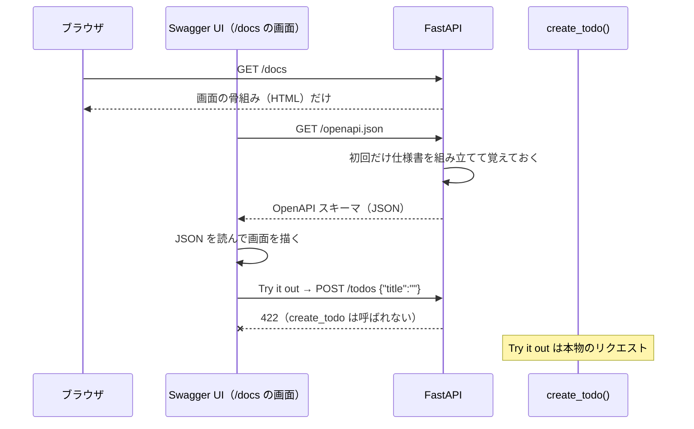
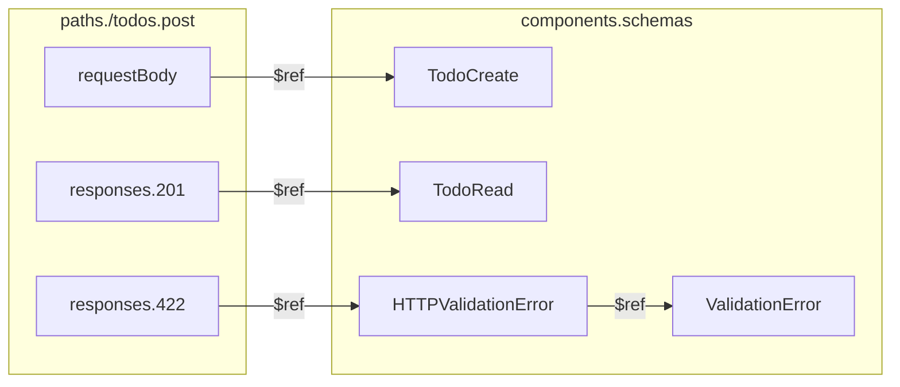

# P1b — 生成物を読めるようになる

P1a では**宣言を書いた**。P1b では、その宣言から FastAPI が**何を生成したか**を読み、
残りの CRUD・ファイル分割・デバッガまで進む。

| # | タイトル |
| --- | --- |
| P1-6 | 生成された仕様書を読む |
| P1-7 | 残りの CRUD と 404 |
| P1-8 | ルーター分割と依存性注入 |
| P1-9 | Zed からブレークポイントで止める |
| P1-10 | 欄をまたぐ条件を書く（v11 で追加） |

---

## P1-6: 生成された仕様書を読む

**作るもの**: `/openapi.json` を `jq` で読み、**書いたコードの1行1行が仕様書のどこに現れているか**を対応づける。コードは `tags=` / `summary=` / docstring を足すだけ
**重要度**: 🔴 毎日使う — 仕様書はフロントエンドや他チームとの**約束そのもの**で、コードを変えるたびに「約束がどう変わったか」を確かめることになるため
**前ステップとの接続**: P1-2 から「仕様書が勝手に生えている」とだけ言って先送りしてきた（2-6b / 3-6b / 4-6b / 5-6b）。**入口の形（P1-4）と出口の形（P1-5）がそろった**ので、ここでまとめて読む

### 6-0. このステップの初出トークン

| 系統 | トークン |
| --- | --- |
| **FastAPI** | `GET /openapi.json`（と `/docs` / `/redoc`）/ `components.schemas` と `$ref` / `tags=` / `summary=`（3つ = 上限） |
| **Python** | `"""..."""`（docstring） |
| **【道具】** | `jq` の読み方（`.キー` / `."/todos"` / `keys` / `\|` / `-c` / `-r`） |
| **周辺** | — |

> `jq` は P1-5 で「整形する道具」として出しただけだった。今回は**主役の道具**なので、周辺注ではなく 6-2b で読み方をまとめて扱う。

---

### 6-1. コード

**今回のコード変更は小さい。** 主役は 6-6 の「読む」ほう。

#### 要件

1. 3つのエンドポイントに **`tags=`** を付ける。`/health` は `"health"`、`/todos` の2つは `"todos"`
2. 3つに **`summary=`** で日本語の短い説明を付ける
3. `create_todo` に **docstring**（関数の説明文）を書く。複数行で、箇条書きを1つ以上含める
4. ruff / mypy が通る

#### 骨組み: `app/main.py`（変わる部分だけ）

```python
@app.get("/health")  # TODO: tags と summary
def health() -> dict[str, str]:
    return {"status": "ok"}


@app.post("/todos", status_code=201)  # TODO: tags と summary
def create_todo(todo: TodoCreate) -> TodoRead:
    # TODO: ここに docstring（関数の最初の行に置く）
    new_todo = TodoRead(id=len(todos) + 1, title=todo.title, done=todo.done)
    todos.append(new_todo)
    return new_todo


@app.get("/todos")  # TODO: tags と summary
def list_todos() -> list[TodoRead]:
    return todos
```

<details><summary>完成形（自分で書いてから開く）</summary>

`app/main.py`（全文）

```python
from fastapi import FastAPI

from app.schemas.todo import TodoCreate, TodoRead

app = FastAPI()

todos: list[TodoRead] = []


@app.get("/health", tags=["health"], summary="死活確認")
def health() -> dict[str, str]:
    return {"status": "ok"}


@app.post("/todos", status_code=201, tags=["todos"], summary="TODO を1件作る")
def create_todo(todo: TodoCreate) -> TodoRead:
    """
    タイトルを受け取り、ID を振って保存する。

    - 知らない欄を送ると 422
    - 成功すると 201
    """
    new_todo = TodoRead(id=len(todos) + 1, title=todo.title, done=todo.done)
    todos.append(new_todo)
    return new_todo


@app.get("/todos", tags=["todos"], summary="TODO の一覧")
def list_todos() -> list[TodoRead]:
    return todos
```

</details>

✅ 検証済み: Python 3.12.13 / FastAPI 0.141.1 / Pydantic 2.13.5 / jq 1.8.2。
完成形を別の場所にコピーして `ruff check` = `All checks passed!`、`ruff format --check` = `4 files already formatted`、
`mypy` = `Success: no issues found in 4 source files`。`jq` の出力はすべて 6-6 に実物を貼った。

> 💡 **補足**: 6-6 の Q1〜Q3 は、**コードを変える前**（P1-5 の状態）でも同じ結果になる。先に読んで、最後に `tags=` を足して差分を見る（6-6b）順番でもよい。

---

### 6-1b. 📊 図解

#### (a) 4つの名前は、それぞれどこにいるか



✅ 描画確認済み: mermaid 12.0.0 でパース通過。

**Swagger UI は FastAPI の一部ではなく、ブラウザで動く「JSON を絵にする道具」。**
`/docs` が返すのは空っぽの画面で、中身は**ブラウザが改めて `/openapi.json` を取りに行って**描いている。
だから「コードを直したのに画面が変わらない」ときは、**まず `/openapi.json` を `jq` で見る**。JSON が変わっていなければコード側（あるいはサーバの再起動）、JSON が変わっていれば画面側（ブラウザの再読み込み）の問題、と切り分けられる。

#### (b) `$ref` は「実体はあっち」という矢印



✅ 描画確認済み: mermaid 12.0.0 でパース通過。

**`paths` の中には形の実体が無い。** 全部が `components.schemas` を指す矢印になっている。
`TodoRead` は `POST` の 201 からも `GET` の 200 からも指されているが、**実体は1か所**。
右下の `HTTPValidationError → ValidationError` は、**あなたが書いていないのに FastAPI が足した**もの（422 の形）。

---

### 6-2a. 🔤 入口の2行

#### 🔤 `GET /openapi.json`
**読み方**: 「オープン・エーピーアイ・ドット・ジェイソン」
**要するに**: **この API の取扱説明書を、機械が読める形で1枚にしたもの**。書いたコードから自動で作られる。

#### 🔤 `components.schemas` と `$ref`
**読み方**: 「コンポーネンツ・ドット・スキーマズ」「ダラー・レフ」（レフは reference の略）
**要するに**: `components.schemas` は**データの形の見本帳**。`$ref` は「**形は見本帳の何ページ目を見て**」という付箋。

#### 🔤 `tags=["todos"]` / `summary="..."`
**読み方**: 「タグズ・イコール…」「サマリー・イコール…」
**要するに**: 取扱説明書の**章分け**と、各ページの**見出し**。動きは何も変わらない。

---

### 6-2b. 🧰 【道具】`jq` の読み方（このステップで使う分だけ）

`jq` は **JSON を上から順にたどって、欲しいところだけ取り出す**道具。書き方はフォルダをたどるのに近い。

| 書き方 | 意味 | 例 |
| --- | --- | --- |
| `.` | 全体（そのまま整形して出す） | `jq .` |
| `.キー` | そのキーの中へ入る | `.info` → `{"title":"FastAPI","version":"0.1.0"}` |
| `.a.b` | 続けて入る | `.info.title` → `"FastAPI"` |
| `."/todos"` | **記号を含むキーは `""` で囲む** | `.paths."/todos"` |
| `keys` | 中にあるキーの**名前だけ**を並べる | `.paths \| keys` → `["/health","/todos"]` |
| `\|` | 左の結果を右に渡す（シェルのパイプと同じ考え方） | `.paths \| keys` |
| `-c` | 1行に詰めて出す（Compact） | `jq -c .info` |
| `-r` | 文字列の `""` を外して出す（Raw） | `jq -r .info.title` → `FastAPI` |

**いちばん転ぶところ**: `/` や `$` を含むキーを `""` で囲み忘れる。実際のエラーはこうなる。

```
$ jq '.paths./todos' openapi.json
jq: error: syntax error, unexpected '/', expecting FORMAT or QQSTRING_START or '[' at <top-level>, line 1, column 8:
    .paths./todos
           ^

$ jq '...schema.$ref' openapi.json
jq: error: syntax error, unexpected BINDING, expecting FORMAT or QQSTRING_START or '[' ...
```

✅ 検証済み: jq 1.8.2 で実際に出した出力。

`$ref` の `$` は、jq の中では「変数」の印なので、`."$ref"` と囲まないと別物として読まれる。
**`QQSTRING_START`（= `"` が来るはずだった）と言われたら、囲み忘れ**と覚えておく。

> 💡 コマンド全体は `'...'`（シングルクォート）で囲む。こうすると、中の `"` と `$` をシェルが勝手に解釈しない。

---

### 6-2. 🔬 仕組み解剖

| 部品 | 正式名称 | 実行時に何が起きるか |
| --- | --- | --- |
| `GET /openapi.json` | OpenAPI スキーマ | `FastAPI()` を作った時点で、この経路が**自動で経路表に入っている**。**最初に叩かれたとき**に、経路表と各経路の型・デコレータの引数をすべて読んで JSON を組み立て、`app.openapi_schema` に**覚えておく**。2回目からは覚えたものを返すだけ |
| `components.schemas` / `$ref` | 再利用される形の定義 / 参照 | Pydantic がモデルごとに **JSON Schema**（JSON の形を書くための別の決まり）を作り、FastAPI がそれを `components.schemas` に1つずつ並べる。使う場所には実体ではなく `{"$ref": "#/components/schemas/名前"}` を置く |
| `tags=` / `summary=` / docstring | パスオペレーションのメタデータ | 起動時にデコレータが受け取り、経路表の行にメモとして付くだけ。**リクエストの処理には一切使われない**。`summary=` を省くと関数名から作られ（`create_todo` → `"Create Todo"`）、docstring は `description` になる |

**いつ評価されるか**: 型やデコレータの引数を読むのは起動時。JSON に組み立てるのは**最初に `/openapi.json` が叩かれたとき**（以後は使い回し。`--reload` で再起動すれば作り直される）。

**どの道具の責務か**: モデル1つぶんの形（`properties` / `required` / `minLength`）は **Pydantic** が JSON Schema として作る。
それを `paths` と組み合わせて1枚にまとめ、422 の形を足すのが **FastAPI**。画面に描くのは **Swagger UI / ReDoc**（ブラウザ側）。

**失敗したらどうなるか**: 読む側の失敗は無い。怖いのは**書いてあることと実際が違う**ほう。6-4 のなぜなぜ③で扱う。

#### 用語を分ける（§4.14）

| 呼び名 | 何を指すか | どこにあるか |
| --- | --- | --- |
| **OpenAPI** | API の仕様書を書くための**決まりそのもの**（昔は Swagger Specification と呼ばれていた） | 仕様の文書 |
| **OpenAPI スキーマ** | その決まりに従って FastAPI が**生成した JSON** | `GET /openapi.json` |
| **Swagger UI** | その JSON を読んで**画面に描き、試し打ちもできる道具** | `GET /docs` |
| **ReDoc** | 同じ JSON を**読み物の見た目**で描く道具（試し打ちは無い） | `GET /redoc` |

**「Swagger を見て」は、この4つのどれかが曖昧。** この教材では必ず4つの名前で呼び分ける。
根拠: https://fastapi.tiangolo.com/tutorial/first-steps/#openapi ／ https://swagger.io/specification/

#### コードの1行が、スキーマのどこに出るか

| コード | スキーマ上の場所と値 |
| --- | --- |
| `@app.post("/todos")` | `paths."/todos".post` |
| 関数名 `create_todo` | `operationId: "create_todo_todos_post"`（関数名 + パス + メソッド） |
| `todo: TodoCreate` | `requestBody` → `$ref: TodoCreate`、`"required": true` |
| `Field(min_length=1, max_length=200)` | `TodoCreate.properties.title` の `"minLength": 1` / `"maxLength": 200` |
| `done: bool = False` | `"default": false`、そして `required` に**入らない** |
| `extra="forbid"` | `"additionalProperties": false` |
| `status_code=201` | `responses."201"`（200 は**消える**） |
| `-> TodoRead` | `responses."201"` → `$ref: TodoRead` |
| （書いていない） | `responses."422"` → `$ref: HTTPValidationError` |
| `-> list[TodoRead]` | `"type": "array"`、`"items"` → `$ref: TodoRead` |
| `-> dict[str, str]` | `"type": "object"`、`"additionalProperties": {"type": "string"}` |

**P1a で書いた宣言は、ほぼ全部ここに出ている。** 6-6 で1つずつ `jq` で確かめる。

---

### 6-3. 🐍 Python解説

#### 🐍 `"""..."""`（docstring）

```python
def create_todo(todo: TodoCreate) -> TodoRead:
    """
    タイトルを受け取り、ID を振って保存する。

    - 知らない欄を送ると 422
    """
```

**読み方**: 「トリプル・クォート」。中身は「ドックストリング」（documentation string の略）

**たとえ**: 関数に付ける**取扱説明の貼り紙**。`#` のメモは Python が捨ててしまうが、こちらは**関数に貼り付いたまま残る**。

**正確には**:
- `"""` で始めて `"""` で閉じると、**改行を含む文字列**を書ける（`"..."` は1行だけ）
- その文字列を**関数の中身の一番最初**に置くと、特別に **docstring** として扱われ、関数にくっついて保存される。2行目以降に置くと、ただの捨てられる文字列になる
- **FastAPI はこれを読んで、仕様書の `description` にする**。字下げは自動で取り除かれ、Markdown（`- ` の箇条書きなど）としても解釈される
- `#` のコメントとの使い分け: `#` は**コードを読む人**へのメモ、docstring は**関数を使う人**への説明

**TS なら**: 関数の上に書く `/** ... */`（JSDoc）が近い。違いは**置く場所が関数の中**であることと、**実行中のプログラムから読める**こと（JSDoc はコンパイル後には残らない）。

> 💡 あなたがブランクページ再現で `"""Health check endpoint"""` と書いていたのが、まさにこれ。
> `/health` に付けていれば、`paths."/health".get.description` に `"Health check endpoint"` が出る。

---

### 6-3a. 🐍 Python の道具立て ／ 6-3b. 🧩 周辺注

このステップでは該当なし（`jq` は 6-2b で扱った）。

---

### 6-4. 解説 — なぜこう設計するか

#### 🪜 なぜなぜ: なぜ仕様書を手で書かず、コードから作るのか

**なぜ① `/openapi.json` の中身は、どこから来ているのか**
→ **起動時に経路表に登録されたもの全部**から。デコレータの引数（`status_code=` / `tags=`）、引数の型（`TodoCreate`）、戻り値の型（`TodoRead`）を、FastAPI が最初の `/openapi.json` のときにまとめて読み、1枚の JSON に組み立てる。
**あなたは仕様書を1行も書いていない**のに、`minLength` まで入っていたのはそのため。

**なぜ② 仕様書を別に手で書く（`openapi.yaml` を用意する）のでは、なぜだめなのか**
→ **2か所に書いたものは、いつか必ずズレる**から（P1-2 の なぜなぜ② と同じ理屈）。
`max_length` を 200 から 100 に変えたのに `openapi.yaml` を直し忘れると、フロントエンドは古い約束のまま作り続ける。
コードから作れば、**仕様書は実装の写し**になり、ズレようがない。P1-3 のなぜなぜ② で「宣言だから機械に読める」と書いたのは、ここに繋がっている。
根拠: https://fastapi.tiangolo.com/features/#automatic-docs

**なぜ③ では、コードから作る方式は何を失うのか** 🤔 まず自分で考える

<details><summary>答え</summary>

2つ失う。

**1. 宣言していないことは、仕様書に出ない。**
「実装の写し」と言ったが、正確には**宣言の写し**。宣言の外で起きることは写らない。

- P1-5 の 5-6 Q3 で起こした **500** は、`responses` のどこにも無い（6-6 の Q3 で確かめる）
- 次の P1-7 で `HTTPException(404)` を投げるようにしても、**投げるだけでは 404 は仕様書に出ない**

→ **手当て**（§4.2.1 ルール6）: **P1-7** で `responses=` を使い、「このエンドポイントは 404 も返す」と**宣言として**書き足す。
仕様書に出したいことは、**型かデコレータの引数で宣言する**。これが FastAPI で仕様書を正しく保つための唯一の方法。

**2. 「先に仕様書を決めてから作る」進め方がしにくい。**
フロントエンドと先に約束だけを決めて、並行して作りたい場面がある（**スキーマファースト**と呼ばれる進め方）。
コードから作る方式では、**コードを書くまで仕様書が存在しない**。

→ **この教材では手当てしない。** 仕様書から Python のコードを生成する道具はあるが、FastAPI の中心的な使い方から外れる。
代わりに、**中身が空のエンドポイント（型だけ書いて `...`）を先に作って仕様書を渡す**、という逃げ方はできる。
</details>

> 🧠 **FastAPI の考え方**: 仕様書は「書くもの」ではなく「**宣言から出てくるもの**」。
> だから仕様書に載せたいことは、**コメントではなく宣言として書く**。宣言していないことは、仕様書にとって存在しない。

---

### 6-5. 🏢 実務メモ ／ ⚠️ アンチパターン

> 🏢 **実務メモ**: `tags=` は**リソース単位**（`todos` / `users`）で付ける。Swagger UI はタグごとにエンドポイントをまとめて表示し、
> OpenAPI スキーマからクライアントのコードを自動生成する道具の多くも、**タグ単位でファイルやクラスを分ける**。
> 根拠: https://fastapi.tiangolo.com/advanced/generate-clients/#generate-a-typescript-client-with-tags

> ⚠️ **アンチパターン**: 仕様書に載せたい条件を、**docstring にだけ**書く（「title は 200 文字まで」と説明文に書いて、`max_length=200` を書かない）。
> docstring は人間が読む説明で、**検証もされず、機械も読めない**。条件は `Field()` に、説明は docstring に、と分ける。
> 根拠: https://fastapi.tiangolo.com/tutorial/path-operation-configuration/#description-from-docstring

---

### 6-6. 🔮 予測 → 動作確認

**先に予想してから実行する。**

1. `/openapi.json` の一番上の階層には、キーがいくつあるか。`TodoCreate` の `required` には何が入っているか
2. `POST /todos` の `responses` のキーは何か。**P1-5 の 5-6 Q3 で起こした 500 は入っているか**
3. `components.schemas` には、いくつの形が載っているか。**自分で書いていないもの**はあるか

サーバを起動しておく。

```bash
uv run uvicorn app.main:app --port 8000 --reload
```

<details><summary>実行と結果</summary>

**1 の答え: 4つ。`required` は `["title"]` だけ**

```bash
curl -s http://127.0.0.1:8000/openapi.json | jq 'keys'
```
```json
["components", "info", "openapi", "paths"]
```

上から順に読む（§4.14）。

```bash
curl -s http://127.0.0.1:8000/openapi.json | jq -c '{openapi, info}'
curl -s http://127.0.0.1:8000/openapi.json | jq -c '.paths | keys'
```
```
{"openapi":"3.1.0","info":{"title":"FastAPI","version":"0.1.0"}}
["/health","/todos"]
```

- `openapi`: 準拠している OpenAPI の版。FastAPI が決める
- `info`: API の名前と版。`FastAPI()` に何も渡していないので既定値のまま（この教材では変えない）
- `paths`: P1-3 で作った `/items/` は、**消したので載っていない**

`TodoCreate` の中身:

```bash
curl -s http://127.0.0.1:8000/openapi.json | jq '.components.schemas.TodoCreate'
```
```json
{
  "properties": {
    "title": { "type": "string", "maxLength": 200, "minLength": 1, "title": "Title" },
    "done": { "type": "boolean", "title": "Done", "default": false }
  },
  "additionalProperties": false,
  "type": "object",
  "required": ["title"],
  "title": "TodoCreate"
}
```

（読みやすさのため、`properties` の中だけ1行に詰めて貼った）

**`done` は `= False` があるので `required` に入らない。** P1-4 の「既定値があれば任意」が、そのまま仕様書に写っている。
`extra="forbid"` は `"additionalProperties": false` になった。**仕様書を読むだけで、フロントエンドは「余計な欄を送ると弾かれる」と分かる。**

**2 の答え: `["201", "422"]`。500 は入っていない**

```bash
curl -s http://127.0.0.1:8000/openapi.json | jq '.paths."/todos".post.responses | keys'
```
```json
["201", "422"]
```

- `201`: `status_code=201` を書いたので、既定の `200` が**置き換わった**
- `422`: **書いていないのに入っている**。ボディを受け取る以上、形が合わないことがありうるので、FastAPI が自動で足す
- **500 は無い。** P1-5 で実際に 500 を返せたのに、仕様書には一言も書かれていない。**宣言の外で起きたことは写らない**（6-4 のなぜなぜ③）

`$ref` をたどってみる。

```bash
curl -s http://127.0.0.1:8000/openapi.json \
  | jq -r '.paths."/todos".post.requestBody.content."application/json".schema."$ref"'
```
```
#/components/schemas/TodoCreate
```

**この文字列は、そのまま jq の道順になっている。** `#` が「この JSON の一番上」、`/` が「中へ入る」。

```
#/components/schemas/TodoCreate
 → jq '.components.schemas.TodoCreate'
```

**3 の答え: 4つ。そのうち2つは自分で書いていない**

```bash
curl -s http://127.0.0.1:8000/openapi.json | jq -c '.components.schemas | keys'
```
```json
["HTTPValidationError","TodoCreate","TodoRead","ValidationError"]
```

`TodoCreate` と `TodoRead` はあなたのクラス。**`HTTPValidationError` と `ValidationError` は FastAPI が足した 422 の形**。

```bash
curl -s http://127.0.0.1:8000/openapi.json | jq -c '.components.schemas.ValidationError.required'
```
```json
["loc","msg","type"]
```

**P1-3 から読んできた 422 の `loc` / `msg` / `type` は、ここで「必ずある欄」として約束されていた。** `input` と `ctx` は `required` に入っていない（無いこともある）。

**おまけ: 戻り値の型も写っている**

```bash
curl -s http://127.0.0.1:8000/openapi.json | jq -c '.paths."/todos".get.responses."200".content."application/json".schema'
```
```json
{"items":{"$ref":"#/components/schemas/TodoRead"},"type":"array","title":"Response List Todos Todos Get"}
```

`-> list[TodoRead]` が「`TodoRead` を並べた配列」として書かれている。
</details>

✅ 検証済み（上の出力はすべて実行して取得。`TodoCreate` の出力だけ、`properties` の中を1行に詰めて貼った）。

#### Swagger UI / ReDoc で見る — 🧑 読者が検証

**Swagger UI の画面操作は生成側では実行できない**ので、手順と判定基準を書く（§4.6(c)）。

1. ブラウザで `http://127.0.0.1:8000/docs` を開く
2. **`health` と `todos` の2つの見出しに分かれている**ことを確かめる（`tags=` を付けた後。付ける前は `default` 1つにまとまっている）
3. `POST /todos` を開き、見出しの横に **`TODO を1件作る`**（`summary=`）、その下に **docstring の箇条書き**が出ていることを確かめる
4. **Try it out** → Request body を `{"title": ""}` に書き換える → **Execute**
5. **判定基準**: Responses の **Server response** に `422` と、`"loc": ["body", "title"]` を含むボディが出る。
   その上の **Curl** 欄に、実際に送ったコマンドが出ている（自分で書いた `curl` と見比べる）
6. 同じ手順で `{"title": "牛乳を買う"}` を送り、**`201`** と `"id"` を含むボディが返ることを確かめる
7. 画面の一番下の **Schemas** に、`TodoCreate` / `TodoRead` / `HTTPValidationError` / `ValidationError` の4つが並んでいることを確かめる（6-6 の Q3 と同じもの）
8. `http://127.0.0.1:8000/redoc` も開き、**同じ内容が、試し打ちボタンの無い読み物の形**で出ることを確かめる

**スクリーンショット**: 手順5で 422 が返った状態の、**Responses の Server response の部分**（ステータス `422` とボディが両方入る範囲）を撮り、
`docs/images/p1-6-swagger-try-it-out-422.png` に保存する。


> ⚠️ **Try it out は本物のリクエスト**。手順6で作った TODO は、`GET /todos` にも本当に増えている。

---

### 6-6b. 🧾 OpenAPI スキーマの差分

**今回からは毎回、コードの変更で仕様書がどう変わったかを見る**（§4.14）。
`tags=` / `summary=` / docstring を足す前と後で、`POST /todos` の見出しまわりを比べる。

```bash
curl -s http://127.0.0.1:8000/openapi.json \
  | jq '.paths."/todos".post | {tags, summary, description, operationId}'
```

**足す前（P1-5 の状態）**
```json
{ "tags": null, "summary": "Create Todo", "description": null, "operationId": "create_todo_todos_post" }
```

**足した後**
```json
{
  "tags": ["todos"],
  "summary": "TODO を1件作る",
  "description": "タイトルを受け取り、ID を振って保存する。\n\n- 知らない欄を送ると 422\n- 成功すると 201",
  "operationId": "create_todo_todos_post"
}
```

✅ 検証済み（「足す前」は1行に詰めて貼った）。

- `summary` は、書かなければ**関数名から自動で作られていた**（`create_todo` → `Create Todo`）
- `description` は docstring から。**先頭の字下げは取り除かれている**
- `operationId` は**変わらない**。関数名とパスとメソッドから作られるので、`summary=` とは無関係
- `null` と出ているのは「そのキーが**無い**」という意味（jq が無いキーを `null` として見せている）

**変わったのは見出しまわりだけで、`requestBody` と `responses` は1文字も変わっていない。** `tags=` と `summary=` は**動きを変えない**ことが、差分からも分かる。

---

### 6-7. ✅ 想起チェック

1. OpenAPI / OpenAPI スキーマ / Swagger UI / ReDoc を、それぞれ1行で区別せよ
2. `"$ref": "#/components/schemas/TodoRead"` を `jq` で開くには、どう書くか
3. `TodoCreate` の `required` に `done` が入っていないのはなぜか
4. `POST /todos` は 500 を返しうるのに、`responses` に 500 が無いのはなぜか
5. 「コードを直したのに Swagger UI が変わらない」とき、最初に何を確かめるか

<details><summary>答え</summary>

1. **OpenAPI** = 仕様書の書き方の決まり ／ **OpenAPI スキーマ** = FastAPI が作った JSON（`/openapi.json`）／
   **Swagger UI** = その JSON を画面にして試し打ちできる道具（`/docs`）／ **ReDoc** = 同じ JSON を読み物にする道具（`/redoc`）
2. `jq '.components.schemas.TodoRead'`。`#` が一番上、`/` が「中へ入る」
3. **`= False` という既定値があるから。** 既定値があれば任意、という P1-4 の規則がそのまま写っている
4. **仕様書は宣言の写しで、500 はどこにも宣言していないから。** 出したいなら `responses=` で宣言する（P1-7）
5. **`/openapi.json` を `jq` で見る。** JSON が古ければサーバ側（再起動されているか）、JSON が新しければブラウザ側（再読み込み）
</details>

---

### 6-8. 初出トークンの回収確認

| トークン | 扱い |
| --- | --- |
| `GET /openapi.json`（と `/docs` / `/redoc`） | 6-2a / 6-2 で仕組み解剖（初回に組み立てて覚える）/ 用語の表 / 6-6 / 🧑 Swagger UI の手順 |
| `components.schemas` と `$ref` | 6-2a / 6-1b(b) の図 / 6-6 の Q1〜Q3 で実物をたどる |
| `tags=` / `summary=` | 6-2a / 6-2 / 6-5 実務メモ / 6-6b で差分 |
| `"""..."""`（docstring） | 6-3 で Python解説 / 6-6b で `description` になるのを確認 |
| `jq` の読み方 | 6-2b（実際のエラー出力つき）/ **P1-5 の ⏭️「jq の書き方は P1-6」を回収** |
| 以前の ⏭️ | **P1-2 の `/docs`、P1-3 の `parameters`、P1-4 の `requestBody` と `minLength`、P1-5 の `["201","422"]` を 6-6 でまとめて回収** |
| 宣言していないものは出ない | 6-4 なぜなぜ③ / 6-6 Q2 / ⏭️ **P1-7 の `responses=` で回収** |

> P1-3 の 3-6b で予告した `parameters`（`"in": "path"` / `"in": "query"`）は、`/items/` を P1-4 で消したので**今の仕様書には無い**。
> P1-7 で `GET /todos/{todo_id}` を作ると、`"in": "path"` として再び現れる。そこで確かめる。

**未回収: 0件**（`⏭️` 宣言は2件、どちらも P1-7 で回収）

---

### 6-9. 📌 進捗の更新

`README.md` の進捗表 P1b を「**P1-6 完了**（4ステップ中1）」、次の一手を `M1: P1 ステップ7` に更新した。

**次のステップ**: P1-7「残りの CRUD と 404」。`GET /todos/{todo_id}` / `PUT` / `DELETE` を足し、見つからないときに **404** を返す。
**404 を返すだけでは仕様書に出ない**ことを 6-6b の差分で確かめ、`responses=` で宣言して出す。
P1-5 の 🔓 で予告した「`DELETE` の後に `id` が重なる」も、ここで予測問題として踏む。
